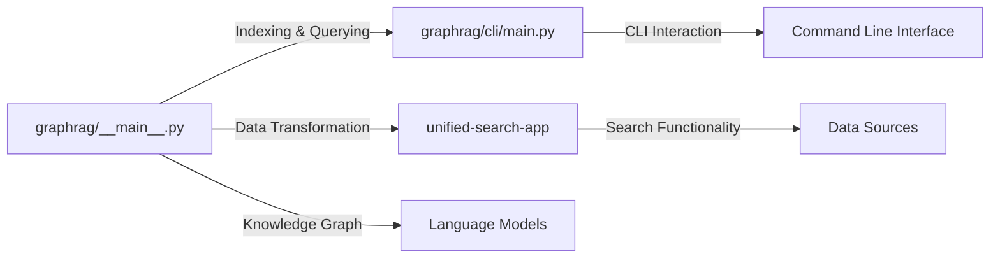

# Overview

The `graphrag` repository is a Python-based project that focuses on indexing and querying data using Large Language Models (LLMs). The primary goal is to enhance the reasoning abilities of LLMs with a structured knowledge graph.

# Architecture

# Data Flow / Execution Flow

1. The main entry point is either `graphrag/__main__.py` or `graphrag/cli/main.py`.
2. Data is indexed and transformed using the Language Models (LLMs) and the knowledge graph.
3. The transformed data is then used for search functionality within the `unified-search-app`.
4. Users can interact with the system through the Command Line Interface (CLI).

# Configuration & Dependencies

The project's configuration is managed in various files, including `pyproject.toml` and multiple `config.json` and `settings.yml` files in the `tests/fixtures` directory.

# How to Run / Key Scripts

To run the project, you can either execute the main script (`graphrag/__main__.py`) or use the CLI (`graphrag/cli/main.py`). Detailed instructions can be found in the `docs/get_started.md` file.

# Notable Design Choices / Extension Points

- The project uses the Numpy docstring convention for code documentation.
- The `unified-search-app` module provides a unified search functionality, leveraging various data sources and search algorithms.