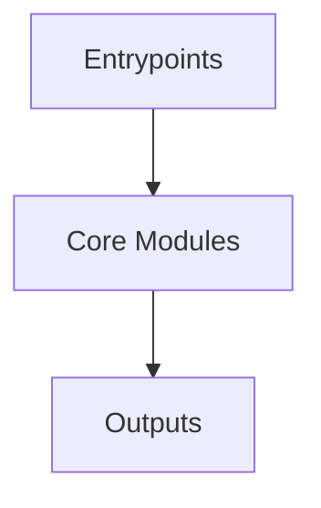

# Overview
Repository `json` appears to implement a modular system with 1118 source files at commit `4bc4e37f4f56f88b3a80abb7a6508b19a244e803`.

## Architecture
Major components inferred from file/module analysis:
- `docs`: JSON library that provides a simple and efficient way to parse and generate JSON data
- `src`: The `src/modules/CMakeLists.txt` module is a configuration file that manages the build process of the `nlohmann_json_modules` C++ library using CMake
- `root`: The `json` module in the provided repository is a C++ library for parsing, serializing, and manipulating JSON data
- `tests`: and build configuration

## Data Flow / Execution Flow
Typical execution path: `Entrypoint -> Core Modules -> Runtime Services -> Output/Side Effects`.
Entrypoints initialize core modules, which orchestrate processing and emit outputs or side effects.

## Configuration & Dependencies
- Build/dependency files: CMakeLists.txt, docs/mkdocs/requirements.txt, docs/mkdocs/docs/integration/cget/CMakeLists.txt, docs/mkdocs/docs/integration/conan/CMakeLists.txt, docs/mkdocs/docs/integration/cpm/CMakeLists.txt, docs/mkdocs/docs/integration/homebrew/CMakeLists.txt, docs/mkdocs/docs/integration/hunter/CMakeLists.txt, docs/mkdocs/docs/integration/macports/CMakeLists.txt, docs/mkdocs/docs/integration/spack/CMakeLists.txt, docs/mkdocs/docs/integration/vcpkg/CMakeLists.txt, src/modules/CMakeLists.txt, tests/CMakeLists.txt, tests/abi/CMakeLists.txt, tests/abi/config/CMakeLists.txt, tests/abi/diag/CMakeLists.txt, tests/abi/inline_ns/CMakeLists.txt, tests/benchmarks/CMakeLists.txt, tests/cmake_add_subdirectory/CMakeLists.txt, tests/cmake_add_subdirectory/project/CMakeLists.txt, tests/cmake_fetch_content/CMakeLists.txt, tests/cmake_fetch_content/project/CMakeLists.txt, tests/cmake_fetch_content2/CMakeLists.txt, tests/cmake_fetch_content2/project/CMakeLists.txt, tests/cmake_import/CMakeLists.txt, tests/cmake_import/project/CMakeLists.txt, tests/cmake_import_minver/CMakeLists.txt, tests/cmake_import_minver/project/CMakeLists.txt, tests/cmake_target_include_directories/CMakeLists.txt, tests/cmake_target_include_directories/project/CMakeLists.txt, tests/cuda_example/CMakeLists.txt, tests/module_cpp20/CMakeLists.txt, tests/thirdparty/Fuzzer/CMakeLists.txt, tests/thirdparty/Fuzzer/test/CMakeLists.txt, tests/thirdparty/Fuzzer/test/no-coverage/CMakeLists.txt, tests/thirdparty/Fuzzer/test/ubsan/CMakeLists.txt, tests/thirdparty/Fuzzer/test/uninstrumented/CMakeLists.txt, tools/astyle/requirements.txt, tools/generate_natvis/requirements.txt, tools/serve_header/requirements.txt
- Config files: tools/amalgamate/config_json.json, tools/amalgamate/config_json_fwd.json

## How to Run / Key Scripts
- Detected entrypoints: not clearly detected
- Use repository build scripts/package manager tasks based on detected build files.

## Notable Design Choices / Extension Points
- The codebase is organized in modules that can be extended by adding new feature files under existing module boundaries.
- Extension is likely centered around entrypoint wiring, configuration files, and module-specific implementations.
