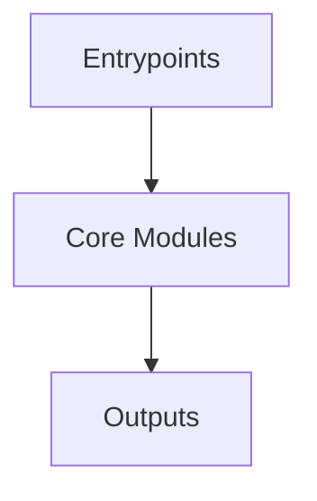

# Overview
Repository `libsql` appears to implement a modular system with 3177 source files at commit `6e55668cdb1d1d7406ea7fd6eea22991ac1ac301`.

## Architecture
Major components inferred from file/module analysis:
- `libsql-ffi`: The `libsql-ffi/libsql-ffi-SQLite3MultipleCiphers` module is a CMake-based project that provides a shared library (`sqlite3mc`) of SQLite with multiple cipher support
- `libsql-sqlite3`: type(&col_type),             notnull = if notnull { "NOT NULL" } else { "" },             dflt_value = crate::util::escape_value(&dflt_value)         );          self.db.execute_batch(&sql, &[])?;  The `libsql-sqlite3/ex...
- `vendored`: The `vendored/sqlite3-parser` module in the `libsql` repository houses the build configuration for the SQLite3 parser library, named `rlemon`
- `docs`: "stmt": Stmt, }  type DescribeResp = {     "type": "describe",     "describe_result": DescribeResult, } ```  The client sends a `describe` request to get the schema of a table or a view
- `libsql-server`: The `libsql-server` module is a component of the `libsql` repository, responsible for managing database connections and implementing an orderly shutdown process when necessary



## Data Flow / Execution Flow
Typical execution path: `Entrypoint -> Core Modules -> Runtime Services -> Output/Side Effects`.
Entrypoints initialize core modules, which orchestrate processing and emit outputs or side effects.

## Configuration & Dependencies
- Build/dependency files: libsql-ffi/bundled/SQLite3MultipleCiphers/CMakeLists.txt, libsql-ffi/bundled/SQLite3MultipleCiphers/conan/all/test_package/CMakeLists.txt, libsql-sqlite3/benchmark/requirements.txt, libsql-sqlite3/ext/crr/package.json, vendored/sqlite3-parser/CMakeLists.txt
- Config files: .cargo/config.toml, .config/nextest.toml, libsql-ffi/bundled/SQLite3MultipleCiphers/conan/config.yml

## How to Run / Key Scripts
- Detected entrypoints: not clearly detected
- Use repository build scripts/package manager tasks based on detected build files.

## Notable Design Choices / Extension Points
- The codebase is organized in modules that can be extended by adding new feature files under existing module boundaries.
- Extension is likely centered around entrypoint wiring, configuration files, and module-specific implementations.
