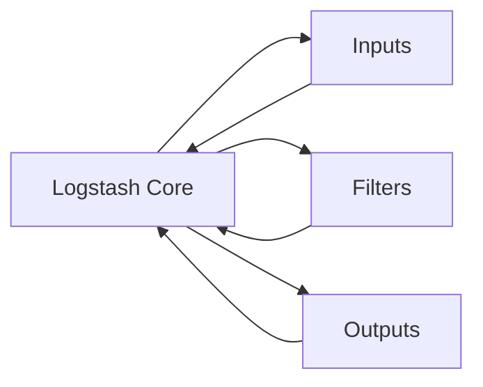

base but rather focuses on building and testing the X-Pack components, such as the Logstash Outputs, Inputs, and Filters, as well as the X-Pack server and its plugins.

In summary, the X-Pack module's `x-pack/build.gradle` file serves as the central hub for managing the build process, dependencies, and test configurations for the X-Pack components of the Logstash project.

---

# Overview

The Logstash project is an open-source data processing pipeline that ingests, transforms, and outputs log events. It is written in Java and Ruby and is part of the Elastic Stack, which also includes Elasticsearch and Kibana.

# Architecture

The Logstash architecture consists of three main components: Inputs, Filters, and Outputs. The Logstash Core module provides the Java implementation of these components, while the Inputs, Filters, and Outputs modules provide the actual implementations for each component.

# Data Flow / Execution Flow

1. Log events are ingested by one or more Inputs.
2. The ingested events are passed to the Filters for processing.
3. The processed events are then passed to one or more Outputs for further processing or storage.

# Configuration & Dependencies

The Logstash project relies on various dependencies, primarily managed by the `buildSrc` and `x-pack` modules. The `buildSrc` module manages the project's build process, while the `x-pack` module manages the build process for the X-Pack components.

Configuration files, such as `config/logstash.yml` and `config/pipelines.yml`, define the Inputs, Filters, and Outputs to be used, as well as their respective