# Overview

. Input, filter, and output plugins can be added or customized to handle various data sources, transformations, and destinations.

## community_02
Title: Tools Subsystem Summary

Purpose: The Tools subsystem provides various utility scripts and tools for building, testing, and maintaining Logstash.

Internal Structure: The Tools subsystem consists of several Gradle build scripts (e.g., `build.gradle`, `tools/dependencies-report/build.gradle`) that manage the build process for different components of Logstash. It also includes notice files for dependencies, indicating their licenses and authors.

Runtime Role: The tools are used during the development and maintenance of Logstash. They help in building the project, generating reports, and managing dependencies.

Likely Extension Points: The Tools subsystem does not have a direct extension point for users. However, developers can contribute by improving the build process, adding new tools, or enhancing existing ones.

## community_03
Title: Docs Subsystem Summary

Purpose: The Docs subsystem provides documentation for developers and users to understand the Logstash architecture, usage, and development process.

Internal Structure: The Docs subsystem consists of various Markdown files (e.g., `docs/extend/codec-new-plugin.md`) that cover different aspects of Logstash, such as extending Logstash with new plugins, community maintenance, and plugin documentation.

Runtime Role: The documentation is primarily used by developers and users to learn about Logstash and its features.

Likely Extension Points: Users can contribute to the documentation by creating new articles, updating existing ones, or improving the overall structure and organization.

## community_04
Title: QA Subsystem Summary

Purpose: The QA subsystem is responsible for testing Logstash and its components to ensure they meet the required quality standards.

Internal Structure: The QA subsystem includes Gradle build scripts (e.g., `qa/integration/build.gradle`), fixture files (e.g., `qa/docker/fixtures/multiple_pipelines/config/pipelines.yml`), and test specifications (e.g., `qa/integration/fixtures/reload_config_spec.yml`) for

## Architecture

Input, filter, and output plugins can be added or customized to handle various data sources, transformations, and destinations.

## community_02
Title: Tools Subsystem Summary

Purpose: The Tools subsystem contains various utilities and scripts used for building, testing, and maintaining Logstash.

Internal Structure: The Tools subsystem consists of several Gradle build scripts (e.g., `build.gradle`, `tools/dependencies-report/build.gradle`) and notice files (e.g., `tools/dependencies-report/src/main/resources/notices/aws-sdk-core-NOTICE.txt`). These files are used for building the Logstash project, managing dependencies, and generating notices for third-party libraries.

Dependencies: The Tools subsystem depends on the Logstash core and other external libraries, as specified in the build scripts and notice files.

Runtime Role: The Tools subsystem is primarily used during the development and maintenance of Logstash. It is not directly involved in data processing at runtime.

Likely Extension Points: The Tools subsystem can be extended by adding new build scripts, utilities, or scripts to support new features, improve the build process, or automate tasks.

## community_03
Title: Docs Subsystem Summary

Purpose: The Docs subsystem contains documentation for Logstash, including user guides, plugin documentation, and contribution guidelines.

Internal Structure: The Docs subsystem consists of Markdown files (e.g., `docs/extend/codec-new-plugin.md`, `CONTRIBUTING.md`) and other documentation resources. These files provide information on various aspects of Logstash, such as extending Logstash with new plugins, contributing to the project, and using specific features.

Dependencies: The Docs subsystem depends on the Logstash core and its plugins for accurate and up-to-date information.

Runtime Role: The Docs subsystem is not involved in data processing at runtime. Its primary role is to provide documentation for users, developers, and contributors.

Likely Extension Points: The Docs subsystem can be extended by adding new documentation resources, updating existing ones, or improving the organization and structure of the documentation.

## community_04
Title: QA Sub

### Architecture Graph

```mermaid

flowchart TD
  community_01[logstash-core\nlogstash-core/lib/logstash-core.rb, logstash-core/lib/logstash/bootstrap_check/default_config.rb]
  community_02[tools\ntools/dependencies-report/src/main/resources/notices/aws-sdk-core-NOTICE.txt, tools/dependencies-report/src/main/resources/notices/com.fasterxml.jackson.core!jackson-annotations-NOTICE.txt]
  community_03[docs\ndocs/extend/java-codec-plugin.md, docs/extend/java-filter-plugin.md]
  community_04[qa\nqa/docker/fixtures/multiple_pipelines/config/pipelines.yml, qa/integration/build.gradle]
  community_05[lib\nlib/pluginmanager/gem_installer.rb, lib/pluginmanager/offline_plugin_packager.rb]
  community_06[x-pack\nx-pack/spec/config_management/fixtures/pipelines.json, x-pack/distributions/internal/observabilitySRE/qa/acceptance/docker/elasticsearch/config/elasticsearch-fips.yml]
  community_07[README.md\nREADME.md, build.gradle]
  community_08[.buildkite\n.buildkite/scripts/health-report-tests/config/pipelines.yml, .buildkite/scripts/health-report-tests/requirements.txt]

```

## Data Flow / Execution Flow

system. Input, filter, and output plugins can be added or customized to handle various data sources, transformations, and destinations.

## community_02
Title: Tools Subsystem Summary

Purpose: The Tools subsystem provides various utility scripts and tools for building, testing, and maintaining Logstash.

Internal Structure: The Tools subsystem consists of several Gradle build scripts (e.g., `build.gradle`, `tools/dependencies-report/build.gradle`) that manage the build process for different components of Logstash. These scripts also include notices for third-party libraries used in Logstash.

Runtime Role: The tools are not directly involved in the runtime execution of Logstash. Instead, they are used for tasks such as building, testing, and reporting dependencies.

Likely Extension Points: The Tools subsystem does not have obvious extension points for users. It is primarily used by developers and maintainers for building and testing Logstash.

## community_03
Title: Docs Subsystem Summary

Purpose: The Docs subsystem provides documentation for users, developers, and maintainers of Logstash.

Internal Structure: The Docs subsystem consists of various Markdown files (e.g., `.buildkite/scripts/benchmark/README.md`, `docs/extend/codec-new-plugin.md`) that provide information about using, developing, and maintaining Logstash.

Runtime Role: The documentation is not part of the runtime execution of Logstash. It is used by users, developers, and maintainers to learn about Logstash and its features.

Likely Extension Points: Users can contribute to the documentation by submitting pull requests with improvements or additions.

## community_04
Title: QA Subsystem Summary

Purpose: The QA subsystem is responsible for testing Logstash and its various components.

Internal Structure: The QA subsystem includes Gradle build scripts (e.g., `qa/integration/build.gradle`), fixture configurations (e.g., `qa/docker/fixtures/multiple_pipelines/config/pipelines.yml`), and test specifications (e.g., `qa/integration/fixtures/reload_config_spec

## Configuration & Dependencies

Input, filter, and output plugins can be added or customized to handle various data sources, transformations, and destinations.

## community_02
Title: Tools Subsystem Summary

Purpose: The Tools subsystem provides various utilities for managing and analyzing Logstash. These tools help in building, testing, and reporting on the Logstash project.

Internal Structure: The Tools subsystem consists of several Gradle build files (e.g., `build.gradle`, `tools/dependencies-report/build.gradle`) that manage the build process for different components. The tools also include notice files for dependencies, indicating their licenses and authors.

Dependencies: The Tools subsystem depends on various external libraries, as indicated by the notice files.

Runtime Role: These tools are primarily used during the development and testing phases of Logstash. They help in building the project, generating reports, and managing dependencies.

Likely Extension Points: The Tools subsystem does not seem to have a clear extension point for user-defined functionality.

## community_03
Title: Docs Subsystem Summary

Purpose: The Docs subsystem provides documentation for developing and using Logstash. It includes guides, tutorials, and reference materials for various aspects of Logstash.

Internal Structure: The Docs subsystem consists of Markdown files (e.g., `docs/extend/codec-new-plugin.md`) that are organized into directories based on their topics.

Dependencies: The Docs subsystem does not have significant dependencies beyond the Markdown format and any dependencies of the hosting platform.

Runtime Role: The Docs subsystem is primarily used by developers and users to learn about Logstash and its features.

Likely Extension Points: The Docs subsystem can be extended by creating new Markdown files or modifying existing ones to add or update documentation.

## community_04
Title: QA Subsystem Summary

Purpose: The QA subsystem is responsible for testing and validating Logstash. It includes integration tests, acceptance tests, and smoke tests to ensure the correct functioning of Logstash.

Internal Structure: The QA subsystem consists of Gradle build files (e.g., `qa/integration/build.gradle`) and test fixtures (

## How to Run / Key Scripts

plugin architecture. Input, filter, and output plugins can be added or customized to suit specific use cases. The plugin manager (`pluginmanager/gem_installer.rb`) is responsible for installing plugins from the Gemfile.

## community_02
Title: Tools Subsystem Summary

Purpose: The Tools subsystem provides various utility scripts and tools for tasks such as dependency reporting, benchmarking, and CLI tools.

Internal Structure: The tools are organized into separate directories, each containing a `build.gradle` file for building the tool. Notable tools include the dependencies report tool, benchmark CLI, and jvm options parser.

Dependencies: The tools depend on various external libraries, as indicated in the notices files.

Runtime Role: These tools are typically used for specific tasks during development, testing, or maintenance of the Logstash project.

Likely Extension Points: New tools can be added by creating a new directory, defining a `build.gradle` file, and implementing the desired functionality.

## community_03
Title: Docs Subsystem Summary

Purpose: The Docs subsystem contains documentation for various aspects of Logstash, including extending Logstash with new plugins, community guidelines, and plugin development best practices.

Internal Structure: The documentation is organized into Markdown files, which are grouped by topic.

Dependencies: The docs do not have direct dependencies.

Runtime Role: The documentation serves as a reference for developers, users, and maintainers of Logstash.

Likely Extension Points: New documentation can be added by creating a new Markdown file and updating the `docs_anchors` array in the architecture IR.

## community_04
Title: QA Subsystem Summary

Purpose: The QA subsystem contains integration tests, fixtures, and acceptance tests for Logstash and its components.

Internal Structure: The QA subsystem is organized into several directories, each containing tests for specific aspects of Logstash. Notable directories include `qa/docker`, `qa/integration`, and `qa/fixtures`.

Dependencies: The QA subsystem depends on Logstash itself, as well as other components such as Elasticsearch and Filebeat.

Runtime Role: The QA sub

## Notable Design Choices / Extension Points

its plugin architecture. Input, filter, and output plugins can be easily added or modified to customize the data processing pipeline. The plugin management is handled by the `pluginmanager` directory, which includes files like `gem_installer.rb` and `offline_plugin_packager.rb`.

## community_02
Title: Tools Subsystem Summary

Purpose: The Tools subsystem contains various tools used for building, testing, and maintaining Logstash.

Internal Structure: The tools are primarily written in Gradle and are located in the `tools` directory. Notable tools include the dependencies report tool, benchmark CLI, and jvm options parser.

Runtime Role: These tools are used during the development and testing phases of Logstash. They help in building the project, generating reports, running benchmarks, and parsing JVM options.

Likely Extension Points: There are no obvious extension points in the Tools subsystem as it primarily serves support functions.

## community_03
Title: Docs Subsystem Summary

Purpose: The Docs subsystem provides documentation for developers and users of Logstash.

Internal Structure: The documentation is stored in the `docs` directory and is written in Markdown. It includes guides on extending Logstash, such as creating new plugins and community maintenance.

Runtime Role: The documentation serves as a reference for users and developers to understand how to use and extend Logstash.

Likely Extension Points: The documentation can be extended by contributing new guides, updating existing ones, or improving the structure and organization of the documentation.

## community_04
Title: QA Subsystem Summary

Purpose: The QA subsystem contains fixtures, specifications, and scripts used for testing Logstash.

Internal Structure: The QA subsystem is located in the `qa` directory and includes Gradle build files, fixtures for testing multiple pipelines and simple pipelines, and integration tests.

Runtime Role: The QA subsystem is used during the development and testing phases of Logstash to ensure the correct functioning of the software.

Likely Extension Points: The QA subsystem can be extended by adding new tests, improving existing tests, or creating new fixtures for testing different scenarios.

## community_05
Title: Lib Subsystem Summary