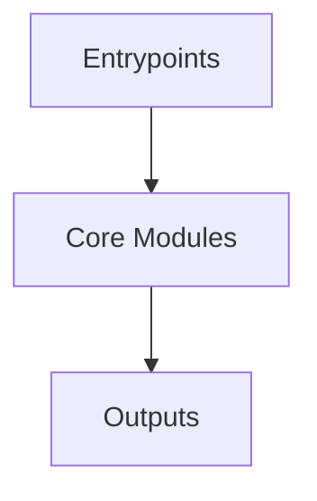

# Overview
Repository `mermaid` appears to implement a modular system with 1031 source files at commit `82800a2c8461370fe133458c12dd42bdc5dc3871`.

## Architecture
Major components inferred from file/module analysis:
- `docs`: commit      commit      commit      commit      commit      commit      commit      commit      commit      commit      commit      commit      commit      commit      commit      commit      commit      commit      comm...
- `root`: The `root` module in the `mermaid-monorepo` repository serves as the central hub, managing the project's dependencies, scripts, and build processes through the `package.json` file
- `packages`: The "@mermaid-js/packages" module is a collection of extensions and utilities for the Mermaid.js library, a popular tool for generating diagrams using Markdown-ish syntax
- `tests`: The `tests` module in the `mermaid` repository is dedicated to testing the Mermaid library

## Data Flow / Execution Flow
Typical execution path: `Entrypoint -> Core Modules -> Runtime Services -> Output/Side Effects`.
Entrypoints initialize core modules, which orchestrate processing and emit outputs or side effects.

## Configuration & Dependencies
- Build/dependency files: package.json, packages/examples/package.json, packages/mermaid-example-diagram/package.json, packages/mermaid-layout-elk/package.json, packages/mermaid-zenuml/package.json, packages/mermaid/package.json, packages/mermaid/src/docs/package.json, packages/parser/package.json, packages/tiny/package.json, tests/webpack/package.json
- Config files: cspell.config.yaml, tsconfig.eslint.json, tsconfig.json, .changeset/config.json, .cspell/cspell.config.yaml, cypress/tsconfig.json, packages/examples/tsconfig.json, packages/mermaid-example-diagram/tsconfig.eslint.json, packages/mermaid-example-diagram/tsconfig.json, packages/mermaid-layout-elk/tsconfig.json, packages/mermaid-zenuml/tsconfig.json, packages/mermaid/tsconfig.eslint.json, packages/mermaid/tsconfig.json, packages/mermaid/src/docs/tsconfig.json, packages/mermaid/src/schemas/config.schema.yaml, packages/parser/langium-config.json, packages/parser/tsconfig.json

## How to Run / Key Scripts
- Detected entrypoints: packages/examples/src/index.ts, packages/mermaid/src/dagre-wrapper/index.js, packages/mermaid/src/dagre-wrapper/intersect/index.js, packages/mermaid/src/diagrams/xychart/chartBuilder/index.ts, packages/mermaid/src/diagrams/xychart/chartBuilder/components/axis/index.ts, packages/mermaid/src/diagrams/xychart/chartBuilder/components/plot/index.ts, packages/mermaid/src/docs/.vitepress/theme/index.ts, packages/mermaid/src/rendering-util/layout-algorithms/dagre/index.js, packages/mermaid/src/rendering-util/rendering-elements/intersect/index.js, packages/mermaid/src/themes/index.js, packages/parser/src/index.ts, packages/parser/src/language/index.ts, packages/parser/src/language/architecture/index.ts, packages/parser/src/language/common/index.ts, packages/parser/src/language/gitGraph/index.ts, packages/parser/src/language/info/index.ts, packages/parser/src/language/packet/index.ts, packages/parser/src/language/pie/index.ts, packages/parser/src/language/radar/index.ts, packages/parser/src/language/treemap/index.ts, tests/webpack/src/index.js
- Use repository build scripts/package manager tasks based on detected build files.

## Notable Design Choices / Extension Points
- The codebase is organized in modules that can be extended by adding new feature files under existing module boundaries.
- Extension is likely centered around entrypoint wiring, configuration files, and module-specific implementations.
