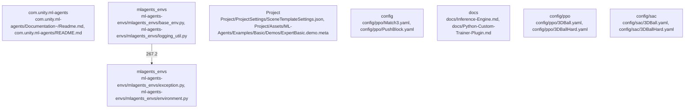

# Overview

## community_02
Subsystem: ML-Agents Environments

Purpose:
The ML-Agents Environments subsystem provides a set of pre-built environments for training AI agents using the Unity ML-Agents framework. These environments cover various tasks, such as navigation, manipulation, and puzzle-solving.

Internal Structure:
The ML-Agents Environments subsystem consists of several base environments and specific environments tailored for specific tasks. The base environment provides a common interface for all environments, while the specific environments implement the unique aspects of each task.

Dependencies:
The ML-Agents Environments subsystem relies on the Unity ML-Agents framework and the Unity game engine as its primary dependencies. It also requires the TensorFlow library for implementing machine learning algorithms.

Runtime Role:
During runtime, the ML-Agents Environments subsystem provides a platform for AI agents to interact with the environment, learn from their experiences, and make decisions based on the learned policies. The base environment manages the overall interaction, while the specific environments provide the necessary data for training the agents.

Likely Extension Points:
Potential extension points for the ML-Agents Environments subsystem include:
1. Development of new environments for various tasks and challenges.
2. Integration with additional machine learning algorithms, such as reinforcement learning, supervised learning, and unsupervised learning.
3. Enhancements to the base environment to accommodate new types of tasks and challenges.
4. Improvements to the specific environments to support more complex tasks and real-world simulations.

## community_03
Subsystem: Unity Project

Purpose:
The Unity Project subsystem serves as the main workspace for developing and testing AI agents using the Unity ML-Agents framework. It includes assets, scenes, and settings necessary for creating and customizing environments for training AI agents.

Internal Structure:
The Unity Project subsystem consists of several key components: Assets, Scenes, and Settings. Assets are the reusable objects and resources used in the project, such as models, textures, and animations. Scenes are the individual levels or environments within the project. Settings provide configuration options for the project, such as the physics engine, rendering settings, and AI settings.

## Architecture

. Integration with cloud-based services for distributed training and deployment.

## community_02
Subsystem: ML-Agents Environments

Purpose:
The ML-Agents Environments subsystem provides a set of pre-built environments for training AI agents using the Unity ML-Agents framework. These environments cover various tasks, such as navigation, manipulation, and puzzle-solving.

Internal Structure:
The ML-Agents Environments subsystem consists of several base environment classes and specific environment implementations. The base environment class defines the common interface for all environments, while the specific implementations provide the unique features and challenges for each task.

Dependencies:
The ML-Agents Environments subsystem relies on the Unity ML-Agents framework as its primary dependency. It also requires the TensorFlow and OpenAI Gym libraries for implementing machine learning algorithms and interfacing with various learning environments.

Runtime Role:
During runtime, the ML-Agents Environments subsystem provides the necessary data for training AI agents in pre-built environments. The base environment class handles communication between the agent and the environment, while the specific implementations provide the unique challenges and rewards for each task.

Likely Extension Points:
Potential extension points for the ML-Agents Environments subsystem include:
1. Development of new environment implementations for various tasks and challenges.
2. Integration with additional machine learning algorithms, such as reinforcement learning, supervised learning, and unsupervised learning.
3. Enhancements to the base environment class to accommodate new types of tasks and challenges.
4. Improvements to the environment data generation to support more realistic and dynamic environments.
5. Integration with cloud-based services for distributed training and deployment.

## community_03
Subsystem: Unity Project

Purpose:
The Unity Project subsystem serves as the main workspace for developing and testing AI agents using the Unity ML-Agents framework. It includes assets, scenes, and settings necessary for running the ML-Agents environments and training AI agents.

Internal Structure:
The Unity Project subsystem consists of several key components: Assets, Scenes, and Project Settings. Assets are the reusable objects and resources used in the project, such as models, textures, and

### Architecture Graph

## Data Flow / Execution Flow

## community_02
Subsystem: ML-Agents Environments

Purpose:
The ML-Agents Environments subsystem provides a set of pre-built environments for training AI agents using the Unity ML-Agents framework. These environments cover various tasks, such as navigation, manipulation, and puzzle-solving.

Internal Structure:
The ML-Agents Environments subsystem consists of several base environments and specific environments tailored for specific tasks. The base environment provides a common interface for all environments, while the specific environments implement the unique features and challenges for each task.

Dependencies:
The ML-Agents Environments subsystem relies on the Unity ML-Agents framework and the Unity game engine as its primary dependencies. It also requires the TensorFlow library for implementing machine learning algorithms.

Runtime Role:
During runtime, the ML-Agents Environments subsystem provides a platform for AI agents to interact with the environment, learn from their experiences, and make decisions based on the learned policies. The base environment handles communication between the agent and the Unity game engine, while the specific environments provide the necessary data for training the agents.

Likely Extension Points:
Potential extension points for the ML-Agents Environments subsystem include:
1. Development of new environments for various tasks and challenges.
2. Integration with additional machine learning algorithms, such as reinforcement learning, supervised learning, and unsupervised learning.
3. Enhancements to the base environment to accommodate new types of tasks and challenges.
4. Improvements to the specific environments to support more complex tasks and real-world simulations.

## community_03
Subsystem: Project

Purpose:
The Project subsystem serves as the main repository for the Unity ML-Agents framework, including the core ML-Agents codebase, examples, and assets.

Internal Structure:
The Project subsystem consists of several folders, including Assets, ML-Agents, and Examples. The Assets folder contains the Unity assets required for the ML-Agents framework, such as models, scenes, and materials. The ML-Agents folder contains the core ML-Agents codebase, including the Learning Environment, Inference Engine, and Learning Algorithms. The Examples folder contains demonstrations and examples

## Configuration & Dependencies

. Integration with cloud-based services for distributed training and deployment.

## community_02
Subsystem: ML-Agents Environments

Purpose:
The ML-Agents Environments subsystem provides a set of pre-built environments for training AI agents using the Unity ML-Agents framework. These environments cover a variety of tasks, such as navigation, manipulation, and puzzle-solving.

Internal Structure:
The ML-Agents Environments subsystem consists of several base environments and specific environment implementations. The base environment provides a common interface for all environments, while the specific implementations offer unique features and challenges for training AI agents.

Dependencies:
The ML-Agents Environments subsystem relies on the Unity ML-Agents framework as its primary dependency. It also requires the TensorFlow and OpenAI Gym libraries for implementing machine learning algorithms and interfacing with various learning environments.

Runtime Role:
During runtime, the ML-Agents Environments subsystem provides a platform for AI agents to interact with pre-built environments and learn from their experiences. The base environment handles communication between the agent and the environment, while the specific implementations offer unique challenges and rewards for the agent to learn from.

Likely Extension Points:
Potential extension points for the ML-Agents Environments subsystem include:
1. Development of new environment implementations to cover a wider range of tasks and challenges.
2. Integration with additional machine learning algorithms, such as reinforcement learning, supervised learning, and unsupervised learning.
3. Enhancements to the base environment to accommodate new types of tasks and challenges.
4. Improvements to the environment's reward systems to encourage desired behaviors in the AI agents.
5. Integration with cloud-based services for distributed training and deployment.

## community_03
Subsystem: Project

Purpose:
The Project subsystem contains the main Unity project files for the ML-Agents framework, including assets, settings, and examples.

Internal Structure:
The Project subsystem consists of several key components: Assets, Scene Templates, and Examples. Assets contain the game objects, materials, and scripts used in the project. Scene Templates provide a starting point for creating new scenes within the project. Examples demonstrate the use

## How to Run / Key Scripts

.

## community_02
Subsystem: ML-Agents Environments

Purpose:
The ML-Agents Environments subsystem provides a set of pre-built environments for training AI agents using the Unity ML-Agents framework. These environments cover a variety of tasks, such as navigation, manipulation, and puzzle-solving.

Internal Structure:
The ML-Agents Environments subsystem consists of several base environments and specific environments tailored for various tasks. The base environment provides a foundation for creating custom environments, while the specific environments offer pre-configured settings for common tasks.

Dependencies:
The ML-Agents Environments subsystem relies on the Unity ML-Agents framework and the Unity game engine as its primary dependencies. It also requires the TensorFlow library for implementing machine learning algorithms.

Runtime Role:
During runtime, the ML-Agents Environments subsystem serves as the interface between the AI agent and the game environment. It manages the agent's interactions with the environment, collects data for training, and provides feedback to the agent based on its actions.

Likely Extension Points:
Potential extension points for the ML-Agents Environments subsystem include:
1. Development of new environments for various tasks and challenges.
2. Integration with additional machine learning algorithms for training agents in the environments.
3. Enhancements to the base environment to support more complex tasks and interactions.
4. Improvements to the data collection and feedback mechanisms to better support the training process.

## community_03
Subsystem: Project

Purpose:
The Project subsystem contains the main Unity project files for the ML-Agents repository, including assets, settings, and scenes. It serves as the foundation for building and testing AI agents within the Unity game engine.

Internal Structure:
The Project subsystem consists of several key components: assets, scenes, and settings. Assets include models, textures, and other resources used in the project. Scenes define the game environment and layout, while settings control various project-wide configurations.

Dependencies:
The Project subsystem relies on the Unity game engine as its primary dependency. It also requires the ML-Agents framework for integrating AI agents into the game environment.

Runtime Role

## Notable Design Choices / Extension Points

behavior.
5. Integration with other game engines or simulation platforms.

## community_02
Subsystem: ML-Agents Environments

Purpose:
The ML-Agents Environments subsystem provides a set of pre-built environments for training AI agents using the Unity ML-Agents framework. These environments cover various tasks, such as navigation, manipulation, and puzzle-solving.

Internal Structure:
The ML-Agents Environments subsystem consists of several base environment classes and specific environment implementations. The base environment classes define the common interfaces and functionalities for all environments, while the specific environment implementations provide the unique features and challenges for each task.

Dependencies:
The ML-Agents Environments subsystem relies on the Unity ML-Agents framework as its primary dependency. It also requires the TensorFlow and OpenAI Gym libraries for implementing machine learning algorithms and interfacing with various learning environments.

Runtime Role:
During runtime, the ML-Agents Environments subsystem provides a platform for training AI agents in pre-built environments. The base environment classes handle the communication between the agents and the Unity engine, while the specific environment implementations provide the necessary data for training the agents.

Likely Extension Points:
Potential extension points for the ML-Agents Environments subsystem include:
1. Development of new environment implementations for various tasks and challenges.
2. Integration with additional machine learning algorithms, such as reinforcement learning, supervised learning, and unsupervised learning.
3. Enhancements to the base environment classes to accommodate new types of tasks and challenges.
4. Improvements to the communication between the agents and the Unity engine for better performance and flexibility.
5. Integration with other game engines or simulation platforms to support a wider range of environments.

## community_03
Subsystem: Unity Project

Purpose:
The Unity Project subsystem contains the core assets and settings for the ML-Agents examples and demos. It includes the Unity scenes, models, and configurations required for running the examples and demonstrating the capabilities of the ML-Agents framework.

Internal Structure:
The Unity Project subsystem consists of several key components: scenes, models, and settings. The scenes define the environments for the