# Overview

dependencies include the `react` and `react-helmet` libraries, which are required for rendering the Search Metadata component.

## community_02
**Puppeteer Subsystem Summary: Documentation**

The Documentation subsystem within the Puppeteer repository is responsible for providing comprehensive API documentation for the Puppeteer library. This documentation is organized into various sections, including API, Examples, FAQ, Contributing, Troubleshooting, and Supported Browsers.

The Documentation subsystem primarily consists of Markdown files, such as `README.md`, `docs/index.md`, and other files listed in the `docs_anchors` array of the Architecture IR. These files are rendered and served through the website subsystem.

## community_03
**Puppeteer Subsystem Summary: Core Library**

The Core Library subsystem within the Puppeteer repository is the primary component of the Puppeteer library itself. It provides a set of APIs for controlling headless and automated browsing, including the ability to launch and control browsers, navigate pages, execute JavaScript, and more.

The Core Library subsystem is centered around the `index.ts` file in the `packages/puppeteer-core/src` directory, which serves as the entrypoint for the library. This file imports and initializes various modules, such as `environment.ts`, `index-browser.ts`, and `puppeteer-core-browser.ts`. These modules define the core functionality of the library, including browser, browser context, and CDP session management.

## community_04
**Puppeteer Subsystem Summary: Testing**

The Testing subsystem within the Puppeteer repository is responsible for ensuring the correct functioning of the Puppeteer library across various scenarios. This subsystem includes unit tests, integration tests, and end-to-end tests, which are executed using tools like Jest and Mocha.

The Testing subsystem consists of various test files, such as `test/src/cdp/extensions.spec.ts`, `test/src/webExtension.spec.ts`, and other files listed in the `test` directory. These tests cover various aspects of the Puppeteer library, including its interaction with the Chrome DevTools Protocol (CDP),

## Architecture

of the Puppeteer repository, such as the Search Bar and Search Page, utilize the Search Metadata subsystem to display search results and manage the search process.

## community_02
**Puppeteer Subsystem Summary: Documentation**

The Documentation subsystem within the Puppeteer repository is responsible for providing comprehensive API documentation for the Puppeteer library. This subsystem consists of various Markdown files, including the `README.md` file, and other documentation files located in the `docs` directory.

The Documentation subsystem is primarily used by developers to understand the capabilities and usage of the Puppeteer library. It provides API reference documentation, examples, troubleshooting guides, and contributing guidelines. The documentation is versioned, with each version having its own set of documentation files.

## community_03
**Puppeteer Subsystem Summary: Core Library**

The Core Library subsystem within the Puppeteer repository is the primary component of the Puppeteer library. It provides a set of APIs for controlling headless and automated browsing, network requests, and browser automation tasks.

The Core Library subsystem is built using TypeScript and is composed of various modules, such as `Browser`, `BrowserContext`, and `CDPSession`. These modules provide APIs for creating and managing browser instances, executing scripts, and interacting with the browser's DevTools Protocol (CDP).

The Core Library subsystem is used by various parts of the Puppeteer repository, including the Test Server, Schematics, and the Puppeteer Extension.

## community_04
**Puppeteer Subsystem Summary: Testing**

The Testing subsystem within the Puppeteer repository is responsible for ensuring the correct functioning of the Puppeteer library. This subsystem consists of various test suites, including unit tests, integration tests, and end-to-end tests.

The Testing subsystem is located in the `test` directory and includes test files for the Core Library, Test Server, and Puppeteer Extension. The tests cover various aspects of the Puppeteer library, such as API functionality, browser compatibility, and performance.

## community_05
**Puppeteer Subsystem Summary: Build System**

The Build System subsystem within the Pupp

### Architecture Graph

```mermaid

flowchart TD
  community_01[website\nwebsite/src/theme/SearchMetadata/index.js, website/versioned_docs/version-24.17.1/api/puppeteer.browser.installextension.md]
  community_02[docs\ndocs/api/puppeteer.browser.installextension.md, docs/api/puppeteer.browser.uninstallextension.md]
  community_03[packages\npackages/testserver/src/index.ts, packages/browsers/package.json]
  community_04[test\ntest/src/cdp/extensions.spec.ts, test/src/webExtension.spec.ts]
  community_05[README.md\nREADME.md, package.json]
  community_06[packages/puppeteer-core/src\npackages/puppeteer-core/src/index.ts, packages/puppeteer-core/src/tsconfig.cjs.json]
  community_07[docs\ndocs/CHANGELOG.md, docs/contributing.md]
  community_08[packages/puppeteer-core\npackages/puppeteer-core/package.json, packages/puppeteer-core/tsconfig.json]

```



## Data Flow / Execution Flow

The `SearchMetadata` function is called in the `website/src/theme/SearchMetadata/index.js` file, which is an entrypoint in the repository.

## community_02
**Puppeteer Subsystem Summary: Documentation**

The Documentation subsystem within the Puppeteer repository is responsible for providing comprehensive API documentation for the Puppeteer library. This documentation is organized into various sections, such as API, examples, FAQ, contributing, and supported browsers.

The internal structure of this subsystem consists of multiple Markdown files, including `README.md`, `docs/CHANGELOG.md`, `docs/contributing.md`, `docs/examples.md`, `docs/faq.md`, `docs/index.md`, `docs/supported-browsers.md`, and `docs/troubleshooting.md`. These files are located in the `docs_anchors` array of the architecture IR.

The Documentation subsystem does not have any direct dependencies within the repository. However, it relies on the accurate and up-to-date information provided by other subsystems, such as the Puppeteer Core and the Testing subsystems, to generate accurate and helpful documentation.

## community_03
**Puppeteer Subsystem Summary: Core Services**

The Core Services subsystem within the Puppeteer repository is responsible for providing the fundamental functionality of the Puppeteer library. This includes creating a new browser instance, managing browser contexts, and interacting with the Chrome DevTools Protocol (CDP) session.

The internal structure of this subsystem consists of various TypeScript files located in the `packages/puppeteer-core/src` directory, such as `Browser.ts`, `BrowserContext.ts`, and `CDPSession.ts`. The `index.ts` file serves as the entrypoint for the Core Services subsystem.

The Core Services subsystem has dependencies on the `puppeteer-core-browser.ts` and `environment.ts` files, which are responsible for creating a browser instance and managing the environment, respectively. The Core Services subsystem also depends on the `puppeteer-core-browser.ts` file to provide the `Browser` class, which is the primary interface for interacting with the browser

## Configuration & Dependencies

of the Puppeteer repository may also depend on this subsystem to manage their own unique counters for various purposes.

## community_02
**Puppeteer Subsystem Summary: Documentation**

The Documentation subsystem within the Puppeteer repository is responsible for maintaining the project's official documentation. This documentation is organized into various sections, including API documentation, examples, FAQs, and more.

The Documentation subsystem relies on Markdown files, such as `README.md`, `docs/index.md`, and other files listed in the `docs_anchors` array of the Architecture IR. These files are used to structure and present the documentation in a clear and organized manner.

The Documentation subsystem does not have any direct dependencies within the Puppeteer repository. However, it does rely on the overall structure and organization of the repository to ensure that the documentation remains accurate and up-to-date.

## community_03
**Puppeteer Subsystem Summary: Core Library**

The Core Library subsystem within the Puppeteer repository is the primary focus of the project. It provides a high-level API for controlling headless and automated browsing, as well as managing browser contexts and CDP sessions.

The Core Library subsystem is implemented in TypeScript and consists of several entrypoints, such as `packages/puppeteer-core/src/index.ts`. This entrypoint serves as the main entry point for the Core Library and exports the `Browser` class, which is the primary interface for interacting with the library. Other classes, such as `BrowserContext` and `CDPSession`, are also exported and used to manage browser contexts and CDP sessions, respectively.

The Core Library subsystem has several dependencies, including the `puppeteer-core-browser` module, which provides browser-specific implementations for the Core Library. It also depends on the `environment.ts` module, which sets up the environment for the Core Library based on the current platform.

## community_04
**Puppeteer Subsystem Summary: Testing**

The Testing subsystem within the Puppeteer repository is responsible for ensuring the correct functionality of the Core Library and other parts of the Puppeteer project. This subsystem includes various test suites, such as unit tests,

## How to Run / Key Scripts

.

### Key Scripts

1. **Building the Search Metadata component:**

```sh
cd website
npm run build:search-metadata
```

This command builds the Search Metadata component, which generates the `SearchMetadata.js` file in the `website/src/theme/SearchMetadata/` directory.

2. **Running the Search Metadata component:**

```sh
cd website
npm start
```

This command starts the development server for the Search Metadata component, allowing you to view and test the component in a browser.

## community_02
**Puppeteer Subsystem Summary: Documentation**

The Documentation subsystem within the Puppeteer repository is responsible for maintaining the project's official documentation. The documentation is organized into various sections, including API documentation, examples, FAQs, and more.

The Documentation subsystem relies on Markdown files, which are stored in the `docs/` directory, to generate the final documentation. The documentation is built using the `docsify` static site generator, which converts Markdown files into HTML pages.

### Key Scripts

1. **Building the documentation:**

```sh
cd docs
npm run build
```

This command builds the Puppeteer documentation, generating the built documentation in the `docs/.vuepress/dist/` directory.

2. **Running the documentation locally:**

```sh
cd docs
npm run dev
```

This command starts the local development server for the Puppeteer documentation, allowing you to view and test the documentation in a browser.

## community_03
**Puppeteer Subsystem Summary: Core Library**

The Core Library subsystem within the Puppeteer repository is the primary focus of the project. It provides a high-level API for controlling headless Chrome or Chromium browsers, as well as running scripts and automating tasks.

The Core Library subsystem consists of various modules, including `Browser`, `BrowserContext`, `CDPSession`, and more. These modules are responsible for managing browser instances, contexts, and communication with the browser's DevTools Protocol (CDP).

### Key Scripts

1. **Building the Core Library:**

## Notable Design Choices / Extension Points

tag. This class is defined in the `website/src/theme/SearchMetadata/MonotonicCountMap.js` file.

## community_02
**Puppeteer Subsystem Summary: Documentation**

The Documentation subsystem within the Puppeteer repository is responsible for maintaining the project's official documentation. The documentation is organized into various sections, including API documentation, examples, FAQs, and more.

The main entrypoint for the Documentation subsystem is the `docs/index.md` file, which serves as the landing page for the documentation. The documentation is generated using the MkDocs static site generator, and the source files are located in the `docs/` directory.

The Documentation subsystem has no explicit dependencies, but it relies on the MkDocs configuration and the Markdown files within the `docs/` directory to generate the final documentation.

## community_03
**Puppeteer Subsystem Summary: Core Library**

The Core Library subsystem within the Puppeteer repository is the primary focus of the project. It provides a high-level API for controlling headless browsers, automating web navigation, and performing various browser-related tasks.

The Core Library subsystem is implemented in TypeScript and is organized into several modules, including `Browser`, `BrowserContext`, `CDPSession`, and more. The main entrypoint for the Core Library is the `index.ts` file in the `packages/puppeteer-core/src/` directory.

The Core Library subsystem has several dependencies, including the Chromium and Firefox browsers, the CDP (Chrome DevTools Protocol), and various third-party libraries such as `parsel-js`. These dependencies are managed using the `package.json` files in the respective directories.

## community_04
**Puppeteer Subsystem Summary: Testing**

The Testing subsystem within the Puppeteer repository is responsible for ensuring the correct functioning of the Core Library and other subsystems. The tests are organized into several categories, including CDP tests, web extension tests, and more.

The main entrypoint for the Testing subsystem is the `test/src/` directory, which contains various test files for different aspects of the project. The tests are written in TypeScript and utilize