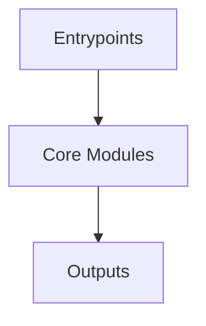

# Overview
Repository `qmk_firmware` appears to implement a modular system with 22246 source files at commit `1a58fce043e7f2e2b938dee03945dabc29e48d73`.

## Architecture
Major components inferred from file/module analysis:
- `docs`: use this document as a reference when updating ChibiOS and ChibiOS-Contrib, ensuring a consistent and well-documented upgrade process
- `lib`: encoders.py` file in the `qmk_firmware` repository provides custom JSON encoders for handling specific data types and objects within the QMK firmware development environment
- `root`: The `root` module of the `qmk_firmware` repository serves as the foundation for a customizable keyboard firmware, primarily based on the `tmk_keyboard` firmware
- `builddefs`: The `builddefs/docsgen` module within the `qmk_firmware` repository is responsible for managing the documentation generation process
- `keyboards`: The `keyboards/ergodox_ez/util/keymap_beautifier` module in the qmk_firmware repository is a specialized tool designed for formatting keymap files for the ErgoDox EZ keyboard
- `util`: The `util` module in the `qmk_firmware` repository is a collection of utility functions and resources primarily focused on supporting the Continuous Integration (CI) system
- `data`: The `data` module in the `qmk_firmware` repository is primarily responsible for managing and providing structured metadata about keyboards supported by QMK

## Data Flow / Execution Flow
Typical execution path: `Entrypoint -> Core Modules -> Runtime Services -> Output/Side Effects`.
Entrypoints initialize core modules, which orchestrate processing and emit outputs or side effects.

## Configuration & Dependencies
- Build/dependency files: requirements.txt, builddefs/docsgen/package.json, keyboards/ergodox_ez/util/keymap_beautifier/requirements.txt, util/ci/requirements.txt
- Config files: .vscode/settings.json

## How to Run / Key Scripts
- Detected entrypoints: builddefs/docsgen/.vitepress/theme/index.ts, lib/python/qmk/cli/doctor/main.py
- Use repository build scripts/package manager tasks based on detected build files.

## Notable Design Choices / Extension Points
- The codebase is organized in modules that can be extended by adding new feature files under existing module boundaries.
- Extension is likely centered around entrypoint wiring, configuration files, and module-specific implementations.
