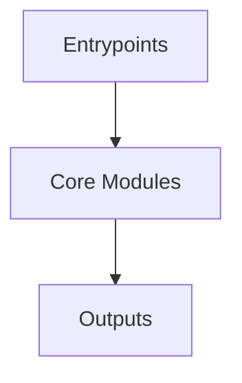

# Overview
Repository `rasa` appears to implement a modular system with 1282 source files at commit `f28c69e4672cd978745f5a73396c79c26017d612`.

## Architecture
Major components inferred from file/module analysis:
- `rasa`: self.nlu_interpreter is not None and self.policies      def handle_message(self, message: Message) -> Optional[Message]:         """Handle a message from the user."""         if self.is_ready():             self.current_...
- `docs`: The `docs` module in the Rasa repository, housed within the `package.json` file, serves as the central hub for managing and executing various scripts essential for the project's documentation
- `root`: The Rasa module, a part of the Rasa repository, is an open-source machine learning framework for developing contextual text and voice-based conversational assistants

## Data Flow / Execution Flow
Typical execution path: `Entrypoint -> Core Modules -> Runtime Services -> Output/Side Effects`.
Entrypoints initialize core modules, which orchestrate processing and emit outputs or side effects.

## Configuration & Dependencies
- Build/dependency files: pyproject.toml, data/examples/dialogflow/package.json, docs/package.json
- Config files: .pre-commit-config.yaml, data/configs_for_docs/config_featurizers.yml, data/configs_for_docs/default_config.yml, data/configs_for_docs/default_english_config.yml, data/configs_for_docs/default_spacy_config.yml, data/configs_for_docs/example_for_suggested_config.yml, data/configs_for_docs/example_for_suggested_config_after_train.yml, data/configs_for_docs/pretrained_embeddings_convert_config.yml, data/configs_for_docs/pretrained_embeddings_mitie_config_1.yml, data/configs_for_docs/pretrained_embeddings_mitie_config_2.yml, data/configs_for_docs/pretrained_embeddings_spacy_config.yml, data/configs_for_docs/supervised_embeddings_config.yml, data/graph_schemas/config_pretrained_embeddings_mitie_predict_schema.yml, data/graph_schemas/config_pretrained_embeddings_mitie_train_schema.yml, data/graph_schemas/config_pretrained_embeddings_mitie_zh_predict_schema.yml, data/graph_schemas/config_pretrained_embeddings_mitie_zh_train_schema.yml, data/graph_schemas/config_pretrained_embeddings_spacy_duckling_predict_schema.yml, data/graph_schemas/config_pretrained_embeddings_spacy_duckling_train_schema.yml, data/graph_schemas/default_config_core_predict_schema.yml, data/graph_schemas/default_config_core_train_schema.yml, data/graph_schemas/default_config_e2e_predict_schema.yml, data/graph_schemas/default_config_e2e_train_schema.yml, data/graph_schemas/default_config_finetune_epoch_fraction_schema.yml, data/graph_schemas/default_config_finetune_schema.yml, data/graph_schemas/default_config_nlu_predict_schema.yml, data/graph_schemas/default_config_nlu_train_schema.yml, data/graph_schemas/default_config_predict_schema.yml, data/graph_schemas/default_config_train_schema.yml, data/graph_schemas/graph_config_short_predict_schema.yml, data/graph_schemas/graph_config_short_train_schema.yml, data/graph_schemas/keyword_classifier_config_predict_schema.yml, data/graph_schemas/keyword_classifier_config_train_schema.yml, data/graph_schemas/max_hist_config_predict_schema.yml, data/graph_schemas/max_hist_config_train_schema.yml, data/test/config_embedding_test.yml, data/test_action_extract_slots_11333/config.yml, data/test_config/config_crf_custom_features.yml, data/test_config/config_crf_no_pattern_feature.yml, data/test_config/config_crf_no_regex.yml, data/test_config/config_crf_no_synonyms.yml, data/test_config/config_default_assistant_id_value.yml, data/test_config/config_defaults.yml, data/test_config/config_embedding_intent_response_selector.yml, data/test_config/config_empty_en.yml, data/test_config/config_empty_en_after_dumping.yml, data/test_config/config_empty_en_after_dumping_core.yml, data/test_config/config_empty_en_after_dumping_nlu.yml, data/test_config/config_empty_fr.yml, data/test_config/config_empty_fr_after_dumping.yml, data/test_config/config_language_only.yml, data/test_config/config_no_assistant_id.yml, data/test_config/config_no_assistant_id_with_comments.yml, data/test_config/config_pipeline_empty.yml, data/test_config/config_pipeline_missing.yml, data/test_config/config_policies_empty.yml, data/test_config/config_policies_missing.yml, data/test_config/config_pretrained_embeddings_convert.yml, data/test_config/config_pretrained_embeddings_mitie.yml, data/test_config/config_pretrained_embeddings_mitie_2.yml, data/test_config/config_pretrained_embeddings_mitie_diet.yml, data/test_config/config_pretrained_embeddings_mitie_zh.yml, data/test_config/config_pretrained_embeddings_spacy.yml, data/test_config/config_pretrained_embeddings_spacy_de.yml, data/test_config/config_pretrained_embeddings_spacy_duckling.yml, data/test_config/config_response_selector_minimal.yml, data/test_config/config_spacy_entity_extractor.yml, data/test_config/config_supervised_embeddings.yml, data/test_config/config_supervised_embeddings_duckling.yml, data/test_config/config_ted_policy_model_checkpointing.yml, data/test_config/config_ted_policy_model_checkpointing_zero_eval_num_examples.yml, data/test_config/config_ted_policy_model_checkpointing_zero_every_num_epochs.yml, data/test_config/config_ted_policy_no_model_checkpointing.yml, data/test_config/config_train_server_json.yml, data/test_config/config_train_server_md.yml, data/test_config/config_unique_assistant_id.yml, data/test_config/config_with_comment_between_suggestions.yml, data/test_config/config_with_comments.yml, data/test_config/config_with_comments_after_dumping.yml, data/test_config/embedding_random_seed.yaml, data/test_config/example_config.yaml, data/test_config/graph_config.yml, data/test_config/graph_config_short.yml, data/test_config/keyword_classifier_config.yml, data/test_config/max_hist_config.yml, data/test_config/no_max_hist_config.yml, data/test_config/stack_config.yml, data/test_config/test_moodbot_config_no_assistant_id.yml, data/test_custom_action_triggers_action_extract_slots/config.yml, data/test_domains/test_domain_files_with_no_session_config_and_custom_session_config/config.yml, data/test_domains/test_domain_files_with_no_session_config_and_custom_session_config/domain.yml, data/test_domains/test_domain_files_with_no_session_config_and_custom_session_config/data/nlu.yml, data/test_domains/test_domain_files_with_no_session_config_and_custom_session_config/data/responses.yml, data/test_domains/test_domain_files_with_no_session_config_and_custom_session_config/data/stories.yml, data/test_domains/test_domain_with_separate_session_config/configuration.yml, data/test_domains/test_domain_with_separate_session_config/intents.yml, data/test_domains/test_domain_with_separate_session_config/responses.yml, data/test_e2ebot/config.yml, data/test_from_trigger_intent_with_mapping_conditions/config.yml, data/test_from_trigger_intent_with_no_mapping_conditions/config.yml, data/test_logging_config_files/test_invalid_format_value_in_config.yml, data/test_logging_config_files/test_invalid_handler_key_in_config.yml, data/test_logging_config_files/test_invalid_value_for_level_in_config.yml, data/test_logging_config_files/test_logging_config.yml, data/test_logging_config_files/test_missing_required_key_invalid_config.yml, data/test_logging_config_files/test_non_existent_handler_id.yml, data/test_moodbot/config.yml, data/test_moodbot/unexpected_intent_policy_config.yml, data/test_multi_domain/config.yml, data/test_multi_domain/data/MoodBot/config.yml, data/test_multiproject/config.yml, data/test_response_selector_bot/config.yml, data/test_restaurantbot/config.yml, data/test_spacybot/config.yml, docker/configs/config_pretrained_embeddings_mitie.yml, docker/configs/config_pretrained_embeddings_spacy_de.yml, docker/configs/config_pretrained_embeddings_spacy_en.yml, docker/configs/config_pretrained_embeddings_spacy_en_duckling.yml, docker/configs/config_pretrained_embeddings_spacy_it.yml, examples/concertbot/config.yml, examples/e2ebot/config.yml, examples/formbot/config.yml, examples/knowledgebasebot/config.yml, examples/moodbot/config.yml, examples/reminderbot/config.yml, examples/responseselectorbot/config.yml, examples/rules/config.yml, rasa/cli/initial_project/config.yml, rasa/engine/recipes/config_files/default_config.yml, rasa/shared/utils/schemas/config.yml, rasa/shared/utils/schemas/model_config.yml

## How to Run / Key Scripts
- Detected entrypoints: docs/plugins/google-tagmanager/index.js, docs/themes/theme-custom/index.js, rasa/__main__.py, rasa/server.py, rasa/cli/run.py, rasa/cli/train.py, rasa/cli/arguments/run.py, rasa/cli/arguments/train.py, rasa/core/run.py, rasa/core/train.py, rasa/nlu/run.py, tests/train.py
- Use repository build scripts/package manager tasks based on detected build files.

## Notable Design Choices / Extension Points
- The codebase is organized in modules that can be extended by adding new feature files under existing module boundaries.
- Extension is likely centered around entrypoint wiring, configuration files, and module-specific implementations.
