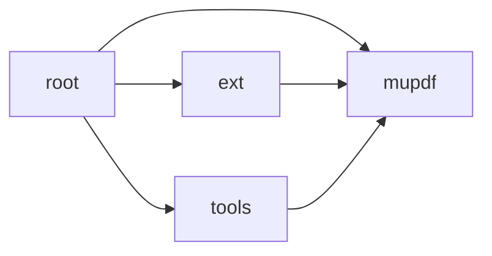

# Overview

The `sumatrapdf` repository is a multi-format document reader primarily focused on PDF, EPUB, MOBI, CBZ, CBR, FB2, CHM, XPS, and DjVu files. The repository is governed by the GNU General Public License version 3 (AGPLv3) and some components under the BSD license.

# Architecture

The architecture of the `sumatrapdf` repository consists of several modules, each with a specific purpose. The main modules are `docs`, `root`, `ext`, `mupdf`, and `tools`.

# Data Flow / Execution Flow

1. The user interacts with the `root` module, which serves as the main entry point for the SumatraPDF application.
2. The `root` module uses the `mupdf` module to render PDF documents and other supported formats.
3. The `mupdf` module interacts with the `ext` module to handle specific file types, such as HEIF files, through the libheif library.
4. The `tools` module manages various tools and applications used within the project, such as `logview-web`, `logview`, and `pdfjs`.

# Configuration & Dependencies

Configuration files are located in the `configs` array of the module map snapshot. These files include `.vscode/settings.json`, `ext/harfbuzz/.circleci/config.yml`, `mupdf/platform/wasm/tsconfig.json`, `tools/logview-web/jsconfig.json`, and `tools/logview/frontend/jsconfig.json`.

Dependencies are managed using various methods, such as CMakeLists.txt files, setup.py, pyproject.toml, and package.json files.

# How to Run / Key Scripts