# Overview

"kind": "entrypoint",
      "importance": 9.0
    },
    {
      "path": "packages/svelte/src/animate/index.js",
      "kind": "module",
      "importance": 8.0
    },
    {
      "path": "packages/svelte/src/attachments/index.js",
      "kind": "module",
      "importance": 8.0
    },
    {
      "path": "packages/svelte/src/compiler/index.js",
      "kind": "module",
      "importance": 8.0
    },
    {
      "path": "packages/svelte/src/compiler/migrate/index.js",
      "kind": "module",
      "importance": 8.0
    },
    {
      "path": "packages/svelte/src/compiler/phases/1-parse/index.js",
      "kind": "module",
      "importance": 8.0
    },
    {
      "path": "packages/svelte/src/compiler/phases/2-analyze/index.js",
      "kind": "module",
      "importance": 8.0
    },
    {
      "path": "packages/svelte/src/compiler/phases/2-analyze/visitors/shared/a11y/index.js",
      "kind": "module",
      "importance": 8.0
    },
    {
      "path": "packages/svelte/src/compiler/phases/3-transform/client/transform-template/index.js",
      "kind": "module",
      "importance": 8.0
    },
    {
      "path": "packages/svelte/src/compiler/phases/3-transform/css/index.js",
      "kind": "module",
      "importance": 8.0
    },
    {
      "path": "packages/svelte/src/compiler/phases/3-transform/index.js",
      "kind": "

## Architecture

kind": "entrypoint",
      "importance": 9.0
    },
    {
      "path": "packages/svelte/src/animate/index.js",
      "kind": "module",
      "importance": 8.0
    },
    {
      "path": "packages/svelte/src/attachments/index.js",
      "kind": "module",
      "importance": 8.0
    },
    {
      "path": "packages/svelte/src/compiler/index.js",
      "kind": "module",
      "importance": 8.0
    },
    {
      "path": "packages/svelte/src/compiler/migrate/index.js",
      "kind": "module",
      "importance": 8.0
    },
    {
      "path": "packages/svelte/src/compiler/phases/1-parse/index.js",
      "kind": "module",
      "importance": 8.0
    },
    {
      "path": "packages/svelte/src/compiler/phases/2-analyze/index.js",
      "kind": "module",
      "importance": 8.0
    },
    {
      "path": "packages/svelte/src/compiler/phases/2-analyze/visitors/shared/a11y/index.js",
      "kind": "module",
      "importance": 8.0
    },
    {
      "path": "packages/svelte/src/compiler/phases/3-transform/client/transform-template/index.js",
      "kind": "module",
      "importance": 8.0
    },
    {
      "path": "packages/svelte/src/compiler/phases/3-transform/css/index.js",
      "kind": "module",
      "importance": 8.0
    },
    {
      "path": "packages/svelte/src/compiler/phases/3-transform/index.js",
      "kind": "module

### Architecture Graph

```mermaid

flowchart TD
  community_01[packages/svelte\npackages/svelte/tests/runtime-browser/custom-elements-samples/$$props/_config.js, packages/svelte/tests/runtime-browser/custom-elements-samples/$$props/main.svelte]
  community_02[packages/svelte\npackages/svelte/src/compiler/migrate/index.js, packages/svelte/src/compiler/phases/3-transform/css/index.js]
  community_03[packages/svelte\npackages/svelte/tests/runtime-legacy/samples/key-block-transition-global/_config.js, packages/svelte/tests/runtime-legacy/samples/key-block-transition-global/main.svelte]
  community_04[documentation/docs\ndocumentation/docs/index.md, documentation/docs/98-reference/30-runtime-errors.md]
  community_05[documentation/docs/02-runes\ndocumentation/docs/02-runes/01-what-are-runes.md, documentation/docs/02-runes/02-$state.md]
  community_06[README.md\nREADME.md, package.json]
  community_07[documentation/docs/01-introduction\ndocumentation/docs/01-introduction/01-overview.md, documentation/docs/01-introduction/02-getting-started.md]
  community_08[packages/svelte/tests\npackages/svelte/tests/runtime-legacy/samples/reactive-values-text-node/_config.js, packages/svelte/tests/runtime-legacy/samples/reactive-values-text-node/main.svelte]

```

## Data Flow / Execution Flow

"kind": "entrypoint",
      "importance": 9.0
    },
    {
      "path": "packages/svelte/src/animate/index.js",
      "kind": "module",
      "importance": 8.0
    },
    {
      "path": "packages/svelte/src/attachments/index.js",
      "kind": "module",
      "importance": 8.0
    },
    {
      "path": "packages/svelte/src/compiler/index.js",
      "kind": "module",
      "importance": 8.0
    },
    {
      "path": "packages/svelte/src/compiler/migrate/index.js",
      "kind": "module",
      "importance": 8.0
    },
    {
      "path": "packages/svelte/src/compiler/phases/1-parse/index.js",
      "kind": "module",
      "importance": 8.0
    },
    {
      "path": "packages/svelte/src/compiler/phases/2-analyze/index.js",
      "kind": "module",
      "importance": 8.0
    },
    {
      "path": "packages/svelte/src/compiler/phases/2-analyze/visitors/shared/a11y/index.js",
      "kind": "module",
      "importance": 8.0
    },
    {
      "path": "packages/svelte/src/compiler/phases/3-transform/client/transform-template/index.js",
      "kind": "module",
      "importance": 8.0
    },
    {
      "path": "packages/svelte/src/compiler/phases/3-transform/css/index.js",
      "kind": "module",
      "importance": 8.0
    },
    {
      "path": "packages/svelte/src/compiler/phases/3-transform/index.js",
      "kind":

## Configuration & Dependencies

kind": "entrypoint",
      "importance": 9.0
    },
    {
      "path": "packages/svelte/src/animate/index.js",
      "kind": "module",
      "importance": 8.0
    },
    {
      "path": "packages/svelte/src/attachments/index.js",
      "kind": "module",
      "importance": 8.0
    },
    {
      "path": "packages/svelte/src/compiler/index.js",
      "kind": "module",
      "importance": 8.0
    },
    {
      "path": "packages/svelte/src/compiler/migrate/index.js",
      "kind": "module",
      "importance": 8.0
    },
    {
      "path": "packages/svelte/src/compiler/phases/1-parse/index.js",
      "kind": "module",
      "importance": 8.0
    },
    {
      "path": "packages/svelte/src/compiler/phases/2-analyze/index.js",
      "kind": "module",
      "importance": 8.0
    },
    {
      "path": "packages/svelte/src/compiler/phases/2-analyze/visitors/shared/a11y/index.js",
      "kind": "module",
      "importance": 8.0
    },
    {
      "path": "packages/svelte/src/compiler/phases/3-transform/client/transform-template/index.js",
      "kind": "module",
      "importance": 8.0
    },
    {
      "path": "packages/svelte/src/compiler/phases/3-transform/css/index.js",
      "kind": "module",
      "importance": 8.0
    },
    {
      "path": "packages/svelte/src/compiler/phases/3-transform/index.js",
      "kind": "module

## How to Run / Key Scripts

"kind": "entrypoint",
      "importance": 9.0
    },
    {
      "path": "packages/svelte/src/animate/index.js",
      "kind": "module",
      "importance": 8.0
    },
    {
      "path": "packages/svelte/src/attachments/index.js",
      "kind": "module",
      "importance": 8.0
    },
    {
      "path": "packages/svelte/src/compiler/index.js",
      "kind": "module",
      "importance": 8.0
    },
    {
      "path": "packages/svelte/src/compiler/migrate/index.js",
      "kind": "module",
      "importance": 8.0
    },
    {
      "path": "packages/svelte/src/compiler/phases/1-parse/index.js",
      "kind": "module",
      "importance": 8.0
    },
    {
      "path": "packages/svelte/src/compiler/phases/2-analyze/index.js",
      "kind": "module",
      "importance": 8.0
    },
    {
      "path": "packages/svelte/src/compiler/phases/2-analyze/visitors/shared/a11y/index.js",
      "kind": "module",
      "importance": 8.0
    },
    {
      "path": "packages/svelte/src/compiler/phases/3-transform/client/transform-template/index.js",
      "kind": "module",
      "importance": 8.0
    },
    {
      "path": "packages/svelte/src/compiler/phases/3-transform/css/index.js",
      "kind": "module",
      "importance": 8.0
    },
    {
      "path": "packages/svelte/src/compiler/phases/3-transform/index.js",
      "kind

## Notable Design Choices / Extension Points

",
      "kind": "entrypoint",
      "importance": 9.0
    },
    {
      "path": "packages/svelte/src/animate/index.js",
      "kind": "module",
      "importance": 8.0
    },
    {
      "path": "packages/svelte/src/attachments/index.js",
      "kind": "module",
      "importance": 8.0
    },
    {
      "path": "packages/svelte/src/compiler/index.js",
      "kind": "module",
      "importance": 8.0
    },
    {
      "path": "packages/svelte/src/compiler/migrate/index.js",
      "kind": "module",
      "importance": 8.0
    },
    {
      "path": "packages/svelte/src/compiler/phases/1-parse/index.js",
      "kind": "module",
      "importance": 8.0
    },
    {
      "path": "packages/svelte/src/compiler/phases/2-analyze/index.js",
      "kind": "module",
      "importance": 8.0
    },
    {
      "path": "packages/svelte/src/compiler/phases/2-analyze/visitors/shared/a11y/index.js",
      "kind": "module",
      "importance": 8.0
    },
    {
      "path": "packages/svelte/src/compiler/phases/3-transform/client/transform-template/index.js",
      "kind": "module",
      "importance": 8.0
    },
    {
      "path": "packages/svelte/src/compiler/phases/3-transform/css/index.js",
      "kind": "module",
      "importance": 8.0
    },
    {
      "path": "packages/svelte/src/compiler/phases/3-transform/index.js",
      "