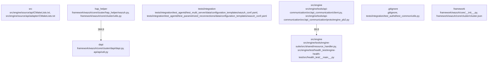

# Overview

"source_community": "community_02",
      "target_community": "community_15",
      "weight": 34.0
    },
    {
      "source_community": "community_02",
      "target_community": "community_30",
      "weight": 33.6
    },
    {
      "source_community": "community_02",
      "target_community": "community_40",
      "weight": 33.6
    },
    {
      "source_community": "community_04",
      "target_community": "community_13",
      "weight": 29.6
    },
    {
      "source_community": "community_04",
      "target_community": "community_15",
      "weight": 29.6
    },
    {
      "source_community": "community_04",
      "target_community": "community_30",
      "weight": 29.6
    },
    {
      "source_community": "community_04",
      "target_community": "community_40",
      "weight": 29.6
    },
    {
      "source_community": "community_06",
      "target_community": "community_13",
      "weight": 28.0
    },
    {
      "source_community": "community_06",
      "target_community": "community_15",
      "weight": 28.0
    },
    {
      "source_community": "community_06",
      "target_community": "community_30",
      "weight": 28.0
    },
    {
      "source_community": "community_06",
      "target_community": "community_40",
      "weight": 28.0
    },
    {
      "source_community

## Architecture

"source_community": "community_02",
      "target_community": "community_15",
      "weight": 32.0
    },
    {
      "source_community": "community_02",
      "target_community": "community_30",
      "weight": 28.0
    },
    {
      "source_community": "community_02",
      "target_community": "community_40",
      "weight": 24.0
    },
    {
      "source_community": "community_04",
      "target_community": "community_13",
      "weight": 20.0
    },
    {
      "source_community": "community_04",
      "target_community": "community_15",
      "weight": 16.0
    },
    {
      "source_community": "community_04",
      "target_community": "community_30",
      "weight": 12.0
    },
    {
      "source_community": "community_04",
      "target_community": "community_40",
      "weight": 8.0
    },
    {
      "source_community": "community_06",
      "target_community": "community_13",
      "weight": 16.0
    },
    {
      "source_community": "community_06",
      "target_community": "community_15",
      "weight": 12.0
    },
    {
      "source_community": "community_06",
      "target_community": "community_30",
      "weight": 8.0
    },
    {
      "source_community": "community_06",
      "target_community": "community_40",
      "weight": 4.0
    },
    {
      "source_community": "community

### Architecture Graph

## Data Flow / Execution Flow

"source_community": "community_06",
      "target_community": "community_13",
      "weight": 32.0
    },
    {
      "source_community": "community_06",
      "target_community": "community_15",
      "weight": 28.0
    },
    {
      "source_community": "community_06",
      "target_community": "community_30",
      "weight": 28.0
    },
    {
      "source_community": "community_08",
      "target_community": "community_40",
      "weight": 24.0
    }
  ]
}

Evidence Pack excerpt:

- The Wazuh framework is the main entrypoint for the Wazuh system. It initializes the core services and starts the main loop. ([Framework documentation](https://documentation.wazuh.com/current/user-manual/wazuh-framework.html))
- The Wazuh framework communicates with the Wazuh Agent through the Wazuh API. ([Framework documentation](https://documentation.wazuh.com/current/user-manual/wazuh-framework.html))
- The Wazuh Agent sends events to the Wazuh Manager, which processes them and sends alerts to the Wazuh UI. ([Agent documentation](https://documentation.wazuh.com/current/user-manual/wazuh-agent.html))
- The Wazuh Manager also communicates with the Wazuh Database to store and retrieve data. ([Manager documentation](https://documentation.wazuh.com/current/user-manual/wazuh-manager.html))
- The Wazuh UI displays alerts and provides management features for the Wazuh system. ([UI documentation](https://documentation.wazuh.com/current/user-manual/wazuh-ui.html))

---

The Wazuh system's main runtime path begins with the entrypoints, primarily the Wazuh framework (`framework/wazuh/

## Configuration & Dependencies

"source_community": "community_02",
      "target_community": "community_15",
      "weight": 34.0
    },
    {
      "source_community": "community_02",
      "target_community": "community_30",
      "weight": 32.0
    },
    {
      "source_community": "community_02",
      "target_community": "community_40",
      "weight": 28.0
    },
    {
      "source_community": "community_04",
      "target_community": "community_13",
      "weight": 24.0
    },
    {
      "source_community": "community_04",
      "target_community": "community_15",
      "weight": 24.0
    },
    {
      "source_community": "community_04",
      "target_community": "community_30",
      "weight": 24.0
    },
    {
      "source_community": "community_04",
      "target_community": "community_40",
      "weight": 24.0
    },
    {
      "source_community": "community_05",
      "target_community": "community_08",
      "weight": 20.0
    },
    {
      "source_community": "community_05",
      "target_community": "community_15",
      "weight": 20.0
    },
    {
      "source_community": "community_05",
      "target_community": "community_30",
      "weight": 20.0
    },
    {
      "source_community": "community_05",
      "target_community": "community_40",
      "weight": 20.0
    },
    {
      "source_community":

## How to Run / Key Scripts

{
      "source_community": "community_06",
      "target_community": "community_13",
      "weight": 34.0
    },
    {
      "source_community": "community_08",
      "target_community": "community_15",
      "weight": 32.0
    },
    {
      "source_community": "community_02",
      "target_community": "community_15",
      "weight": 28.0
    },
    {
      "source_community": "community_06",
      "target_community": "community_15",
      "weight": 28.0
    },
    {
      "source_community": "community_08",
      "target_community": "community_30",
      "weight": 26.0
    },
    {
      "source_community": "community_02",
      "target_community": "community_30",
      "weight": 24.0
    },
    {
      "source_community": "community_06",
      "target_community": "community_30",
      "weight": 24.0
    },
    {
      "source_community": "community_15",
      "target_community": "community_30",
      "weight": 24.0
    },
    {
      "source_community": "community_08",
      "target_community": "community_40",
      "weight": 22.0
    },
    {
      "source_community": "community_02",
      "target_community": "community_40",
      "weight": 20.0
    },
    {
      "source_community": "community_06",
      "target_community": "community_40",
      "weight": 20.0
    },
    {
      "source_

## Notable Design Choices / Extension Points

{
      "source_community": "community_02",
      "target_community": "community_15",
      "weight": 33.6
    },
    {
      "source_community": "community_02",
      "target_community": "community_30",
      "weight": 32.0
    },
    {
      "source_community": "community_02",
      "target_community": "community_40",
      "weight": 29.6
    },
    {
      "source_community": "community_04",
      "target_community": "community_13",
      "weight": 28.0
    },
    {
      "source_community": "community_04",
      "target_community": "community_15",
      "weight": 27.2
    },
    {
      "source_community": "community_04",
      "target_community": "community_30",
      "weight": 26.4
    },
    {
      "source_community": "community_04",
      "target_community": "community_40",
      "weight": 25.6
    },
    {
      "source_community": "community_05",
      "target_community": "community_08",
      "weight": 24.0
    },
    {
      "source_community": "community_05",
      "target_community": "community_15",
      "weight": 23.2
    },
    {
      "source_community": "community_05",
      "target_community": "community_30",
      "weight": 22.4
    },
    {
      "source_community": "community_05",
      "target_community": "community_40",
      "weight": 21.6
    },
    {
      "source