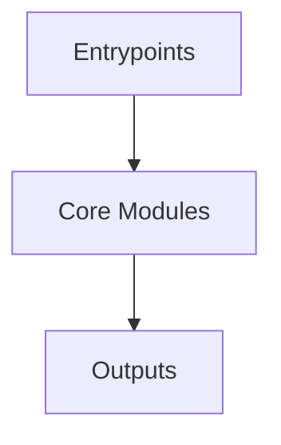

# Overview
Repository `x64dbg` appears to implement a modular system with 1397 source files at commit `134e7ebb26523757ca9042f2a0925024751f42c7`.

## Architecture
Major components inferred from file/module analysis:
- `docs`: contains information about the last exception that occurred in the debugging process
- `src`: Zydis disassembler library
- `root`: The `root` module of the x64dbg repository is the core of an open-source Windows binary debugger designed for malware analysis and reverse engineering

## Data Flow / Execution Flow
Typical execution path: `Entrypoint -> Core Modules -> Runtime Services -> Output/Side Effects`.
Entrypoints initialize core modules, which orchestrate processing and emit outputs or side effects.

## Configuration & Dependencies
- Build/dependency files: CMakeLists.txt, docs/requirements.txt, src/cross/CMakeLists.txt, src/cross/minidump/CMakeLists.txt, src/cross/remote_server/pyproject.toml, src/cross/widgets/CMakeLists.txt, src/gui/Src/ThirdPartyLibs/md4c/CMakeLists.txt, src/test/avx512/CMakeLists.txt, src/test/cmdline/CMakeLists.txt, src/test/random_dll/CMakeLists.txt, src/zydis_wrapper/CMakeLists.txt
- Config files: CMakeSettings.json

## How to Run / Key Scripts
- Detected entrypoints: src/cross/remote_server/main.py
- Use repository build scripts/package manager tasks based on detected build files.

## Notable Design Choices / Extension Points
- The codebase is organized in modules that can be extended by adding new feature files under existing module boundaries.
- Extension is likely centered around entrypoint wiring, configuration files, and module-specific implementations.
