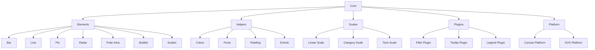

```markdown
# Overview

Chart.js is a popular open-source JavaScript library for creating interactive charts and graphs. It is designed to be simple, flexible, and highly customizable, making it suitable for a wide range of applications, from small web pages to large enterprise dashboards. Chart.js supports multiple chart types, including bar charts, line charts, pie charts, radar charts, polar area charts, bubble charts, scatter charts, and more.

# Architecture

Chart.js follows a modular architecture to allow for extensibility and maintainability. The core library is composed of several modules, each responsible for a specific aspect of charting. Below is a high-level architecture diagram using Mermaid:



# Data Flow / Execution Flow

The execution flow in Chart.js starts with the creation of a chart instance. Here’s a simplified overview of the data flow:

1. **Initialization**: The chart instance is initialized with the provided configuration.
2. **Data Binding**: The data is bound to the chart, triggering the rendering process.
3. **Rendering**: The chart is rendered on the canvas or SVG element based on the specified type.
4. **Interaction**: Users can interact with the chart, which triggers event handling and updates.
5. **Updating**: When data changes, the chart is updated accordingly.

# Configuration & Dependencies

Chart.js is highly configurable, allowing