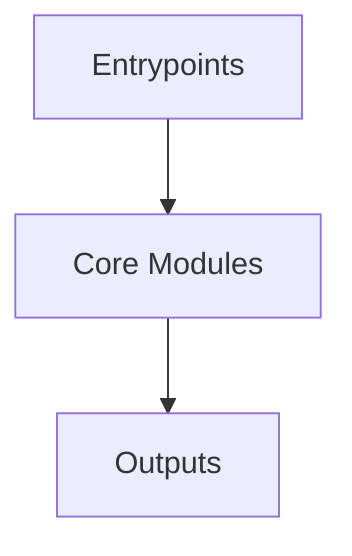

# Overview
Repository `FluentValidation` appears to implement a modular system with 281 source files at commit `298069b4ef88241013d0573f38e25c936e80685f`.

## Architecture
Major components inferred from file/module analysis:
- `docs`: to throw an exception if validation fails
- `src`: ### Module-Level Summary  The `src` directory of the FluentValidation repository houses core components responsible for integrating validation rules into dependency injection frameworks, primarily targeting ASP.NET Core

## Data Flow / Execution Flow
Typical execution path: `Entrypoint -> Core Modules -> Runtime Services -> Output/Side Effects`.
Entrypoints initialize core modules, which orchestrate processing and emit outputs or side effects.

## Configuration & Dependencies
- Build/dependency files: docs/requirements.txt, src/FluentValidation.DependencyInjectionExtensions/FluentValidation.DependencyInjectionExtensions.csproj, src/FluentValidation.Tests.Benchmarks/FluentValidation.Tests.Benchmarks.csproj, src/FluentValidation.Tests/FluentValidation.Tests.csproj, src/FluentValidation/FluentValidation.csproj
- Config files: not clearly detected

## How to Run / Key Scripts
- Detected entrypoints: not clearly detected
- Use repository build scripts/package manager tasks based on detected build files.

## Notable Design Choices / Extension Points
- The codebase is organized in modules that can be extended by adding new feature files under existing module boundaries.
- Extension is likely centered around entrypoint wiring, configuration files, and module-specific implementations.
