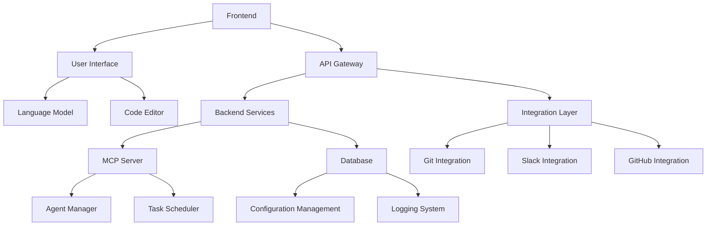

# Overview

OpenHands is an AI-driven platform for software development agents. It enables developers to perform various tasks such as modifying code, running commands, browsing the web, calling APIs, and copying code snippets from StackOverflow. The platform supports both cloud and local deployments, making it accessible to developers worldwide.

# Architecture

The OpenHands architecture consists of several interconnected modules, including the frontend, backend, and integrations. Below is a high-level overview of the architecture using a Mermaid diagram:



# Data Flow / Execution Flow

The data flow in OpenHands follows a typical client-server architecture. Users interact with the frontend via a web interface, which communicates with the backend through an API gateway. The backend processes requests, interacts with the language model for code generation and analysis, and manages database operations. Integrations with external systems like Git, Slack, and GitHub are handled through the integration layer, which facilitates communication between the backend and these systems.

# Configuration & Dependencies

OpenHands relies on several configuration files and dependencies to function properly. Key configuration files include:

- `config.template.toml`: Central configuration for the MCP server.
- `.vscode/settings.json`: VSCode-specific settings.
- `dev_config/python/mypy.ini`: MyPy configuration for static type checking.
- `dev_config/python/ruff.toml`: Ruff configuration for code linting.
- `dev_config/python/.pre-commit-config.yaml`: Pre-commit hooks configuration.

Dependencies are managed using `pyproject.toml` and `enterprise/pyproject.toml`. These files specify project metadata, dependencies, and build configurations, ensuring that the project is set up correctly for development and production environments.

# How to Run / Key Scripts

To run OpenHands locally, follow these steps:

1. **Clone the Repository:**
   ```bash
   git clone https://github.com/All-Hands-AI/OpenHands.git
   cd OpenHands
   ```

2. **Set Up Virtual Environment:**
   ```bash
   python -m venv venv
   source venv/bin/activate  # On Windows use `venv\Scripts\activate`
   ```

3. **Install Dependencies:**
   ```bash
   pip install -r requirements.txt
   ```

4. **Run the Backend:**
   ```bash
   python openhands/server/__main__.py
   ```

5. **Run the Frontend:**
   ```bash
   cd frontend
   npm install
   npm start
   ```

Key scripts for development and testing include:

- `run_tests.sh`: Runs unit tests using pytest.
- `lint_code.sh`: Lints the code using Ruff.
- `format_code.sh`: Formats the code using Black.

# Notable Design Choices / Extension Points

OpenHands incorporates several notable design choices and extension points:

1. **Modular Architecture:** The platform is designed as a collection of loosely coupled modules, allowing for easy expansion and customization.
2. **Language Model Integration:** OpenHands leverages advanced language models for code generation and analysis, providing a powerful toolset for developers.
3. **Extensible Integrations