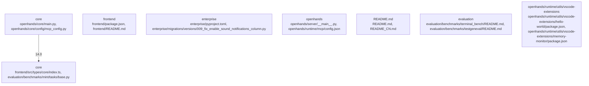

# Overview

purposes. This subsystem encompasses server-side logic, client integrations, and utility scripts.

**Internal Structure:** 
- **Server-Side Logic:** Managed by `__main__.py` and `app.py`, which handle routing, request processing, and response generation.
- **Client Integrations:** Includes `vscode` integration, which facilitates interaction with Visual Studio Code through extensions and APIs.
- **Utility Scripts:** Various scripts located in `runtime/utils` and `integrations/vscode/src/test/suite`, aiding in development and testing.

**Dependencies:** 
- **Python Libraries:** Utilizes libraries such as Flask, Pydantic, and SQLAlchemy for web development and data handling.
- **External Tools:** May require external tools like Docker for containerization.

**Runtime Role:** The `openhands` repository serves as a central hub for all components, enabling seamless interaction between the server and client sides. It supports educational use cases by providing a flexible and extensible platform.

**Extension Points:** 
- **Server-Side Logic:** Customizable routes and handlers can be added to extend functionality.
- **Client Integrations:** Additional integrations can be developed and integrated into the VSCode extension.
- **Utility Scripts:** New scripts can be created to automate repetitive tasks or enhance testing capabilities.

This subsystem is crucial for the overall success of the OpenHands project, offering a versatile platform for hands-on learning and collaboration.

## community_05
**Subsystem Summary: README Files**

The README files (`README.md`, `README_CN.md`, `README_JA.md`) serve as the primary documentation for the OpenHands project. They provide an overview of the project, its features, and how to contribute. These files are essential for onboarding new contributors and understanding the project's scope and goals.

**Internal Structure:** 
- **Content Organization:** Each README file contains sections such as Introduction, Installation, Usage, Contributing, and License.
- **Localization:** Multiple versions (English, Chinese, Japanese) ensure broad accessibility.

**Dependencies:** 
- **Markdown Syntax:** Uses standard Markdown syntax for formatting text.
- **Project Metadata:** Includes links to other documentation, issue trackers, and repositories.

**Runtime Role:** The README files are static documents that do not change at runtime. They provide consistent information about the project, ensuring that all stakeholders have access to accurate and up-to-date details.

**Extension Points:** 
- **New Languages:** Additional README files can be created for new languages.
- **Sections:** Existing sections can be expanded or modified to include

## Architecture

for developers and learners alike. This subsystem encompasses the server-side logic, client integrations, and utility scripts required to run the platform effectively.

**Internal Structure:** 
- **Server-Side Logic:** Managed by `__main__.py` and `app.py`, which handle routing, request processing, and response generation.
- **Client Integrations:** Includes `vscode` integration, which allows for seamless interaction with Visual Studio Code.
- **Utility Scripts:** Various scripts located in `runtime/utils` and `integrations/vscode/src/test/suite` directories, facilitating testing and development.

**Dependencies:** 
- **Python Libraries:** Utilizes libraries such as Flask, SQLAlchemy, and Pydantic for web development and data modeling.
- **External Tools:** Requires Node.js for certain client-side operations.

**Runtime Role:** The `openhands` repository serves as the foundation for running the platform, ensuring that all components are correctly initialized and interact with each other seamlessly.

**Extension Points:** 
- **Server-Side Logic:** Allows for custom routes and middleware.
- **Client Integrations:** Supports adding new integrations with other tools.
- **Utility Scripts:** Enables the addition of new test cases and automation scripts.

This subsystem is crucial for the overall functionality of the OpenHands platform, providing a solid base for further development and expansion.

## community_05
**Subsystem Summary: README Files**

The README files serve as essential documentation for the project, providing information about the project's purpose, setup instructions, and usage guidelines. They are maintained in various languages (English, Chinese, Japanese) and are referenced throughout the project for quick reference and collaboration.

**Internal Structure:** 
- **Language-Specific READMEs:** Each language has its own README file (`README.md`, `README_CN.md`, `README_JA.md`).
- **Project Metadata:** Contains details about the project, such as version numbers, license information, and contact details.

**Dependencies:** 
- **Markdown Parser:** Uses a markdown parser to render the README files.
- **Version Control System:** Integrated with Git for version control and collaboration.

**Runtime Role:** README files are accessed frequently during development and maintenance phases, providing quick access to important project information.

**Extension Points:** 
- **New Languages:** Adding support for new languages by creating new README files.
- **Additional Information:** Including supplementary information in existing README files.

These files are vital for maintaining clarity and accessibility within the project, ensuring that everyone involved understands the project's goals and requirements.

## community_0

### Architecture Graph

## Data Flow / Execution Flow

technologies to enhance educational outcomes. This subsystem encompasses the server-side logic, client-side interfaces, and integration points with external services.

**Internal Structure:** 
- **Server-Side Logic:** Managed by `__main__.py` and `app.py`, which handle routing, request processing, and response generation.
- **Client-Side Interfaces:** Defined in `frontend` and `openhands-ui`, which provide the user-facing components.
- **Integration Points:** Includes `integrations/vscode`, which facilitates integration with Visual Studio Code.

**Dependencies:** 
- **External Libraries:** Utilizes libraries such as Flask for web development, React for front-end UI, and PyTorch for machine learning models.
- **Internal Modules:** Interacts with `runtime`, `core`, and `integrations` modules to provide comprehensive functionality.

**Runtime Role:** The `openhands` repository serves as a unified platform for developers and learners, offering a range of tools and resources to support hands-on projects and experiments.

**Extension Points:** 
- **Server-Side Logic:** Allows for custom routes and middleware.
- **Client-Side Interfaces:** Enables the addition of new components and features.
- **Integration Points:** Facilitates the integration of new tools and services.

This subsystem is crucial for the overall success of the OpenHands project, providing a versatile and extensible platform for various use cases.

## community_05
**Subsystem Summary: README Files**

The README files serve as essential documentation for the OpenHands project, providing information about the project's purpose, setup instructions, and usage guidelines. They are maintained in multiple languages (`README.md`, `README_CN.md`, `README_JA.md`) and are accessible through the root directory of the repository. The README files are also referenced in the `CONTRIBUTING.md` document, ensuring that all contributors have access to important information.

**Internal Structure:** 
- **Main README:** Contains general information about the project, including its purpose, setup instructions, and usage guidelines.
- **Language-Specific READMEs:** Provide localized versions of the README for different regions and languages.
- **CONTRIBUTING.md:** Details the process for contributing to the project, including code style guidelines, issue reporting, and pull request procedures.

**Dependencies:** 
- **Markdown Rendering:** The README files are rendered using Markdown syntax.
- **Version Control System:** Integrated into the version control system (e.g., Git) to track changes and maintain history.

**Runtime Role:** The README files are accessed frequently during the development

## Configuration & Dependencies

educational purposes. This subsystem encompasses server-side logic, integrations, and runtime utilities.

**Internal Structure:** 
- **Server-Side Logic:** Managed by `__main__.py` and `app.py`, which handle incoming requests, process data, and interact with other subsystems.
- **Integrations:** Various integrations are available, including VSCode integration (`openhands.integrations.vscode`) and runtime utilities (`openhands.runtime.utils`).
- **Documentation:** Comprehensive documentation is maintained in `README.md` and other README files within the repository.

**Dependencies:** 
- **Python Libraries:** The project uses Python packages such as Flask, SQLAlchemy, and PyTorch for server-side operations.
- **VSCode Integration:** Relies on VSCode-specific APIs and extensions.
- **Runtime Utilities:** Depends on external libraries like `psutil` for monitoring system resources.

**Runtime Role:** The `openhands` repository serves as a central hub for integrating various tools and resources, providing a unified platform for hands-on learning. It handles server-side logic, manages integrations, and provides utility functions for runtime operations.

**Extension Points:** 
- **Server-Side Logic:** Allows for custom routes and handlers to extend server functionality.
- **Integrations:** Supports adding new integrations by creating new modules within the `integrations` directory.
- **Runtime Utilities:** Offers hooks for extending runtime capabilities, such as monitoring and resource management.

This subsystem is crucial for the overall functionality of the OpenHands platform, enabling it to integrate diverse tools and resources for educational purposes.

## community_05
**Subsystem Summary: README Files**

The README files serve as essential documentation for the OpenHands repository, providing information about the project, its usage, and contributing guidelines. They are located at various paths throughout the repository, including `README.md`, `README_CN.md`, and `README_JA.md`. These files are crucial for onboarding new contributors and users, ensuring they understand how to use and contribute to the project.

**Internal Structure:** Each README file contains sections such as:
- **Project Overview:** A brief description of the project and its goals.
- **Getting Started:** Instructions on how to set up the development environment.
- **Usage:** Information on how to use the project and its features.
- **Contributing:** Guidelines for contributing to the project, including code style, testing, and issue reporting.

**Dependencies:** 
- **Markdown Formatting:** The README files are written in Markdown format, requiring a markdown processor for rendering.
-

## How to Run / Key Scripts

various tools and technologies to enhance the learning process. This subsystem encompasses the server-side logic, client-side interfaces, and integration points with external tools.

**Internal Structure:** 
- **Server-Side Logic:** Managed by `__main__.py` and `app.py`, which handle routing, request processing, and response generation.
- **Client-Side Interfaces:** Defined in `frontend` and `openhands-ui`, which provide the user interface for interacting with the platform.
- **Integration Points:** Includes `integrations/vscode`, which integrates with Visual Studio Code for enhanced development capabilities.

**Dependencies:** 
- **External Libraries:** Utilizes libraries such as Flask for web development, React for front-end UI, and PyTorch for machine learning.
- **Internal Modules:** Interacts with `runtime`, `core`, and `integrations` modules to provide comprehensive functionality.

**Runtime Role:** The `openhands` repository serves as a unified platform for developers and learners, offering a seamless experience across different tools and technologies. It facilitates collaboration, experimentation, and learning through integrated tools and resources.

**Extension Points:** 
- **Server-Side Logic:** Allows for custom routes and middleware to extend server functionality.
- **Client-Side Interfaces:** Enables the addition of new components and pages to enhance the user experience.
- **Integration Points:** Supports the integration of new tools and platforms through modular design.

This summary outlines the key components and roles of the `openhands` repository, highlighting its importance in providing a versatile and collaborative learning environment.

## community_05
**Subsystem Summary: README Files**

The README files serve as essential documentation for the project, providing information about the project's purpose, setup instructions, and usage guidelines. They are maintained in multiple languages (`README.md`, `README_CN.md`, `README_JA.md`) and are crucial for onboarding new contributors and users. The README files also contain links to other important documents and resources, ensuring that users have easy access to all necessary information.

## community_06
**Subsystem Summary: Core Types**

The `types/core` directory contains TypeScript type definitions used throughout the OpenHands project. These types ensure consistency and clarity in code, making it easier to understand and maintain. The directory includes various files such as `index.ts`, `actions.ts`, `base.ts`, and `guards.ts`, each defining specific types and interfaces.

## community_07
**Subsystem Summary: Evaluation Benchmarks**

The evaluation benchmarks submodule focuses on measuring the performance and reliability of the OpenHands system

## Notable Design Choices / Extension Points

tools and technologies to enhance educational outcomes. This subsystem encompasses the server-side logic, client-side interfaces, and integration points with external tools.

**Internal Structure:** 
- **Server-Side Logic:** Managed by `__main__.py` and `app.py`, which handle routing, request processing, and response generation.
- **Client-Side Interfaces:** Defined in `frontend` and `openhands-ui`, which provide the user-facing components.
- **Integration Points:** Includes `integrations/vscode`, which facilitates integration with Visual Studio Code, and `runtime`, which manages runtime environments.

**Dependencies:** 
- **External Libraries:** Utilizes libraries such as Flask for web development, React for front-end UI, and VSCode APIs for integration.
- **Internal Modules:** Interacts with `openhands.server.app`, `openhands.frontend`, and `openhands.runtime`.

**Runtime Role:** The `openhands` repository serves as a unified platform for developers and educators to explore and utilize various tools and technologies. It supports both local and remote development environments, making it accessible for a wide range of users.

**Extension Points:** 
- **Server-Side Logic:** Allows for custom routes and middleware to extend the server's capabilities.
- **Client-Side Interfaces:** Enables the addition of new components or modifications to existing ones to enhance the user experience.
- **Integration Points:** Facilitates the integration of new tools or platforms by extending the existing integration frameworks.

This subsystem is crucial for the overall success of the OpenHands project, providing a flexible and extensible platform for hands-on learning and development.

## community_05
**Subsystem Summary: README Files**

The README files serve as essential documentation for the OpenHands project, providing information about the project's purpose, setup instructions, and usage guidelines. They are maintained in multiple languages (`README.md`, `README_CN.md`, `README_JA.md`) and are referenced in various parts of the repository, ensuring broad accessibility and understanding.

**Internal Structure:** 
- **Main README:** Contains general information about the project, including installation and usage instructions.
- **Language-Specific READMEs:** Provide localized versions of the README for different regions and audiences.

**Dependencies:** 
- **Markdown Formatting:** Uses standard Markdown syntax for formatting text.
- **Version Control:** Integrated into version control systems like Git.

**Runtime Role:** README files are accessed frequently during the development process, serving as a reference point for contributors and users alike. They help ensure that everyone has a clear understanding of how to work with