# Overview

ash-cases/in-memory-session-double-free/index.js` demonstrates basic application setup and session management, highlighting common pitfalls and best practices.

These subsystems collectively form a robust set of tools for developers to test and understand the behavior of Electron applications under various conditions. They serve as both educational resources and practical examples for developing more reliable and efficient Electron applications.

## community_03
The documentation subsystem of Electron is essential for maintaining clarity and accessibility for users and contributors. It includes modules like `extensions-api.md`, `extensions.md`, `ipc-main-service-worker.md`, `service-worker-main.md`, `service-workers.md`, and `structures/extension-info.md`. These documents cover a wide range of topics, from API usage to advanced concepts like extension development and IPC communication. The documentation subsystem ensures that developers have access to comprehensive information about Electron's features and capabilities, facilitating better development and maintenance of Electron applications.

## community_04
The patches subsystem focuses on modifying and extending the Chromium source code to integrate Electron-specific features and improvements. Key components include:

1. **Chromium Patches**: Various patches like `chore_defer_usb_service_getdevices_request_until_usb_service_is.patch`, `custom_protocols_plzserviceworker.patch`, and `feat_configure_launch_options_for_service_process.patch` modify the Chromium source code to enhance Electron's functionality. These patches address specific issues or introduce new features that are relevant to Electron's use case.

2. **Service Worker Enhancements**: Patches such as `feat_enable_passing_exit_code_on_service_process_crash.patch` and `hack_plugin_response_interceptor_to_point_to_electron.patch` focus on improving the performance and reliability of service workers within Electron applications.

3. **Network Service Improvements**: The `network_service_allow_remote_certificate_verification_logic.patch` patch enhances network security by allowing remote certificate verification logic, which is crucial for secure communications in Electron applications.

These patches collectively contribute to making Electron more robust and feature-rich, addressing the needs of both developers and end-users.

## community_05
The README subsystem of Electron is primarily concerned with providing general information and instructions for users and contributors. It includes files like `README.md`, `tsconfig.default_app.json`, `tsconfig.electron.json`, `tsconfig.json`, `tsconfig.script.json`, and `tsconfig.spec.json`. These files serve as the starting point for anyone interacting with the Electron repository, offering guidance on how to get started, configure TypeScript settings, and understand the project structure. The README subsystem ensures that all necessary information

## Architecture

/crash-cases/in-memory-session-double-free/index.js` demonstrates basic application setup and session management, highlighting common pitfalls and best practices.

These subsystems collectively form a robust test suite that helps maintain the reliability and correctness of Electron's core features. They serve as both educational tools and practical examples for developers working with Electron.

## community_03
The documentation subsystem of Electron is essential for maintaining clarity and accessibility for users and developers alike. Key components include:

1. **API Documentation**: Modules like `docs/api/extensions-api.md` provide detailed documentation for Electron's API, including descriptions, usage examples, and parameters. This subsystem ensures that developers have access to comprehensive information about Electron's capabilities.

2. **Glossary**: The glossary (`docs/glossary.md`) defines key terms and concepts related to Electron, helping users understand complex terminology without confusion.

3. **FAQ**: The frequently asked questions section (`docs/faq.md`) addresses common issues and provides solutions, making it easier for users to troubleshoot problems.

4. **Experimental Features**: The experimental features page (`docs/experimental.md`) highlights new features that are still under development, giving users insight into future enhancements.

These components work together to create a well-organized and informative resource center for Electron, enhancing the overall developer experience.

## community_04
The patches subsystem focuses on modifying and extending the Chromium source code to integrate Electron-specific features. Key components include:

1. **Chromium Patches**: Various patches like `patches/chromium/chore_defer_usb_service_getdevices_request_until_usb_service_is.patch` modify the Chromium build system to defer USB device requests until the USB service is available. This ensures smoother integration of USB devices with Electron applications.

2. **Custom Protocols**: Patches such as `patches/chromium/custom_protocols_plzserviceworker.patch` introduce custom protocols for Service Worker support, enabling more advanced web capabilities within Electron applications.

3. **Service Process Configuration**: The `feat_configure_launch_options_for_service_process.patch` patch allows configuring launch options for service processes, improving performance and stability.

4. **Exit Code Handling**: The `feat_enable_passing_exit_code_on_service_process_crash.patch` patch enables passing exit codes on service process crashes, aiding in debugging and error handling.

These patches contribute significantly to the customization and enhancement of Electron's underlying Chromium foundation, ensuring it remains up-to-date with modern web standards and technologies.

## community_05
The README subsystem is primarily concerned with providing general information and instructions about the Electron

### Architecture Graph

```mermaid

flowchart TD
  community_01[shell\nshell/browser/api/electron_api_extensions.cc, shell/browser/api/electron_api_extensions.h]
  community_02[spec\nspec/fixtures/api/app-path/lib/index.js, spec/fixtures/api/electron-main-module/app/index.js]
  community_03[docs\ndocs/api/extensions-api.md, docs/api/extensions.md]
  community_04[patches\npatches/chromium/chore_defer_usb_service_getdevices_request_until_usb_service_is.patch, patches/chromium/custom_protocols_plzserviceworker.patch]
  community_05[README.md\nREADME.md, tsconfig.default_app.json]
  community_06[lib\nlib/browser/api/service-worker-main.ts, lib/browser/api/auto-updater.ts]
  community_07[script\nscript/gen-filenames.ts, script/gen-hunspell-filenames.js]
  community_08[lib\nscript/lib/util.py, script/lib/config.py]

```

## Data Flow / Execution Flow

/fixtures/crash-cases/in-memory-session-double-free/index.js` demonstrates basic application setup, including session management and error handling, which are essential for creating robust Electron applications.

These subsystems collectively form a comprehensive set of tools and examples for developers to test and understand the behavior of Electron's core modules and their interactions.

## community_03
The documentation subsystem of Electron is vital for maintaining clarity and accessibility for users and contributors. It includes modules like `extensions-api.md`, `extensions.md`, `ipc-main-service-worker.md`, and `service-worker-main.md`. These documents serve as references for developers, explaining how to use various features and APIs provided by Electron. The documentation subsystem ensures that developers have access to up-to-date information about Electron's capabilities, making it easier to build and maintain applications using Electron.

## community_04
The patches subsystem is dedicated to managing changes and updates to Electron's underlying Chromium codebase. It includes modules like `chore_defer_usb_service_getdevices_request_until_usb_service_is.patch`, `custom_protocols_plzserviceworker.patch`, and others. These patches address specific issues or enhance certain functionalities within Chromium, which Electron builds upon. By maintaining these patches, Electron ensures compatibility and performance improvements over time.

## community_05
The README subsystem is primarily concerned with providing general information and instructions about the Electron project. It includes files like `README.md`, `tsconfig.default_app.json`, `tsconfig.electron.json`, `tsconfig.json`, `tsconfig.script.json`, and `tsconfig.spec.json`. These files serve as entry points for new contributors and users, offering guidance on setting up the development environment and understanding the project structure.

## community_06
The lib subsystem contains the core implementation of Electron's API. It includes modules like `service-worker-main.ts`, `auto-updater.ts`, `crash-reporter.ts`, `desktop-capturer.ts`, `dialog.ts`, and `exports/electron.ts`. These modules provide the foundational functionality for building Electron applications, enabling developers to interact with the operating system, manage application state, and handle events.

### Data Flow / Execution Flow

Electron's data flow and execution flow begin at the entrypoints defined in the `entrypoints` array of the architecture IR. Entry points are typically JavaScript or TypeScript files located in the `spec/fixtures`, `npm`, and `script/release/notes` directories. These entry points serve as the starting point for executing tests, running scripts, or bootstrapping applications.

For example

## Configuration & Dependencies

rash-cases/in-memory-session-double-free/index.js` demonstrates basic setup and teardown of sessions, ensuring that resources are properly managed during application execution.

These subsystems collectively form a robust test suite for Electron, helping developers ensure that their applications behave as expected under various conditions.

## community_03
The documentation subsystem of Electron is essential for maintaining clarity and accessibility for users and contributors. Key components include:

1. **API Documentation**: Modules like `docs/api/extensions-api.md` and `docs/api/extensions.md` provide detailed documentation on Electron's API, including usage examples and explanations of each function. This subsystem ensures that developers have access to comprehensive information about Electron's capabilities.

2. **FAQ and Troubleshooting**: `docs/faq.md` offers common questions and troubleshooting tips, helping users resolve issues more efficiently. This subsystem enhances the overall user experience by providing quick solutions to frequently encountered problems.

3. **Glossary**: `docs/glossary.md` defines key terms and concepts related to Electron, making the documentation more accessible and understandable. This subsystem helps new users grasp the terminology used throughout the documentation.

4. **Breaking Changes**: `docs/breaking-changes.md` outlines changes that may affect existing codebases, allowing developers to prepare for updates and migrations smoothly. This subsystem ensures that users are aware of potential disruptions and can take appropriate action.

These subsystems work together to maintain high-quality documentation, ensuring that Electron remains accessible and usable for both beginners and experienced developers.

## community_04
The patches subsystem of Electron is dedicated to maintaining compatibility and addressing bugs. Key components include:

1. **Chromium Patches**: Subsystems like `patches/chromium/chore_defer_usb_service_getdevices_request_until_usb_service_is.patch` apply patches to Chromium, the underlying web engine used by Electron. These patches address specific issues or improve performance.

2. **Custom Protocols**: `patches/chromium/custom_protocols_plzserviceworker.patch` introduces custom protocols, enhancing Electron's ability to handle different types of data and services.

3. **Service Process Configurations**: `patches/chromium/feat_configure_launch_options_for_service_process.patch` allows for configuring launch options for service processes, improving control over resource allocation and performance optimization.

4. **Error Handling**: `patches/chromium/feat_enable_passing_exit_code_on_service_process_crash.patch` enables passing exit codes on service process crashes, aiding in debugging and error resolution.

5. **Plugin Response Interception**: `patches/chromium/hack_plugin_response_inter

## How to Run / Key Scripts

**: Demonstrates basic setup and interaction with Electron's core modules, including creating and managing windows, handling events, and interacting with the file system.

These subsystems collectively form a robust set of tools for developers to test and understand the behavior of Electron applications under various conditions.

## community_03
The Electron documentation subsystem is essential for maintaining up-to-date information about the framework's features and usage. Key components include:

1. **API Documentation**: Modules like `docs/api/extensions-api.md` and `docs/api/extensions.md` provide detailed documentation on Electron's API, including how to use extensions and manage service workers. This subsystem ensures that developers have access to comprehensive information about the framework's capabilities.

2. **Glossary and FAQ**: `docs/glossary.md` and `docs/faq.md` offer explanations of technical terms and common questions, making it easier for developers to navigate and understand the framework.

3. **Breaking Changes**: `docs/breaking-changes.md` documents changes that may affect existing applications, helping developers prepare for updates and migrations.

4. **Experimental Features**: `docs/experimental.md` highlights new features that are still in development, providing insights into future enhancements and potential breaking changes.

This subsystem is vital for maintaining a clear and accessible reference guide for Electron developers.

## community_04
The patches subsystem is dedicated to managing external contributions and bug fixes. Key components include:

1. **Chromium Patches**: Various patches like `patches/chromium/chore_defer_usb_service_getdevices_request_until_usb_service_is.patch` address issues in Chromium, which Electron is built upon. These patches ensure compatibility and stability by integrating upstream fixes.

2. **Custom Protocols**: `patches/chromium/custom_protocols_plzserviceworker.patch` introduces custom protocols, enhancing Electron's ability to handle specific types of network requests.

3. **Service Process Configuration**: `patches/chromium/feat_configure_launch_options_for_service_process.patch` allows for configuring launch options for service processes, improving performance and reliability.

4. **Passing Exit Codes**: `patches/chromium/feat_enable_passing_exit_code_on_service_process_crash.patch` enables passing exit codes on service process crashes, aiding in debugging and error handling.

5. **Plugin Response Interception**: `patches/chromium/hack_plugin_response_interceptor_to_point_to_electron.patch` intercepts plugin responses, redirecting them to Electron, ensuring seamless integration.

6. **Network Service Enhancements**: `patches/chromium/network_service_allow_remote_certificate_verification_logic.patch

## Notable Design Choices / Extension Points

Demonstrates basic setup and interaction with Electron's core modules, such as creating a new application instance and accessing its properties.

These subsystems collectively form a robust set of tools for developers to test and understand the behavior of Electron applications under various conditions.

## community_03
The documentation subsystem of Electron is essential for maintaining clarity and accessibility for users and contributors. Key components include:

1. **API Documentation**: Modules like `docs/api/extensions-api.md` provide detailed documentation for Electron's API, including descriptions of functions, parameters, and return values. This documentation is crucial for developers who need to use Electron's features effectively.

2. **FAQ and Troubleshooting**: Sections such as `docs/faq.md` offer common questions and solutions, helping users resolve issues they encounter while using Electron. This subsystem ensures that users have access to the information they need to troubleshoot problems efficiently.

3. **Glossary**: The glossary (`docs/glossary.md`) defines key terms and concepts related to Electron, making it easier for users to understand complex topics without needing additional context.

4. **Breaking Changes**: The `docs/breaking-changes.md` document tracks changes that may affect existing codebases, helping developers prepare for updates and migrations.

These components work together to ensure that Electron remains accessible and understandable to both new and experienced users.

## community_04
The patches subsystem focuses on modifying and extending the Chromium source code to integrate Electron-specific features. Key components include:

1. **Chromium Patches**: Various patches are applied to the Chromium source code to enable Electron-specific functionalities. For example, `patches/chromium/chore_defer_usb_service_getdevices_request_until_usb_service_is.patch` modifies USB device handling logic to better support Electron's needs.

2. **Custom Protocols**: Patches like `patches/chromium/custom_protocols_plzserviceworker.patch` introduce custom protocols that allow Electron applications to handle specific types of requests more efficiently.

3. **Service Process Configuration**: The `feat_configure_launch_options_for_service_process.patch` patch allows Electron to configure launch options for service processes, enhancing performance and reliability.

4. **Error Handling**: Patches such as `feat_enable_passing_exit_code_on_service_process_crash.patch` improve error handling by enabling the passing of exit codes on service process crashes.

These patches collectively enhance the functionality and stability of Electron by integrating necessary modifications into the underlying Chromium codebase.

## community_05
The README subsystem is primarily concerned with providing general information about the Electron project. Key