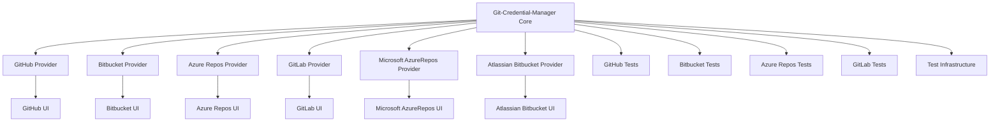

# Overview

Git Credential Manager (GCM) is a secure Git credential helper built on .NET that supports Windows, macOS, and Linux. It provides a consistent and secure authentication experience across major source control hosting services, including Azure DevOps, Azure Repos, Bitbucket, GitHub, and GitLab. GCM replaces the built-in credential helpers provided by Git, offering enhanced security features like multi-factor authentication.

# Architecture

The architecture of GCM is designed to be modular and extensible, allowing for easy integration with different Git hosting platforms. Below is a high-level overview of the architecture using a Mermaid diagram:



### Components

1. **Git-Credential-Manager Core**: The central component that handles the core logic for credential management, including parsing commands and coordinating with other components.
2. **Providers**: Each provider (e.g., GitHub, Bitbucket, Azure Repos) is responsible for handling authentication with its respective hosting service.
3. **UIs**: User interfaces for each provider, providing a graphical representation of the authentication process.
4. **Tests**: Unit and integration tests for the core library and providers.
5. **Test Infrastructure**: Shared infrastructure for running tests.

# Data Flow / Execution Flow

The data flow in GCM follows a typical client-server model, where the client (Git) communicates with the server (Git hosting service) through the credential manager. Here’s a simplified flow:

1. **Client Request**: Git sends a request to the credential manager to retrieve or store credentials.
2. **Credential Manager**: The credential manager checks if the required credentials are already cached. If not, it proceeds to the next step.
3. **Auto-Detection**: The credential manager attempts to auto-detect the hosting service based on the remote URL.
4. **Provider Interaction**: The credential manager interacts with the appropriate provider to fetch or store credentials.
5. **Response**: The provider returns the credentials to the credential manager, which then passes them back to the client.

# Configuration & Dependencies

GCM is highly configurable, allowing users to set various options through configuration files or environment variables. Some common configurations include:

- **Cache Expiry Time**: Duration after which cached credentials expire.
- **Default Authentication Method**: Preferred method for authentication (e.g., OAuth, Token).

Dependencies for GCM include:

- .NET SDK: Required for building and running the project.
- Platform-specific libraries: For example, Windows Credential Manager on Windows and macOS Keychain on macOS.

# How to Run / Key Scripts

To run GCM, follow these steps:

1. **Clone the Repository**:
   ```sh
   git clone https://github.com/git-ecosystem/git-credential-manager.git
   ```

2. **Restore Dependencies**:
   ```sh
   dotnet restore
   ```

3. **Run Tests**:
   ```sh
   dotnet test
   ```

4. **Build the Project**: