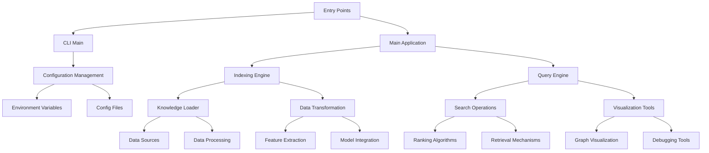

# Overview
The GraphRAG project is a data pipeline and transformation suite designed to extract meaningful, structured data from unstructured text using the power of Large Language Models (LLMs). It leverages a knowledge graph memory structure to enhance LLM outputs, enabling more accurate and contextually relevant responses. This documentation provides a comprehensive overview of the architecture, data flow, configuration, and extension points of the GraphRAG system.

# Architecture
GraphRAG consists of several interconnected modules, each serving a specific function. Below is a high-level architecture diagram using Mermaid:

- **Entry Points**: The application starts from either `graphrag/__main__.py` or `graphrag/cli/main.py`.
- **CLI Main**: Handles command-line interface commands, delegating tasks to the main application.
- **Main Application**: Orchestrates the overall workflow, coordinating between different components.
- **Configuration Management**: Manages configuration settings, including environment variables and config files.
- **Indexing Engine**: Responsible for indexing unstructured text data into a knowledge graph.
- **Query Engine**: Processes queries against the knowledge graph, retrieving and ranking relevant results.
- **Knowledge Loader**: Loads data from various sources into the knowledge graph.
- **Data Transformation**: Transforms raw data into a format suitable for indexing and querying.
- **Search Operations**: Implements algorithms for searching and ranking results based on user queries.
- **Visualization Tools**: Provides tools for visualizing the knowledge graph and debugging query results.
- **Data Sources**: Represents external data sources that provide input for indexing.
- **Data Processing**: Includes steps for cleaning, preprocessing, and enriching data before indexing.
- **Feature Extraction**: Extracts relevant features from text data for indexing.
- **Model Integration**: Integrates LLMs into the indexing and querying processes.
- **Ranking Algorithms**: Defines algorithms for ranking search results based on relevance.
- **Retrieval Mechanisms**: Implements strategies for retrieving data from the knowledge graph.
- **Graph Visualization**: Visualizes the structure of the knowledge graph.
- **Debugging Tools**: Provides tools for diagnosing and resolving issues during development and production.

# Data Flow / Execution Flow
The data flow in GraphRAG follows a typical pipeline pattern, starting from data ingestion and ending with query processing and result retrieval. Here’s a detailed breakdown of the execution flow:

1. **Data Ingestion**: Data is ingested from various sources (e.g., files, databases) and transformed into a format suitable for indexing.
2. **Indexing**: The transformed data is indexed into a knowledge graph, capturing relationships and semantic information.
3. **Query Processing**: User queries are processed against the knowledge graph, utilizing search algorithms to retrieve relevant results.
4. **Result Ranking**: Results are ranked based on their relevance to the query, ensuring the most pertinent information is presented first.
5. **Visualization**: Users can visualize the knowledge graph and query results using provided tools, aiding in understanding and