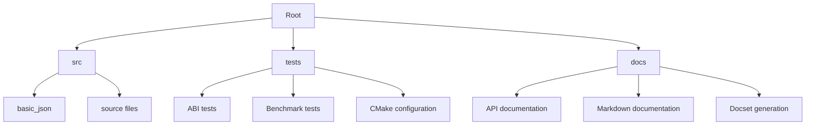

# Overview

The `nlohmann/json` repository is a popular C++ library for parsing, generating, and manipulating JSON data. It provides a versatile `basic_json` class that can represent various JSON data types and offers extensive functionalities for accessing and modifying JSON content. The library is designed to be easy to use and integrates seamlessly with modern C++ practices.

# Architecture

The architecture of the `nlohmann/json` library is centered around the `basic_json` class, which serves as the core container for JSON data. The library is built using CMake for cross-platform support and includes several modules for testing, documentation, and utility functions.

Here is a textual representation of the architecture using Mermaid syntax:



# Data Flow / Execution Flow

The data flow in the `nlohmann/json` library primarily involves parsing JSON data into a `basic_json` object and vice versa. Here’s a high-level overview of the execution flow:

1. **Parsing JSON**:
   - Input JSON data (string or file) is passed to the `basic_json` constructor or static methods like `parse()`.
   - The `basic_json` class parses the input and constructs the corresponding JSON object.

2. **Accessing JSON Data**:
   - Once parsed, JSON data can be accessed using member functions like `at()`, `operator[]`, and others.
   - These functions allow for safe and efficient access to nested JSON structures.

3. **Modifying JSON Data**:
   - JSON objects can be modified using member functions like `push_back()`, `pop_back()`, and others.
   - These modifications can be made directly on the `basic_json` object.

4. **Serializing JSON**:
   - Modified or newly created JSON objects can be serialized back to a string or written to a file using member functions like `dump()`.

# Configuration & Dependencies

The `nlohmann/json` library has minimal external dependencies, primarily relying on the C++ Standard Library. It uses CMake for building and managing the project, which allows for easy integration into various development environments.

Dependencies are managed via `CMakeLists.txt` files, which specify required compiler flags, include directories, and link libraries. For example, the `CMakeLists.txt` in the `src` directory might look something like this:

```cmake
cmake_minimum_required(VERSION 3.10)
project(nlohmann_json)

add_library(nlohmann_json SHARED
    src/basic_json.hpp
    src/adl_serializer.hpp
    # other source files
)

target_include_directories(nlohmann_json PUBLIC ${CMAKE_CURRENT_SOURCE_DIR}/include)
```

# How to Run / Key Scripts

To run the tests and generate documentation, you can use the following commands:

1. **Running Tests**:
   ```sh
   cd json
   mkdir build && cd build
   cmake ..
   make
   ctest
   ```

2. **Generating Documentation**:
   ```sh
   cd json
   git checkout v3.10.2
   make install_venv serve -C docs/mkdocs
   ```

3. **Generating Docset**:
   ```sh
   cd json
   make nlohmann_json.docset
   ```

# Not