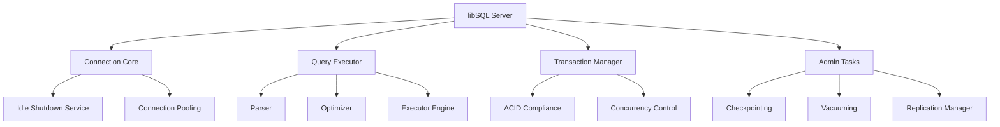

# Overview

libSQL is an embeddable SQL database engine based on SQLite, designed to support replication while maintaining compatibility with the SQLite ecosystem. It offers a batteries-included approach, supporting multiple programming languages including Rust, JavaScript, Python, and Go. The project aims to extend SQLite's capabilities and improve performance, making it suitable for modern applications requiring advanced database features.

# Architecture

libSQL consists of several key modules, each responsible for specific aspects of database functionality. Below is a high-level overview of the architecture using a Mermaid diagram:



- **libSQL Server**: Acts as the central component, coordinating all database operations.
- **Connection Core**: Manages opening and closing connections, handling client requests.
- **Query Executor**: Orchestrates the execution of SQL queries, including parsing, optimization, and execution.
- **Transaction Manager**: Ensures ACID compliance and handles concurrent transactions.
- **Admin Tasks**: Manages administrative functions such as checkpointing, vacuuming, and replication.

# Data Flow / Execution Flow

The data flow within libSQL follows a typical client-server model. Here’s a simplified representation of the execution flow:

1. **Client Request**: A client sends a SQL query to the libSQL server.
2. **Connection Core**: The Connection Core receives the request and establishes a connection if necessary.
3. **Query Executor**: The Query Executor processes the query:
   - **Parser**: Parses the SQL statement into an abstract syntax tree (AST).
   - **Optimizer**: Optimizes the AST for efficient execution.
   - **Executor Engine**: Executes the optimized query against the database.
4. **Result Handling**: The results are returned to the client via the Connection Core.
5. **Transaction Management**: If the query involves transactions, the Transaction Manager ensures ACID compliance.
6. **Admin Tasks**: For administrative commands, the Admin Tasks module handles them accordingly.

# Configuration & Dependencies

libSQL relies on several external libraries and tools for its functionality. The primary dependencies include:

- **SQLite**: The core database engine.
- **Lemon Parser**: For SQL parsing.
- **ZLIB**: For compression.
- **ICU**: For internationalization and Unicode support.

Configuration files are managed using standard formats like `Cargo.toml` for Rust projects and `conan.yml` for dependency management. These files define build settings, dependencies, and other configuration parameters.

# How to Run / Key Scripts

To run libSQL, you can use one of the following methods:

1. **Prebuilt Binary**: Download a prebuilt binary from the official releases page.
2. **Homebrew**: Install using Homebrew with the command:
   ```sh
   brew install tursodatabase/libsql/sqld
   ```
3. **Docker Image**: Use a prebuilt Docker image:
   ```sh
   docker run -it tursodatabase/sqld
   ```
4. **Source Build**: Build from source using Docker/Podman:
   ```sh
   docker-compose up
   ```
5. **Rust Source Build**: Build from source using Rust:
   ```sh
   cargo run
   ```

# Not