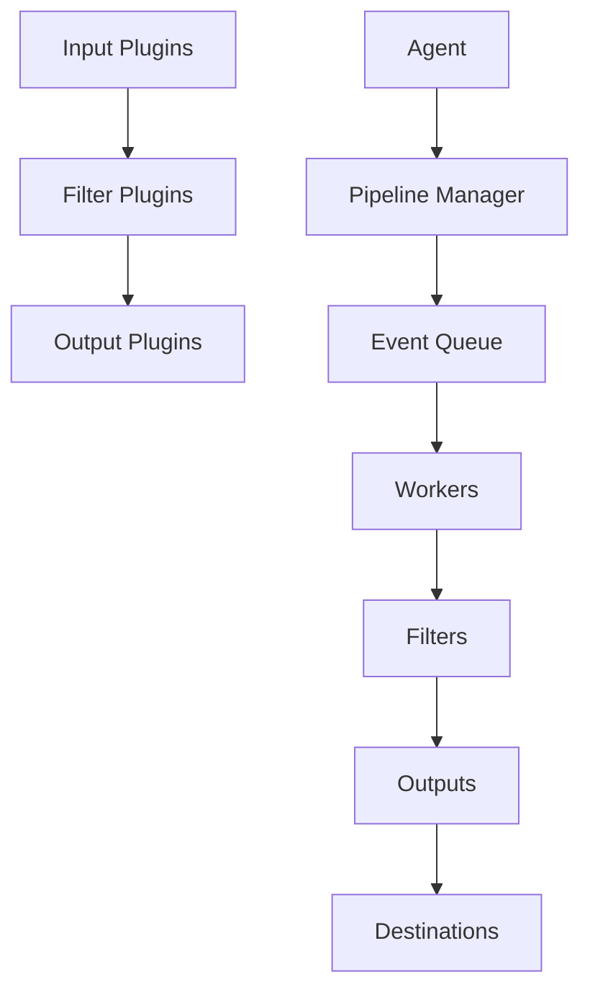

:
- visualization
- dashboard
- index pattern
- saved search
```

```markdown
# Overview

Logstash is an open-source data processing pipeline that ingests data from multiple sources, transforms it, and then delivers it to your chosen destination. Originally developed by Elastic, it has since become a widely adopted tool for log management and data ingestion in various industries.

# Architecture

Logstash consists of several interconnected components that work together to process data efficiently. Below is a textual representation of the architecture using Mermaid syntax:



In this architecture:
- **Input Plugins**: Collect data from various sources such as files, syslog, beats, etc.
- **Filter Plugins**: Transform and enrich the collected data using complex logic.
- **Output Plugins**: Deliver the transformed data to destinations like Elasticsearch, Kafka, etc.
- **Agent**: The main Logstash process that coordinates the input, filter, and output operations.
- **Pipeline Manager**: Manages the lifecycle of pipelines, including loading, reloading, and unloading.
- **Event Queue**: Holds events temporarily while they are being processed.
- **Workers**: Parallel threads that process events concurrently.
- **Filters**: Apply transformations to each event.
- **Destinations**: Where the processed data is sent after filtering.

# Data Flow / Execution Flow

The data flow in Logstash follows a linear sequence starting from the input, through the filter, and finally to the output. Here’s a step-by-step breakdown:

1. **Input**: Events are collected from various sources by input plugins.
2. **Queue**: Events are placed into an internal queue managed by the Pipeline Manager.
3. **Processing**: Workers dequeue events and apply filters sequentially.
4. **Output**: Filtered events are sent to the specified output plugins.

# Configuration & Dependencies

Logstash is highly configurable and can be customized to meet specific requirements. The primary configuration file is `logstash.yml`, which controls global settings such as logging levels, thread counts, and more.

Dependencies are managed using Gradle, and the `build.gradle` file specifies all necessary libraries and plugins. Key dependencies include:

- **Java**: Logstash requires Java 11 or 17.
- **Gradle**: Build automation tool.
- **Plugins**: Various plugins can be installed to extend Logstash's functionality, such as input, filter, and output plugins.

# How to Run / Key Scripts

To run Logstash, follow these steps:

1. **Install Java**: Ensure Java 11 or 17 is installed and configured.
2. **Clone Repository**: Clone the Logstash repository from GitHub.
3. **Build Project**: Use Gradle to build the project.
   ```sh
   ./gradlew assemble
   ```
4. **Run Logstash**: Execute the Logstash binary.
   ```sh
   bin/logstash -f config/logstash.yml
   ```

Key scripts and utilities include:

- **Benchmark CLI**: Measures performance metrics of Logstash pipelines.
  ```sh
  ./gradlew :tools:benchmark-cli:run
  ```
- **Dependencies Report**: Generates comprehensive dependency reports.
  ```sh
  ./gradlew :tools:dependencies-report:run
  ```
- **JVM Options Parser**: Parses and validates JVM options.
  ```sh
  ./gradlew :tools:jvm-options-parser:run
  ```

# Notable Design Choices / Extension Points

Log