# Overview

that Logstash's integration tests are executed reliably and efficiently, maintaining high-quality standards for the software.

## community_05
**Subsystem Summary: Plugin Manager**

The Plugin Manager is a crucial component of Logstash, responsible for managing the installation, removal, and updating of plugins. It includes several key classes and methods that facilitate these operations:

1. **Gem Installer**: Manages the installation of Ruby gems, handling dependencies and version conflicts.
2. **Offline Plugin Packager**: Packages plugins into offline installable bundles, useful for environments without internet access.
3. **Pack Command**: Provides a command-line interface for installing and managing plugins.
4. **Prepare Offline Pack**: Prepares an offline package for distribution, ensuring that all necessary dependencies are included.
5. **Proxy Support**: Facilitates the use of proxies for downloading plugins over the internet.

These components work together to provide a comprehensive solution for managing Logstash plugins, ensuring that users can easily integrate third-party tools and enhance their data processing capabilities.

## community_06
**Subsystem Summary: X-Pack**

X-Pack is an advanced feature set for Logstash that enhances its capabilities with security, monitoring, and management features. It includes several submodules, each addressing a specific aspect of these features:

1. **Security**: Provides authentication, authorization, and encryption for secure data transmission.
2. **Monitoring**: Offers real-time monitoring of Logstash performance and health.
3. **Management**: Includes tools for managing configurations, plugins, and settings.

Each submodule is designed to work seamlessly with the rest of the Logstash ecosystem, providing a unified platform for enhanced data processing and management.

---

### Top Cross-Community Interactions

The most significant cross-community interactions occur between the Logstash Core and the QA subsystem, indicating a strong dependency between them. This interaction is crucial for ensuring that changes made to the core do not break existing test scenarios, thereby maintaining the reliability of the software.

### Top Nodes

The top nodes in the repository include entrypoints, build scripts, and configuration files that play a critical role in the overall structure and functionality of Logstash. These nodes are essential for understanding how the system is assembled and operated.

By examining these sections, you gain insight into the architecture and design decisions behind Logstash, highlighting its strengths and areas for improvement.

## Architecture

subsystem ensures that Logstash integration tests are executed efficiently and reliably, leveraging Gradle's powerful build capabilities and custom task definitions.

## community_05
**Subsystem Summary: Plugin Manager**

The **Plugin Manager** subsystem is responsible for managing the installation, removal, and updating of plugins within the Logstash environment. It includes key components such as the `GemInstaller` class, which handles the installation of Ruby gems, and the `PackCommand` class, which prepares offline plugin packs.

Key Features:
- **Gem Installation**: Manages the installation of Ruby gems required by plugins (`gem_installer.rb`).
- **Offline Pack Preparation**: Creates offline plugin packs for environments without internet access (`offline_plugin_packager.rb`).
- **Proxy Support**: Facilitates the use of proxies for gem installations (`proxy_support.rb`).

Dependencies:
- **Ruby Gems**: Required by plugins for their functionality.
- **Offline Packs**: Used for installing plugins in environments without internet access.
- **Proxies**: For accessing RubyGems repositories behind firewalls.

Runtime Role:
At runtime, the Plugin Manager interacts with the Logstash core to install, remove, and update plugins. It ensures that all necessary dependencies are met and that plugins are compatible with the current version of Logstash.

Extension Points:
- **Custom Installers**: Developers can create custom installer classes to manage the installation of plugins in specific scenarios.
- **Offline Pack Customization**: Users can customize offline plugin packs to meet their unique requirements.

This subsystem is crucial for maintaining a healthy and functional Logstash environment, ensuring that plugins are always up-to-date and compatible with the core system.

## community_06
**Subsystem Summary: X-Pack**

X-Pack is an advanced feature set that enhances Logstash with additional capabilities such as security, monitoring, and observability. It includes various modules like Security, Monitoring, and Observability SRE.

Key Features:
- **Security**: Provides authentication, authorization, and encryption features to secure data in transit and at rest.
- **Monitoring**: Offers real-time monitoring of Logstash performance and health.
- **Observability SRE**: Includes tools for troubleshooting and optimizing Logstash performance.

Dependencies:
- **Elasticsearch**: For integrating with Elasticsearch for monitoring and indexing.
- **Filebeat**: For collecting logs and metrics.
- **Kibana**: For visualizing and analyzing data.

Runtime Role:
At runtime, X-Pack integrates with other Elastic Stack components to provide enhanced functionality. It secures data, monitors performance, and helps optimize operations.

Extension Points

### Architecture Graph

```mermaid

flowchart TD
  community_01[logstash-core\nlogstash-core/lib/logstash-core.rb, logstash-core/lib/logstash/bootstrap_check/default_config.rb]
  community_02[tools\ntools/dependencies-report/src/main/resources/notices/aws-sdk-core-NOTICE.txt, tools/dependencies-report/src/main/resources/notices/com.fasterxml.jackson.core!jackson-annotations-NOTICE.txt]
  community_03[docs\ndocs/extend/java-codec-plugin.md, docs/extend/java-filter-plugin.md]
  community_04[qa\nqa/docker/fixtures/multiple_pipelines/config/pipelines.yml, qa/integration/build.gradle]
  community_05[lib\nlib/pluginmanager/gem_installer.rb, lib/pluginmanager/offline_plugin_packager.rb]
  community_06[x-pack\nx-pack/spec/config_management/fixtures/pipelines.json, x-pack/distributions/internal/observabilitySRE/qa/acceptance/docker/elasticsearch/config/elasticsearch-fips.yml]
  community_07[README.md\nREADME.md, build.gradle]
  community_08[.buildkite\n.buildkite/scripts/health-report-tests/config/pipelines.yml, .buildkite/scripts/health-report-tests/requirements.txt]

```

## Data Flow / Execution Flow

4. **Dependency Management**: The script specifies dependencies on Logstash core, testing frameworks, and other utilities required for running integration tests.

5. **Environment Setup**: Before running tests, the script sets up the environment by copying the modified Log4j configuration and preparing plugin test fixtures.

6. **Test Execution**: Finally, the script executes the integration tests using the `test` task, which depends on the preparation steps.

This subsystem ensures that Logstash's integration tests are run efficiently and reliably, providing confidence in the system's stability and correctness.

## community_05
**Subsystem Summary: Plugin Manager**

The **Plugin Manager** is responsible for managing the installation, removal, and updating of plugins in Logstash. It includes several key components:

- **Gem Installer**: Installs plugins as RubyGems.
- **Offline Plugin Packager**: Packages plugins into offline installable bundles.
- **Pack Command**: Manages the creation and distribution of plugin packs.
- **Prepare Offline Pack**: Prepares a plugin pack for offline installation.
- **Proxy Support**: Provides support for proxy configurations.

These components work together to ensure that plugins can be easily installed and managed, even in environments with limited network access.

**Dependencies:**  
The Plugin Manager relies on RubyGems for installing plugins and requires additional libraries for handling offline installations and proxy settings.

**Runtime Role:**  
At runtime, the Plugin Manager handles the lifecycle of plugins, ensuring that they are correctly installed and updated. It also supports offline installations, which is useful in environments where internet access is restricted.

**Extension Points:**  
Developers can extend the Plugin Manager by adding new commands or functionality. For example, additional commands could be created to manage plugins in different environments or to provide more advanced installation options.

This subsystem is crucial for maintaining the flexibility and scalability of Logstash, allowing users to easily integrate new plugins as needed.

## community_06
**Subsystem Summary: X-Pack**

X-Pack is an optional feature set that enhances Logstash with additional capabilities, such as security, monitoring, and observability. It includes several submodules, each providing specific functionality:

- **Security**: Adds authentication and authorization features to protect sensitive data.
- **Monitoring**: Provides metrics and alerts to monitor the health and performance of Logstash.
- **Observability**: Offers tools for tracing and debugging, helping users understand how data flows through the pipeline.

Each submodule is designed to be modular, allowing users to select and configure only the features they need.

**Dependencies:**  
X-Pack depends on various libraries and

## Configuration & Dependencies

ensures that Logstash integration tests are executed reliably and efficiently, maintaining high-quality standards for the software.

## community_05
**Subsystem Summary: Plugin Manager**

The Logstash plugin manager is responsible for installing, updating, and managing plugins. It includes several key components:

1. **Gem Installer**: Handles the installation of Ruby gems, which are used by many Logstash plugins. It supports both online and offline installations, ensuring that plugins can be installed even in environments without internet access.

2. **Offline Plugin Packager**: Creates packages of plugins that can be installed offline. This feature is particularly useful for environments where internet access is limited.

3. **Pack Command**: Manages the creation and distribution of plugin packs. It allows administrators to bundle multiple plugins into a single package for easier management and deployment.

4. **Prepare Offline Pack**: Prepares a list of plugins that need to be installed offline. This list is used by the offline plugin packager to create the necessary packages.

5. **Proxy Support**: Provides support for proxy servers, allowing the plugin manager to work behind corporate firewalls.

These components ensure that Logstash plugins can be easily managed and deployed across different environments, enhancing the flexibility and scalability of the system.

## community_06
**Subsystem Summary: X-Pack**

X-Pack is an optional module that adds advanced security, monitoring, and management capabilities to Logstash. It includes features such as:

1. **Security Features**: Enhances Logstash with role-based access control (RBAC), SSL/TLS encryption, and user authentication. These features help protect sensitive data and ensure secure communication between nodes.

2. **Monitoring**: Provides comprehensive monitoring capabilities, including metrics collection, alerting, and visualization. This helps administrators keep track of the health and performance of their Logstash instances.

3. **Management**: Offers tools for managing Logstash configurations, plugins, and settings. This simplifies the administration of large-scale deployments.

X-Pack is designed to enhance the overall reliability and manageability of Logstash, making it suitable for production environments where security and performance are critical.

## community_07
**Subsystem Summary: Benchmarking Tools**

The benchmarking tools in Logstash are used to measure the performance and efficiency of the system under various conditions. They include:

1. **Benchmark CLI**: A command-line interface tool for running benchmarks. It allows users to specify the number of threads, batch sizes, and other parameters to simulate realistic workloads.

2. **Dependencies Report**: Generates reports detailing the dependencies of Logstash and its

## How to Run / Key Scripts

-to-date.

4. **Dependency Management**: The script specifies dependencies on Logstash core, testing frameworks, and other utilities required for integration testing.

5. **Environment Setup**: Before running tests, the script sets up the environment by copying the modified Log4j configuration and preparing plugin test fixtures.

6. **Test Execution**: Finally, the script executes the integration tests using the `test` task, which is part of the Gradle build system.

This subsystem ensures that Logstash's integration tests are executed reliably and efficiently, covering various scenarios and configurations.

## community_05
**Subsystem Summary: Plugin Manager**

The **Plugin Manager** is a crucial component of the Logstash ecosystem, responsible for managing the installation, removal, and updating of plugins. It interacts with the RubyGems package manager to install plugins from the official repository or local filesystem. The plugin manager also handles offline installations, allowing users to package and distribute plugins without internet access.

Key Features:
- **Offline Installation**: Packages plugins into `.gem` files for offline distribution.
- **Proxy Support**: Facilitates the installation of plugins behind corporate firewalls or proxies.
- **Gem Installer**: Installs plugins directly from RubyGems repositories.
- **Packaging**: Creates `.gem` files from plugin source code, facilitating easy distribution.

Dependencies:
- RubyGems: For installing plugins from remote repositories.
- Offline Packager: For creating `.gem` files from plugin source code.

Runtime Role:
At runtime, the Plugin Manager is invoked via command-line tools such as `bin/logstash-plugin`. It processes user commands to manage plugins, ensuring that the correct versions are installed and updated.

Extension Points:
- **Offline Mode**: Allows for the creation and distribution of `.gem` files, enabling offline plugin management.
- **Proxy Configuration**: Supports proxy settings for users behind restrictive networks.

This subsystem is vital for maintaining a healthy and functional Logstash environment, ensuring that users have access to the necessary plugins for their data processing needs.

## community_06
**Subsystem Summary: X-Pack**

X-Pack is an advanced feature set that enhances Logstash with additional capabilities such as security, monitoring, and observability. It includes modules for Elasticsearch, Filebeat, and Logstash, providing comprehensive solutions for securing and managing data pipelines.

Key Features:
- **Security**: Implements authentication, authorization, and encryption to protect sensitive data.
- **Monitoring**: Provides real-time visibility into the performance and health of Logstash instances.
- **Observability**: Offers insights into the behavior and usage of

## Notable Design Choices / Extension Points

-date.

4. **Dependency Management**: The script specifies dependencies on Logstash core, testing frameworks, and other utilities needed for running integration tests.

5. **Environment Configuration**: Environment variables are set to configure the test environment, including paths to Logstash binaries and temporary directories.

6. **Task Relationships**: The `integrationTests` task depends on the `preparePluginTestFixtures` task, ensuring that plugin test fixtures are prepared before running tests.

7. **Gradle Plugin Usage**: The script utilizes the `com.github.johnrengelman.shadow` plugin to create executable JAR files for running tests, which simplifies the setup and execution of integration tests.

Overall, the Logstash integration tests are well-organized and maintainable, leveraging Gradle's powerful build capabilities to manage dependencies and execute tests efficiently.

## community_05
**Subsystem Summary: Plugin Manager**

The **Plugin Manager** is responsible for installing, updating, and managing plugins within the Logstash ecosystem. It includes several key components and functionalities:

1. **Gem Installer**: Manages the installation of Ruby gems, which are used to implement plugins. It handles downloading, unpacking, and installing gems into the Logstash environment.

2. **Offline Plugin Packager**: Creates offline plugin packs, which allow users to install plugins without an internet connection. This is particularly useful in environments with restricted access.

3. **Pack Command**: Provides a command-line interface for managing plugin packs. Users can create, list, and delete packs, facilitating the distribution and management of plugins.

4. **Prepare Offline Pack**: Prepares an offline pack by bundling necessary files and configurations. This ensures that the pack contains everything required for successful installation.

5. **Proxy Support**: Adds support for proxy servers, allowing the Gem Installer to download gems through a proxy when necessary.

These components work together to provide a comprehensive solution for managing plugins within Logstash, ensuring that users have the flexibility to customize their data processing pipelines without limitations.

## community_06
**Subsystem Summary: X-Pack**

X-Pack is an advanced feature set that enhances the capabilities of Logstash. It includes security, monitoring, and observability features that help organizations better manage and protect their data pipelines. Key components and functionalities include:

1. **Security Features**: Implements authentication, authorization, and encryption to secure data in transit and at rest. It supports roles-based access control (RBAC) and integrates with popular identity providers like LDAP and Active Directory.

2. **Monitoring and Observability**: Provides real-time visibility into the