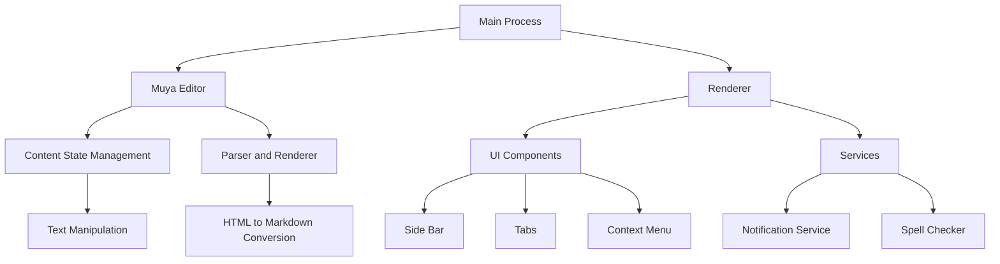

# Overview

MarkText is a modern, open-source Markdown editor designed for speed and usability. Built with a focus on simplicity and extensibility, it offers a rich set of features including real-time preview, various markdown extensions, and a customizable interface. This document provides a comprehensive overview of the repository, detailing its architecture, data flow, configuration, and extension points.

# Architecture

MarkText is structured into several interconnected modules, each responsible for specific functionalities. The core architecture is based around the `muya` package, which handles most of the text editing logic, and the renderer, which manages the display and interaction with the user interface.



# Data Flow / Execution Flow

The data flow in MarkText primarily revolves around the manipulation and rendering of text. When a user types or modifies text, the changes are captured by the `Muya Editor`, which then updates the `Content State`. This updated state is passed to the `Parser and Renderer`, which convert the text into HTML for display in the `Renderer`. The renderer updates the UI accordingly, ensuring a seamless real-time preview experience.

# Configuration & Dependencies

MarkText is configured via several JSON files, including `package.json`, `jsconfig.json`, and `.vscode/settings.json`. These files define project metadata, dependencies, and development settings. The editor relies on several third-party libraries, such as `marked` for parsing Markdown, `prism` for syntax highlighting, and `vue` for the user interface framework.

# How to Run / Key Scripts

To run MarkText, you need to have Node.js installed. Clone the repository and install dependencies using npm:

```bash
git clone https://github.com/marktext/marktext.git
cd marktext
npm install
```

To start the development server, use the following script:

```bash
npm run dev
```

This will launch the editor in a development environment, allowing you to make changes and see them reflected in real-time.

# Notable Design Choices / Extension Points

MarkText includes several notable design choices and extension points that allow developers to customize and extend the editor:

1. **Key Bindings**: Users can configure and add custom key bindings through the preferences menu. This makes it easy to tailor the editor to individual workflow needs.
   
2. **Plugins**: While not explicitly detailed in the provided documentation, MarkText supports plugins, providing a way to extend its functionality without modifying the core codebase.

3. **Custom Themes**: Developers can create and apply custom themes to change the appearance of the editor, enhancing both aesthetics and usability.

4. **Markdown Extensions**: MarkText supports a wide range of markdown extensions, making it versatile for various use cases. Custom extensions can be developed and integrated into the editor.

These design choices and extension points ensure that MarkText remains flexible and adaptable to diverse user needs and preferences.