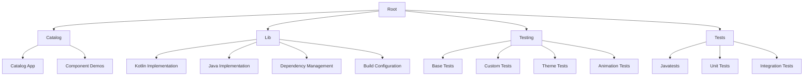
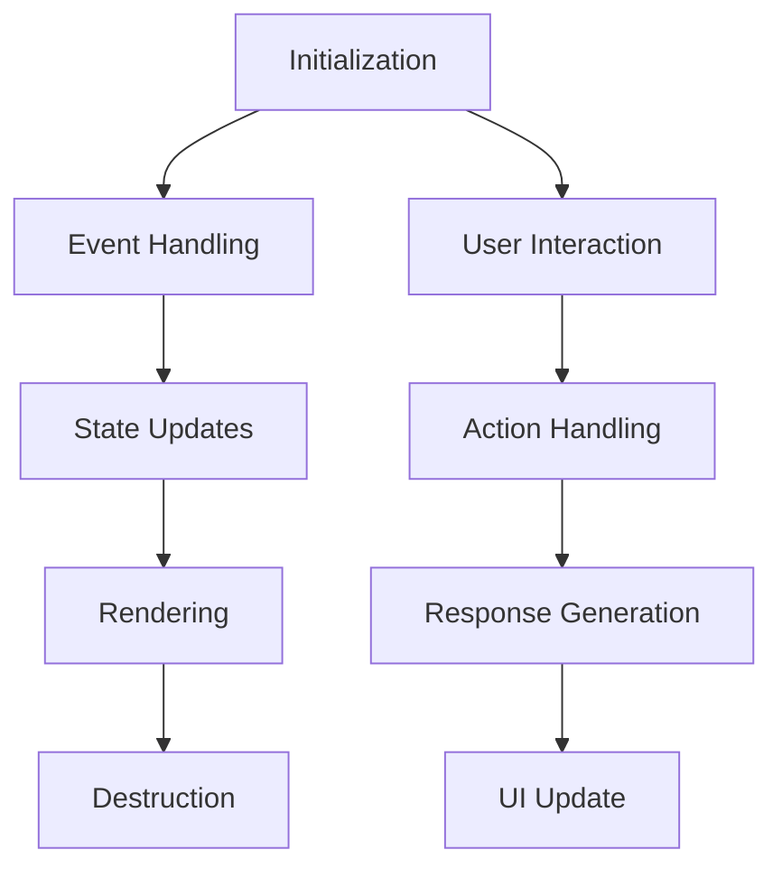

# Overview

Material Components for Android (MDC-Android) is a comprehensive library that provides a set of high-quality, customizable Material Design components for Android applications. Developed by Google, MDC-Android aims to simplify the process of creating modern, user-friendly interfaces by offering a wide range of pre-built components that adhere to Material Design guidelines.

# Architecture

The architecture of MDC-Android is designed to be modular and extensible, allowing developers to easily integrate and customize components according to their needs. Below is a textual representation of the architecture using Mermaid syntax:



### Key Components

1. **Root**: The central configuration hub for the entire project, managing global properties and build scripts.
2. **Catalog**: Houses the Material Components Android Catalog app, showcasing various UI components and their usage.
3. **Lib**: Contains the core implementation of Material Design components for Android.
4. **Testing**: Dedicated to providing comprehensive testing infrastructure for the Material Components library.
5. **Tests**: Houses all testing-related components, including unit, integration, and animation tests.

# Data Flow / Execution Flow

The data flow in MDC-Android follows a typical lifecycle pattern, starting from the initialization of components and ending with their destruction. Below is a textual representation of the execution flow using Mermaid syntax:



### Key Steps

1. **Initialization**: Components are initialized with default or user-defined properties.
2. **Event Handling**: Listeners are attached to handle user interactions and system events.
3. **State Updates**: Based on event handling, the state of the component is updated.
4. **Rendering**: The updated state is rendered to the UI.
5. **Destruction**: When the component is no longer needed, it is properly destroyed to free up resources.

# Configuration & Dependencies

MDC-Android is configured using Gradle scripts, with key configurations managed in the `build.gradle` files of each module. The project relies on several external libraries and dependencies, including:

- **AndroidX Libraries**: For Android development, including support libraries, RecyclerView, and ConstraintLayout.
- **Kotlin**: For language features and interoperability with Java.
- **Dagger**: For dependency injection.
- **Glide**: For image loading.
- **Espresso**: For UI testing.
- **Mockito**: For mocking objects in tests.

These dependencies are managed in the `build.gradle` files of each module, ensuring that all required libraries are included and compatible with the project's build configuration.

# How to Run / Key Scripts

To run MDC-Android, follow these steps:

1. **Clone the Repository**:
    ```sh
    git clone https://github.com/material-components/material-components-android.git
    cd material-components-android