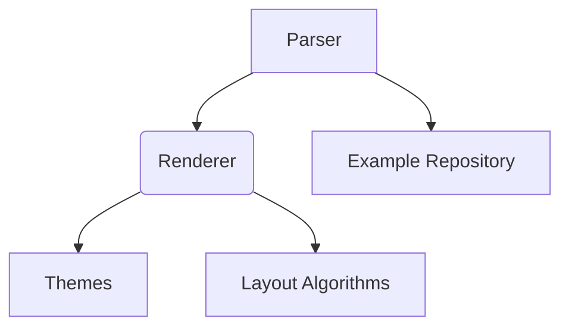

# Overview

Mermaid is a JavaScript-based diagramming and charting tool that allows users to create diagrams from Markdown-like text. It supports various types of diagrams, including flowcharts, sequence diagrams, Gantt charts, class diagrams, and more. Mermaid is designed to be easy to use and integrates well with modern web development environments.

# Architecture

Mermaid is structured as a monorepo containing multiple packages, each serving a specific purpose. The key components include:

- **Parser**: Responsible for parsing the input text and converting it into a format that can be rendered.
- **Renderer**: Converts the parsed data into visual diagrams.
- **Themes**: Defines the appearance of the diagrams.
- **Layout Algorithms**: Determines the positioning of elements within the diagrams.
- **Example Repository**: Contains examples demonstrating how to use Mermaid.

Below is a Mermaid architecture diagram illustrating the relationships between these components:

# Data Flow / Execution Flow

The data flow in Mermaid typically follows this sequence:

1. **Input Text Parsing**: The parser reads the input text and converts it into a structured format.
2. **Rendering**: The renderer takes the structured data and generates the visual representation of the diagram.
3. **Styling**: Themes apply styles to the rendered diagram.
4. **Layout**: Layout algorithms determine the positions of elements within the diagram.
5. **Output**: The final diagram is outputted, either as an image or embedded directly into a webpage.

# Configuration & Dependencies

Mermaid is highly configurable, allowing users to customize various aspects of the diagrams. Configuration options are managed through a JSON schema located at `packages/mermaid/src/schemas/config.schema.yaml`.

Key dependencies include:

- **Dagre**: Used for graph layout algorithms.
- **Langium**: For language modeling and parsing.
- **Webpack**: For building and serving the documentation and test environments.

These dependencies are managed using `pnpm`, a fast package manager for JavaScript.

# How to Run / Key Scripts

To run Mermaid locally, follow these steps:

1. **Clone the Repository**