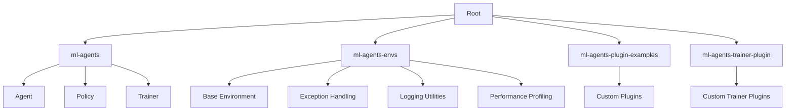

# Overview

The ML-Agents repository is part of the Unity Technologies suite, focused on enabling the creation of intelligent agents within Unity environments using reinforcement learning techniques. The repository consists of multiple modules, each serving a specific purpose in the development and deployment of reinforcement learning models. This documentation aims to provide a comprehensive overview of the architecture, data flow, configuration, and extension points within the ML-Agents repository.

# Architecture

The ML-Agents architecture is modular, with clear separation of concerns between different components. Below is a textual representation of the architecture using Mermaid syntax:

### Key Components

- **Root**: Manages the overall configuration and setup of the project.
- **ml-agents**: Contains core classes and functionalities related to agents, policies, and trainers.
- **ml-agents-envs**: Manages the environment aspects of reinforcement learning experiments, including base environments, exception handling, logging utilities, and performance profiling.
- **ml-agents-plugin-examples**: Provides examples of custom plugins that can be registered and used within the ML-Agents framework.
- **ml-agents-trainer-plugin**: Defines and manages custom trainer plugins that can be integrated into the ML-Agents framework.

# Data Flow / Execution Flow

The data flow within the ML-Agents repository follows a typical reinforcement learning workflow:

1. **Environment Setup**: An environment is initialized, providing initial observations to the agent.
2. **Observation Processing**: The agent processes the observations and decides on an action.
3. **Action Execution**: The selected action is executed within the environment, resulting in new observations and rewards.
4. **Reward Calculation**: The