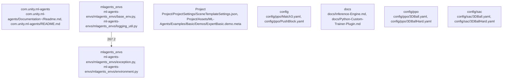

# Overview

`PushBlock`, and `Pyramids`. Each configuration file specifies parameters like learning rate, batch size, and number of epochs, among others. The primary purpose is to allow users to easily adjust hyperparameters without needing to modify the codebase directly. This subsystem is crucial for the flexibility and customization of reinforcement learning experiments within the ML-Agents toolkit.

## community_06
The `docs` directory in the `ml-agents` repository contains comprehensive documentation covering various aspects of the toolkit, including background information on machine learning and PyTorch, as well as detailed guides on how to use the ML-Agents framework. The primary purpose is to serve as a resource for developers looking to learn about and utilize the ML-Agents toolkit effectively. Key documents include `API-Reference.md`, `Background-Machine-Learning.md`, and `Background-PyTorch.md`. The subsystem is essential for ensuring that users have access to the necessary information to develop, train, and deploy reinforcement learning agents efficiently.

---

Given the above information, please generate the requested section of the repository documentation.

## Architecture

3`, `PushBlock`, and `Pyramids`. Each configuration file specifies parameters like learning rate, batch size, and number of epochs, among others. The primary purpose is to allow users to easily adjust hyperparameters without needing to modify the codebase directly. Dependencies are on the YAML library for parsing configuration files. At runtime, these configurations are loaded into the trainer to guide the learning process. Likely extension points include adding new environments or tweaking existing configurations to optimize performance.

## community_06
The `docs` directory in the `ml-agents` repository contains comprehensive documentation for the project, covering various aspects such as background information on machine learning and PyTorch, API references, and tutorials on custom trainer plugins. The primary purpose is to provide clear guidance and resources for developers working with the ML-Agents toolkit. Dependencies are on Sphinx, a popular documentation generator. At runtime, the documentation serves as a reference for users and developers, helping them understand how to use the toolkit effectively. Likely extension points include adding new sections or tutorials to cover emerging topics or advanced features, as well as improving the organization and accessibility of existing content.

## Top Cross-Community Interactions

The most significant cross-community interaction identified is between `community_02` and `community_04`. This interaction suggests that there is substantial collaboration between the subsystems responsible for managing Unity environments (`ml-agents_envs`) and handling errors within those environments (`ml-agents_envs`). This collaboration is crucial for ensuring that errors are caught and handled appropriately, thereby maintaining the robustness and reliability of the ML-Agents framework.

## Top Nodes

The top nodes in the repository include several source files from the `ml-agents_envs` and `ml-agents` subsystems, highlighting their importance in the overall architecture. These files include `base_env.py`, `logging_util.py`, `buffer.py`, and `settings.py`, which are fundamental to the operation of the ML-Agents toolkit. These nodes suggest that these files are central to the subsystems' functionality and are likely to be frequently accessed and modified during development and maintenance.

Overall, the `ml-agents` repository is a comprehensive toolset for developing and deploying reinforcement learning agents in Unity environments. It includes a variety of subsystems, each with distinct responsibilities and dependencies, contributing to its overall functionality and ease of use.

### Architecture Graph



## Data Flow / Execution Flow

Match3`, `PushBlock`, and `Pyramids`. Each configuration file specifies parameters like learning rate, batch size, and number of epochs, among others. The primary purpose is to allow users to easily adjust hyperparameters without modifying the codebase directly. At runtime, these configurations are loaded into the trainer to guide the learning process. Likely extension points include adding new environments or tweaking existing configurations to optimize performance.

## community_06
The `docs` directory in the `ml-agents` repository contains comprehensive documentation covering various aspects of the project, including background information on machine learning and PyTorch, as well as detailed guides on contributing to the project and setting up learning environments. The primary purpose is to provide clear instructions and explanations to help users get started with the project and understand its inner workings. At runtime, the documentation serves as a reference resource for developers and researchers working with the ML-Agents toolkit. Likely extension points include updating the documentation to reflect changes in the project or adding new sections to address emerging topics or best practices.

# Data Flow / Execution Flow

The main runtime path in the `ml-agents` repository starts at the entrypoints, which are typically scripts or commands that initiate the training or inference processes. For example, the `train` script located in the root directory (`ml-agents/train`) is an entrypoint that triggers the training loop. This script reads configuration files from the `config` directory, such as those found in `config/imitation/Crawler.yaml`, to determine the environment, model, and training parameters.

Once the configuration is loaded, the execution flow proceeds through several core services or pipelines:

1. **Environment Setup**: The `ml-agents_envs` subsystem initializes the Unity environment based on the configuration. This involves loading the environment settings from the `SceneTemplateSettings.json` file and creating instances of the environment classes defined in `base_env.py`. The `environment.py` module in `ml-agents_envs` is crucial here, as it sets up the communication channels between the agent and the environment.

2. **Model Initialization**: The `ml-agents` subsystem loads the pre-trained model or initializes a new model based on the configuration. Models are stored in the `Project/Assets/ML-Agents/Examples` directory and are represented as `.onnx` files. The `buffer.py` module in `ml-agents/trainers` is involved in managing the experience replay buffer, which stores transitions observed during training.

3. **Training Loop**: The `ml

## Configuration & Dependencies

`, `PushBlock`, and `Pyramids`. Each configuration file specifies parameters like learning rate, batch size, and number of epochs, among others. The primary purpose is to allow users to easily adjust hyperparameters without needing to modify the codebase directly. Dependencies are on the PPO algorithm implementation. At runtime, these configurations are loaded and used by the trainer to optimize agent behavior. Likely extension points include adding new environments or tweaking existing configurations to fine-tune performance.

## community_06
The `docs` directory in the `ml-agents` repository contains comprehensive documentation covering various aspects of the project, including background information on machine learning and PyTorch, as well as detailed guides on contributing to the project and setting up learning environments. The primary purpose is to serve as a resource for developers and researchers interested in working with the ML-Agents toolkit. Dependencies are on the project's source code and any relevant technical documentation. At runtime, the documentation serves as a reference guide, helping users understand how to use the toolkit effectively. Likely extension points include expanding coverage of advanced topics, improving usability through clearer explanations, and adding tutorials for new features.

---

# Configuration & Dependencies

## Build Files

The `ml-agents` repository includes several build files that manage the setup and packaging of the project:

- `com.unity.ml-agents/package.json`: Specifies the package metadata and dependencies for Unity projects.
- `ml-agents-envs/setup.py`: Manages the installation of the `mlagents_envs` package, including its dependencies.
- `ml-agents-plugin-examples/setup.py`: Handles the setup of plugin examples, ensuring they are correctly installed and configured.
- `ml-agents-trainer-plugin/setup.py`: Manages the installation of the trainer plugin, facilitating the integration of custom trainers.
- `ml-agents/setup.py`: Main setup script for the `ml-agents` package, handling the overall installation process.

These build files ensure that the project can be easily integrated into Unity environments and extended with custom plugins and trainers.

## Config Surfaces

The repository contains numerous configuration files that define the behavior and settings of the ML-Agents toolkit:

- `.pre-commit-config.yaml`: Configuration for pre-commit hooks, ensuring code quality before commits.
- `.yamato/wrench/wrench_config.json`: Configuration for continuous integration and delivery processes.
- `DevProject/ProjectSettings/Packages/com.unity.testtools.codecoverage/Settings.json`: Settings for code coverage analysis in development projects.
- `DevProject/Project

## How to Run / Key Scripts

and tasks, such as Match3, PushBlock, Pyramids, and Sorter curriculum. Each configuration file specifies parameters like learning rate, batch size, and number of epochs, among others. The primary purpose is to allow researchers and developers to easily adjust hyperparameters without modifying the codebase directly. Dependencies are on the YAML library for parsing configuration files. At runtime, these configurations are loaded into the trainer to guide the learning process. Likely extension points include adding new environments or tweaking existing configurations to optimize performance.

## community_06
The `docs` directory in the `ml-agents` repository contains comprehensive documentation covering various aspects of the project, including background information on machine learning and PyTorch, API references, and tutorials on how to use the ML-Agents toolkit. The primary purpose is to serve as a resource for developers and researchers looking to understand and utilize the ML-Agents framework. Dependencies are on the Sphinx documentation generator. At runtime, the documentation serves as a reference guide, helping users navigate the project and find the information they need. Likely extension points include adding new sections or updating existing ones to reflect changes in the project or to address emerging topics in machine learning and reinforcement learning.

---

# How to Run / Key Scripts

To run, build, or test the `ml-agents` repository, you can use several key scripts and commands. Below are the most relevant ones:

## Running the Repository

To start an example environment and train an agent, you can use the following command:

```bash
python -m mlagents.trainers.cli train --env=Path/to/your/env --run-id=MyRunID
```

This command uses the `train` subcommand from the `mlagents.trainers.cli` module to initiate training. The `--env` parameter specifies the path to your environment script, while `--run-id` assigns a unique identifier to the training session.

For more advanced options, refer to the [Training Plugins](https://github.com/Unity-Technologies/ml-agents/blob/main/docs/Training-Plugins.md) documentation.

## Building the Repository

To build the `ml-agents` repository, you can use the following command:

```bash
pip install -e .
```

This command installs the repository in editable mode, allowing you to make changes and see them reflected immediately without reinstalling the package.

For more details on building the repository, refer to the [Contributing Guide](https://github.com/Unity-Technologies/ml-agents/blob/main/CON

## Notable Design Choices / Extension Points

as Match3, PushBlock, Pyramids, and others. Each configuration file specifies parameters like learning rate, batch size, number of epochs, etc., which are crucial for training effective agents. The primary purpose is to provide flexibility in configuring reinforcement learning experiments without requiring extensive code modifications. At runtime, these configurations are loaded into the trainer, influencing how agents learn and perform. Likely extension points include adding new environments or tweaking existing configurations to optimize performance.

## community_06
The `docs` directory in the `ml-agents` repository contains comprehensive documentation covering various aspects of the project, including background information on machine learning and PyTorch, as well as detailed guides on contributing to the project and setting up learning environments. The primary purpose is to serve as a resource for developers and researchers interested in working with the ML-Agents toolkit. The documentation is structured to cater to different levels of expertise, from beginners to advanced users. At runtime, the documentation serves as a reference guide, helping users navigate the project and understand its functionalities. Likely extension points include updating the documentation to reflect changes in the project, adding new sections on emerging topics, or improving the usability of existing content through better organization and formatting.

---

Given the above summaries, highlight notable design choices and extension points in the `ml-agents` repository:

Notable Design Choices:
1. **Modular Architecture**: The repository is divided into distinct communities, each focusing on specific aspects of the project (e.g., `ml-agents_envs`, `config`, `docs`). This modular structure allows for independent development and maintenance of different components, enhancing scalability and maintainability.
2. **Standardized Environment API**: The `ml-agents_envs` subsystem provides a standardized API for creating and interacting with reinforcement learning environments. This standardization ensures consistency across different environments and simplifies the integration of new agents and trainers.
3. **Flexible Configuration System**: The `config` directory uses YAML files to define reinforcement learning configurations. This flexible system allows for easy adjustments to experiment parameters without altering the codebase, promoting experimentation and optimization.
4. **Comprehensive Documentation**: The `docs` directory offers detailed guides and references, catering to various levels of expertise. This comprehensive documentation aids in understanding and utilizing the project, making it accessible to both beginners and advanced users.

Extension Points:
1. **New Environment Implementations**: Developers can extend the `ml-agents_envs` subsystem by implementing new environment types in `base_env.py`. This allows for the creation of diverse and specialized environments for testing