# Overview

the Chrome DevTools Protocol for communication with the browser.

**Runtime Role:** At runtime, Puppeteer operates within a Node.js environment, controlling a headless browser instance to perform automated tasks. It is widely used for web scraping, automation testing, and performance monitoring.

**Extension Points:** Developers can extend Puppeteer by creating custom modules or overriding existing ones. For example, adding new navigation strategies or implementing custom request handlers can be done by extending the `Browser` or `Page` classes.

This subsystem is fundamental to Puppeteer's functionality, enabling developers to automate complex browser-based tasks efficiently.

## community_05
**Subsystem Summary: README.md**

**Purpose:** The README file serves as an overview and introduction to the Puppeteer project, detailing its purpose, installation instructions, usage examples, and contributing guidelines.

**Internal Structure:** The README file typically includes sections such as Introduction, Installation, Usage, Contributing, and License. It often contains code snippets, diagrams, and links to further resources.

**Dependencies:** No external dependencies; it is a static text file.

**Runtime Role:** The README file is accessed by users and contributors alike, providing essential information about the project. It acts as a central hub for understanding the project's scope, requirements, and how to interact with it.

**Extension Points:** Users can contribute to the README by suggesting improvements, adding new sections, or correcting errors. Developers can update the README to reflect changes in the project's structure or functionality.

This subsystem is critical for onboarding new users and maintaining clear communication within the project community.

## community_06
**Subsystem Summary: Puppeteer Core**

**Purpose:** The Puppeteer Core subsystem provides the foundational functionality for controlling browsers, including launching instances, managing browser contexts, and executing JavaScript code within the browser environment.

**Internal Structure:** The subsystem consists of several key files and directories, including `index.ts`, `environment.ts`, and `puppeteer-core-browser.ts`. These files define the core classes and interfaces necessary for browser control.

**Dependencies:** Puppeteer Core depends on Node.js and requires access to a headless instance of Chrome or Chromium. It leverages the Chrome DevTools Protocol for communication with the browser.

**Runtime Role:** At runtime, Puppeteer Core operates within a Node.js environment, controlling a headless browser instance to perform automated tasks. It is essential for the basic functionality of Puppeteer, enabling developers to launch browsers, navigate pages, and execute JavaScript code.

**Extension Points:** Developers can extend Puppeteer Core by creating custom modules or

## Architecture

utilizes various third-party libraries such as `events`, `fs`, `util`, and `url`.

**Runtime Role:** At runtime, Puppeteer operates within a Node.js environment, controlling a headless browser instance to perform automated tasks. It is widely used for web scraping, automation testing, and performance monitoring.

**Extension Points:** Developers can extend Puppeteer by creating custom modules or plugins that integrate with existing functionalities. For example, adding support for new browser features or implementing custom navigation strategies can be achieved by extending the core modules.

This subsystem is fundamental to Puppeteer's capabilities, enabling developers to automate complex browser interactions efficiently.

## community_05
**Subsystem Summary: README.md**

**Purpose:** The README file serves as an overview and introduction to the Puppeteer project, detailing its purpose, installation instructions, usage examples, and contributing guidelines.

**Internal Structure:** The README file typically includes sections such as Introduction, Installation, Usage, Contributing, and License. It may also contain links to additional resources like documentation, issue trackers, and community forums.

**Dependencies:** The README file does not depend on any external libraries but relies on standard Markdown formatting for readability.

**Runtime Role:** The README file acts as a primary source of information for users and contributors, providing essential details about the project and guiding them through initial setup and usage.

**Extension Points:** Users and contributors can extend the README file by adding new sections, improving existing content, or linking to additional resources. For example, adding detailed usage scenarios or troubleshooting tips can enhance the user experience.

This subsystem is critical for the project's accessibility and usability, ensuring that all stakeholders have clear guidance on how to use and contribute to Puppeteer.

## community_06
**Subsystem Summary: Puppeteer Core**

**Purpose:** Puppeteer Core is a lower-level library that provides direct access to the DevTools Protocol, allowing developers to interact with the browser at a more granular level. It is designed for advanced use cases where fine-grained control over the browser is required.

**Internal Structure:** The Puppeteer Core subsystem consists of several modules, including `browser`, `page`, `elementHandle`, and `request`, similar to the Puppeteer subsystem. However, it offers more flexibility and control over browser operations, making it suitable for applications requiring extensive customization.

**Dependencies:** Puppeteer Core depends on Node.js and requires access to a headless instance of Chrome or Chromium. It also utilizes various third-party libraries such as `events`, `fs`, `util`, and `url`.

**Runtime Role

### Architecture Graph

```mermaid

flowchart TD
  community_01[website\nwebsite/src/theme/SearchMetadata/index.js, website/versioned_docs/version-24.17.1/api/puppeteer.browser.installextension.md]
  community_02[docs\ndocs/api/puppeteer.browser.installextension.md, docs/api/puppeteer.browser.uninstallextension.md]
  community_03[packages\npackages/testserver/src/index.ts, packages/browsers/package.json]
  community_04[test\ntest/src/cdp/extensions.spec.ts, test/src/webExtension.spec.ts]
  community_05[README.md\nREADME.md, package.json]
  community_06[packages/puppeteer-core/src\npackages/puppeteer-core/src/index.ts, packages/puppeteer-core/src/tsconfig.cjs.json]
  community_07[docs\ndocs/CHANGELOG.md, docs/contributing.md]
  community_08[packages/puppeteer-core\npackages/puppeteer-core/package.json, packages/puppeteer-core/tsconfig.json]

```

## Data Flow / Execution Flow

uses the Chrome DevTools Protocol (CDP) for communication with the browser.

**Runtime Role:** At runtime, Puppeteer creates an isolated browser environment where it can execute JavaScript code, interact with web pages, and perform automated tasks. It is widely used for web scraping, automation testing, and performance monitoring.

**Extension Points:** Developers can extend Puppeteer by creating custom modules or plugins that integrate with existing functionalities. For example, adding support for new browsers or implementing custom request interceptors can be achieved by extending the `browser` or `page` modules.

## community_05
**Subsystem Summary: README.md**

**Purpose:** The README file serves as the primary documentation and introduction for the Puppeteer project. It outlines the project's purpose, installation instructions, usage examples, and contribution guidelines.

**Internal Structure:** The README file typically includes sections such as Introduction, Installation, Usage, Contributing, and License. It may also contain links to more detailed documentation, issue trackers, and community resources.

**Dependencies:** No external dependencies; relies on standard Markdown formatting.

**Runtime Role:** The README file acts as the first point of contact for users and contributors, providing essential information about the project and guiding them through its initial setup and use.

**Extension Points:** Users and contributors can contribute to the README by adding new sections, improving existing content, or linking to additional resources. The file is maintained through version control systems like Git.

## community_06
**Subsystem Summary: Puppeteer Core**

**Purpose:** The Puppeteer Core subsystem is the foundational part of Puppeteer, providing low-level access to the browser's DevTools Protocol. It handles the creation and management of browser instances, contexts, and pages, as well as network requests and events.

**Internal Structure:** The core consists of several key files and directories, including `index.ts`, `environment.ts`, and `puppeteer-core-browser.ts`. These files define the basic structure and functionality required to interact with the browser.

**Dependencies:** Puppeteer Core depends on Node.js and requires access to a headless instance of Chrome or Chromium. It uses the Chrome DevTools Protocol (CDP) for communication with the browser.

**Runtime Role:** At runtime, Puppeteer Core initializes and controls the browser instance, allowing higher-level modules to build upon its foundation for more complex operations. It is critical for the functioning of Puppeteer's higher-level APIs.

**Extension Points:** Developers can extend Puppeteer Core by adding new modules or plugins that integrate with existing functionalities. For example, adding support

## Configuration & Dependencies

on various third-party libraries such as `events`, `fs`, `util`, and `url`.

**Runtime Role:** At runtime, Puppeteer operates within a Node.js environment, controlling a headless browser instance to perform automated tasks. It is widely used for web scraping, automation testing, and performance monitoring.

**Extension Points:** Developers can extend Puppeteer by creating custom modules or plugins that integrate with existing functionalities. For example, adding support for new browsers or implementing custom navigation strategies can be achieved by extending the core modules.

## community_05
**Subsystem Summary: README.md**

**Purpose:** The README file serves as an overview and introduction to the Puppeteer project, detailing its purpose, installation instructions, usage examples, and contributing guidelines.

**Internal Structure:** The README file typically includes sections such as Introduction, Installation, Usage, Contributing, and License. It often contains code snippets, diagrams, and links to further resources.

**Dependencies:** No external dependencies; it is a static text file.

**Runtime Role:** The README file is a critical resource for users and contributors alike, providing essential information about the project. It helps in understanding the project's scope, setting up the development environment, and following best practices for contributing.

**Extension Points:** Users can contribute to the README by suggesting improvements, adding more detailed usage examples, or correcting inaccuracies. Developers can enhance the README by integrating dynamic content generation or linking to more comprehensive documentation.

## community_06
**Subsystem Summary: Puppeteer Core**

**Purpose:** Puppeteer Core is the foundational module of Puppeteer, providing essential functionalities for controlling a headless browser instance. It includes APIs for launching browsers, managing browser contexts, navigating pages, and interacting with the DOM.

**Internal Structure:** The Puppeteer Core module consists of several sub-modules such as `browser`, `browserContext`, `page`, `elementHandle`, and `request`. Each sub-module encapsulates specific functionalities related to browser operations, page manipulation, DOM interaction, and network requests respectively.

**Dependencies:** Puppeteer Core depends on Node.js and requires access to a headless instance of Chrome or Chromium. It also relies on various third-party libraries such as `events`, `fs`, `util`, and `url`.

**Runtime Role:** At runtime, Puppeteer Core operates within a Node.js environment, controlling a headless browser instance to perform automated tasks. It is the backbone of Puppeteer, providing the necessary tools for developers to build complex automation scenarios.

**Extension Points:** Developers can extend Puppeteer Core by creating

## How to Run / Key Scripts

Chromium. It uses the DevTools Protocol for communication with the browser.

**Runtime Role:** At runtime, Puppeteer operates within a Node.js environment, controlling a headless browser instance to perform automated tasks. It is widely used for web scraping, automation testing, and performance monitoring.

**Extension Points:** Developers can extend Puppeteer by creating custom modules or overriding existing ones. For example, adding new navigation strategies or implementing custom request handlers can be done by extending the `Browser` or `Page` classes.

This subsystem is fundamental to Puppeteer's functionality, enabling developers to automate complex browser-based tasks efficiently.

## community_05
**Subsystem Summary: README.md**

**Purpose:** The README file serves as an overview and introduction to the Puppeteer project, detailing its purpose, installation instructions, usage examples, and contributing guidelines.

**Internal Structure:** The README file typically includes sections such as Introduction, Installation, Usage, Contributing, and License. It often contains code snippets, diagrams, and links to further resources.

**Dependencies:** No external dependencies; it relies solely on the project's own files and documentation.

**Runtime Role:** The README file acts as a primary source of information for users and contributors, guiding them through the initial steps of setting up and using the project.

**Extension Points:** Users and contributors can extend the README by adding more detailed information, tutorials, or examples. However, significant changes should be coordinated to ensure consistency and clarity.

This subsystem is critical for the project's accessibility and usability, serving as a foundational resource for all users.

## community_06
**Subsystem Summary: Puppeteer Core**

**Purpose:** The Puppeteer Core subsystem provides the core functionality required to control a headless browser instance. It includes modules for browser management, page interaction, and network operations.

**Internal Structure:** The Puppeteer Core subsystem consists of several key modules:
- `browser`: Manages the browser instance and its lifecycle.
- `page`: Provides methods for interacting with web pages.
- `elementHandle`: Represents DOM elements and their properties.
- `request`: Handles network requests made by the browser.

**Dependencies:** Puppeteer Core depends on Node.js and requires access to a headless instance of Chrome or Chromium. It uses the DevTools Protocol for communication with the browser.

**Runtime Role:** At runtime, Puppeteer Core operates within a Node.js environment, controlling a headless browser instance to perform automated tasks. It is essential for the basic functionality of Puppeteer, enabling developers to interact with web pages programmatically.

**Extension Points

## Notable Design Choices / Extension Points

. It utilizes the Chrome DevTools Protocol for communication with the browser.

**Runtime Role:** At runtime, Puppeteer operates within a Node.js environment, controlling a headless browser instance to perform automated tasks. It is widely used for web scraping, automation testing, and performance monitoring.

**Extension Points:** Developers can extend Puppeteer by creating custom modules or plugins that integrate with existing functionalities. For example, adding support for new browsers or implementing custom request interceptors can be achieved by extending the `browser` or `page` modules.

## community_05
**Subsystem Summary: README.md**

**Purpose:** The README file serves as an overview and introduction to the Puppeteer project, detailing its purpose, installation instructions, usage examples, and contributing guidelines.

**Internal Structure:** The README file includes sections such as Introduction, Installation, Usage, Contributing, and License. It uses Markdown formatting for readability and clarity.

**Dependencies:** No external dependencies; relies solely on standard Markdown syntax.

**Runtime Role:** The README file acts as a central reference point for users and contributors, providing essential information about the project and facilitating easy onboarding.

**Extension Points:** While the README file itself does not provide direct extension points, it can be updated or extended through pull requests from the community. Adding new sections, improving documentation, or correcting errors are common ways to contribute to the README.

## community_06
**Subsystem Summary: Puppeteer Core**

**Purpose:** The Puppeteer Core subsystem is the foundational part of Puppeteer, providing essential functionalities for controlling a headless browser instance. It includes modules for browser management, page navigation, element interaction, and network requests.

**Internal Structure:** The Puppeteer Core subsystem consists of several key modules:
- `Browser`: Manages the lifecycle of a browser instance.
- `Page`: Represents a single tab in the browser.
- `ElementHandle`: Provides methods for interacting with DOM elements.
- `Request`: Handles network requests made by the browser.

**Dependencies:** Puppeteer Core depends on Node.js and requires access to a headless instance of Chrome or Chromium. It utilizes the Chrome DevTools Protocol for communication with the browser.

**Runtime Role:** At runtime, Puppeteer Core operates within a Node.js environment, controlling a headless browser instance to perform automated tasks. It is the backbone upon which higher-level Puppeteer functionalities are built.

**Extension Points:** Developers can extend Puppeteer Core by creating custom modules or plugins that integrate with existing functionalities. For example, adding support for new browsers or implementing custom request interceptors