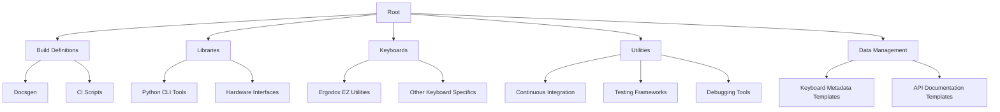

# Overview

The `qmk_firmware` repository is an open-source project focused on creating custom keyboard firmware for mechanical keyboards. It supports a wide range of keyboards and offers extensive documentation, development tools, and community support. The repository is structured to facilitate easy contribution and maintenance, with clear separation of concerns and modular design.

# Architecture

The `qmk_firmware` repository consists of several interconnected modules, each responsible for specific aspects of the project. Below is a textual representation of the architecture using Mermaid syntax:



# Data Flow / Execution Flow

The data flow within the `qmk_firmware` repository involves several stages, starting from source code compilation to flashing the firmware onto a keyboard. Here’s a simplified overview of the execution flow:

1. **Source Code Compilation**:
   - Developers write or modify firmware code in C/C++.
   - The `qmk compile` command is executed, invoking the appropriate compiler based on the keyboard model.
   - The compiler processes the source code, applying any overrides or patches specified in the keyboard configuration files.

2. **Firmware Flashing**:
   - After successful compilation, the firmware binary is generated.
   - The `qmk flash` command is used to upload the firmware to the keyboard via a bootloader interface.
   - The bootloader resets the keyboard, loading the newly flashed firmware.

3. **Testing and Debugging**:
   - Developers run tests to verify the functionality of the firmware.
   - Debugging tools are utilized to identify and fix issues, if any.
   - The process repeats until the firmware meets the desired specifications.

# Configuration & Dependencies

The `qmk_firmware` repository relies on several external dependencies for development and testing. These include:

- **Python Packages**: Essential for command-line tools, hardware interfacing, and documentation generation.
- **Build Tools**: Required for compiling the firmware and running tests.
- **Documentation Tools**: Used to generate and serve the project documentation.

Configuration files such as `requirements.txt` list all necessary dependencies, ensuring that developers have the correct tools installed. Additionally, `.vscode/settings.json` provides settings for Visual Studio Code, facilitating a consistent development environment.

# How to Run / Key Scripts

To get started with the `qmk_firmware` repository, follow these steps:

1. **Clone the Repository**:
   ```sh
   git clone https://github.com/qmk/qmk_firmware.git
   cd qmk_firmware
   ```

2. **Install Dependencies**:
   ```sh
   pip install -r requirements.txt
   ```

3. **Compile Firmware**:
   ```sh
   qmk compile -kb ergodox_ez/default -km default
   ```

4. **Flash Firmware**:
   ```sh
   qmk flash -kb ergodox_ez/default -km default
   ```

5. **Generate Documentation**:
   ```sh
   cd docsgen
   npm install
   npm run dev
   ```

# Notable Design Choices / Extension Points