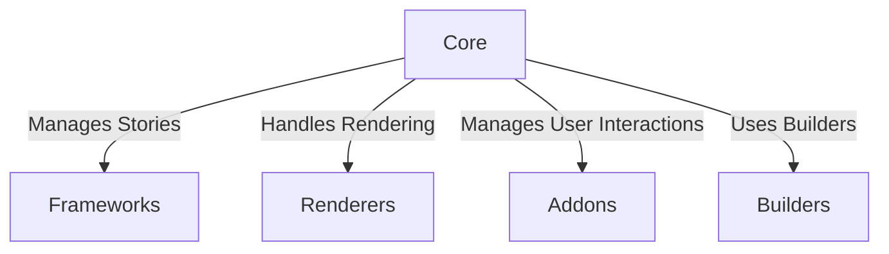

"code/renderers/web-components/package.json",
    "scripts/eslint-plugin-local-rules/package.json",
    "test-storybooks/portable-stories-kitchen-sink/react/package.json",
    "test-storybooks/portable-stories-kitchen-sink/svelte/package.json",
    "test-storybooks/portable-stories-kitchen-sink/vue3/package.json"
  ]
}

# Overview

Storybook is an open-source tool for developing UI components in isolation. It provides a development environment for building UI components in isolation, making it easier to build and test individual components without the need for context from other parts of your application.

# Architecture

The Storybook architecture consists of several key components:

- **Core**: The core module contains the essential functionality for managing stories, rendering them, and handling user interactions.
- **Frameworks**: Each framework (e.g., React, Vue, Angular) has its own module that integrates Storybook with the specific framework.
- **Addons**: Addons extend the functionality of Storybook by providing additional features such as accessibility testing, documentation generation, and pseudo states.
- **Builders**: Builders are responsible for bundling and serving the stories. Storybook supports multiple builders like Vite and Webpack.
- **Renderers**: Renderers handle the actual rendering of stories in different environments (e.g., browser, server).

Here is a textual representation of the architecture using Mermaid syntax:

# Data Flow / Execution Flow

The data flow in Storybook can be described as follows:

1. **User Interaction**: A user interacts with a component in the Storybook interface.
2. **Event Handling**: The event is handled by the Core module.
3. **Framework Integration**: The Core module communicates with the appropriate Framework module to retrieve the component's implementation.
4. **Rendering**: The Core module uses the Renderer module to render the component in the specified environment.
5. **Addon Processing**: If addons are enabled, they process the rendered output before displaying it to the user.

# Configuration & Dependencies

Storybook is configured through a `main.js` or `main.ts` file located in the `.storybook` directory at the root of your project. This file specifies various settings such as the stories directory, frameworks, and addons.

Dependencies are managed via `package.json`. Storybook itself is a monorepo with many packages, each with its own `package.json`.

# How to Run / Key Scripts

To run Storybook, you typically use one of the following scripts:

- `npm run storybook`: Starts Storybook in development mode.
- `npm run build-storybook`: Builds Storybook for production.

These scripts are defined in the `package.json` files of the relevant packages.

# Notable Design Choices / Extension Points

Storybook offers several notable design choices and extension points:

- **Modular Architecture**: Storybook is designed as a modular system, allowing developers to add or remove components as needed.
- **Extensible Addons**: Addons provide a way to extend Storybook's functionality, enabling developers to integrate tools like Jest, Prettier, and more.
- **Flexible Builders**: Storybook supports multiple builders, making it easy to choose the right toolchain for your project.
- **Customizable Renderers**: Developers can create custom renderers to support new environments or technologies.

Caveat: The repository evidence may be incomplete, particularly regarding the full extent of all modules and their interdependencies.