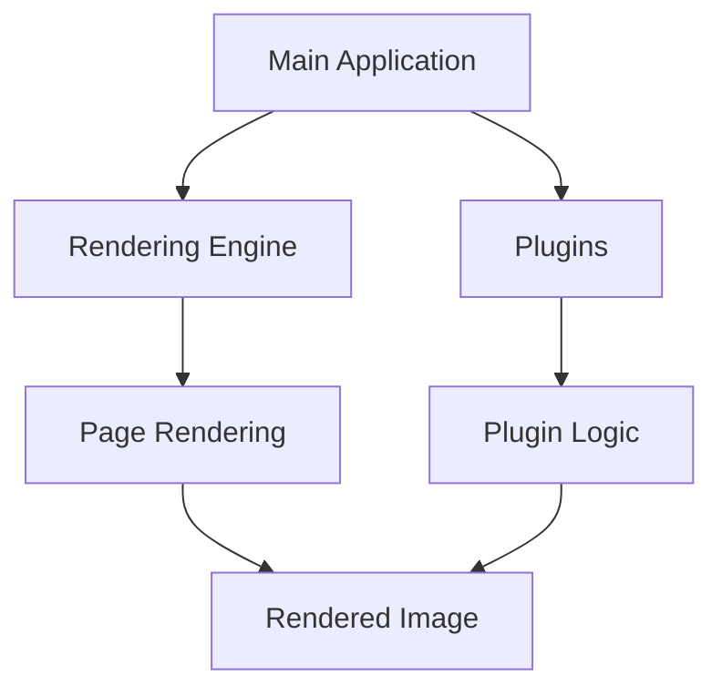

SumatraPDF supports accessibility features, including text-to-speech. To enable text-to-speech, follow these steps:

1. Open SumatraPDF.
2. Press `Ctrl + T` to toggle text-to-speech.
3. Use the arrow keys to navigate through the text.
4. Press `Enter` to read the current line aloud.

## Overview
SumatraPDF is a multi-format (PDF, EPUB, MOBI, CBZ, CBR, FB2, CHM, XPS, DjVu) reader for Windows under (A)GPLv3 license, with some code under BSD license (see AUTHORS).

## Architecture
The SumatraPDF architecture consists of several key components, including the main application, rendering engine, and various plugins. The main application handles user interface operations, while the rendering engine is responsible for displaying PDF pages. Plugins extend the functionality of SumatraPDF, allowing for additional features such as annotations and bookmarks.

## Data Flow / Execution Flow
The data flow in SumatraPDF follows a typical client-server model. The main application communicates with the rendering engine to request page rendering, and the rendering engine processes the request and returns the rendered image. Plugins can intercept and modify this flow, adding their own logic before or after the rendering process.

## Configuration & Dependencies
SumatraPDF relies on several external libraries and frameworks, including MuPDF, Harfbuzz, FreeType, and Gumbo Parser. These dependencies are managed through CMake and pip, ensuring that the correct versions are used during the build process. Additionally, SumatraPDF supports customization through settings files, which allow users to configure various options such as font sizes and display preferences.

## How to Run / Key Scripts
To run SumatraPDF, simply execute the `SumatraPDF.exe` file located in the installation directory. For development purposes, you can use the following scripts:

- `mupdf/scripts/wrap/__main__.py`: A script for wrapping MuPDF functionality in Python.
- `tools/logview-web/package.json`: A script for managing the log view web application.
- `tools/logview/frontend/package.json`: A script for managing the log view frontend component.

## Notable Design Choices / Extension Points
SumatraPDF incorporates several notable design choices and extension points, enabling developers to customize and enhance the application. Some of these include:

- **Plugins**: SumatraPDF supports plugins, allowing developers to extend its functionality without modifying the core codebase.
- **Settings Files**: Users can configure various options through settings files, making it easy to tailor SumatraPDF to their needs.
- **Text-to-Speech Support**: SumatraPDF includes built-in support for text-to-speech, enhancing accessibility for visually impaired users.


```markdown
# SumatraPDF Reader

SumatraPDF is a multi-format (PDF, EPUB, MOBI, CBZ, CBR, FB2, CHM, XPS, DjVu) reader for Windows under (A)GPLv3 license, with some code under BSD license (see AUTHORS).

## Architecture
The SumatraPDF architecture consists of several key components, including the main application, rendering engine, and various plugins. The main application handles user interface operations, while the rendering engine is responsible for displaying PDF pages. Plugins extend the functionality of SumatraPDF, allowing for additional features such as annotations and bookmarks.

## Data Flow / Execution Flow
The data flow in SumatraPDF follows a typical client-server model. The main application communicates with