# Overview

support the development and testing of custom elements using Svelte. It provides a comprehensive set of tools and resources to help developers create robust and reliable custom elements that can be easily integrated into web applications.

## community_02
The `svelte` repository also contains a package focused on Svelte, but this time the emphasis is on the compiler and its associated utilities. The provided community data indicates that there are 238 members involved in this package, with several paths pointing to compiler-related files within the `src/compiler` directory. These paths suggest that the package is heavily involved in compiling Svelte code into optimized JavaScript.

### Purpose
The primary purpose of this subsystem appears to be to compile Svelte code into efficient JavaScript code. It seems to provide a set of tools and utilities to help developers convert their Svelte templates and logic into production-ready JavaScript, optimizing performance and reducing bundle sizes.

### Internal Structure
From the evidence, it's clear that the subsystem includes multiple files located in the `src/compiler` directory. Each file likely corresponds to a specific phase or aspect of the compilation process. For example, there are files related to parsing, analyzing, transforming, and migrating Svelte code. The presence of directories like `phases`, `migrate`, and `preprocess` suggests that the subsystem is organized around different stages of the compilation pipeline.

### Dependencies
While the exact dependencies are not explicitly listed in the provided evidence, given the nature of the subsystem, it is likely to depend on Svelte itself, as well as other libraries or frameworks commonly used in web development environments. Additionally, it might rely on utility libraries such as Babel or TypeScript to perform certain transformations during the compilation process.

### Runtime Role
At runtime, this subsystem would play a crucial role in converting Svelte code into optimized JavaScript. By providing a comprehensive set of tools and utilities, it helps ensure that Svelte code is compiled efficiently and effectively, resulting in smaller and faster bundles that can be delivered to users more quickly.

### Likely Extension Points
Given its focus on compilation, this subsystem could potentially have extension points where developers can add their own custom transformations or optimizations. For example, new phases could be added to the compilation pipeline, or existing phases could be customized to handle specific use cases. Additionally, developers could extend the compiler's capabilities by adding new plugins or extensions that perform additional tasks during the compilation process.

In summary, the `svelte` subsystem is designed to compile Svelte code into efficient JavaScript code. It provides a comprehensive set of tools and utilities

## Architecture

designed to support the creation and testing of custom elements using Svelte. Its internal structure revolves around a series of test files, each representing a different scenario or feature related to custom elements and Svelte integration. At runtime, it plays a critical role in validating the functionality of these custom elements, ensuring they work correctly in web applications. This subsystem is likely to have extension points where developers can add their own tests or customize the behavior of the custom elements.

## community_02
The `svelte` repository contains a package focused on Svelte, a JavaScript compiler for building web applications. The provided community data indicates that there are 238 members involved in this package, with several paths pointing to compiler-related files within the `src/compiler` directory. These paths suggest that the package is heavily involved in compiling Svelte code into optimized JavaScript.

### Purpose
The primary purpose of this subsystem appears to be to compile Svelte code into optimized JavaScript. It seems to provide a comprehensive set of tools and utilities to parse, analyze, transform, and generate code from Svelte templates and scripts.

### Internal Structure
From the evidence, it's clear that the subsystem includes multiple files located in the `src/compiler` directory. These files are organized into phases, such as parsing, analyzing, transforming, and generating code. Each phase has its own set of files and subdirectories, indicating a modular design that allows for easy maintenance and expansion.

### Dependencies
While the exact dependencies are not explicitly listed in the provided evidence, given the nature of the subsystem, it is likely to depend on Svelte itself, as well as other libraries or frameworks commonly used in web development environments. Additionally, it might rely on parsing libraries such as Acorn or Babel to handle the syntax of Svelte templates and scripts.

### Runtime Role
At runtime, this subsystem would play a crucial role in converting Svelte code into optimized JavaScript. By providing a comprehensive set of tools and utilities, it helps ensure that Svelte code is compiled efficiently and effectively, resulting in faster and more performant web applications.

### Likely Extension Points
Given its focus on compilation, this subsystem could potentially have extension points where developers can add their own custom transformations or optimizations. For example, new plugins or extensions could be developed to handle specific features or optimize certain types of code. Additionally, existing transformation steps could be customized or extended to better suit specific use cases.

In summary, the `svelte` subsystem is designed to compile Svelte code into optimized JavaScript. Its internal structure revolves around a series of

### Architecture Graph

```mermaid

flowchart TD
  community_01[packages/svelte\npackages/svelte/tests/runtime-browser/custom-elements-samples/$$props/_config.js, packages/svelte/tests/runtime-browser/custom-elements-samples/$$props/main.svelte]
  community_02[packages/svelte\npackages/svelte/src/compiler/migrate/index.js, packages/svelte/src/compiler/phases/3-transform/css/index.js]
  community_03[packages/svelte\npackages/svelte/tests/runtime-legacy/samples/key-block-transition-global/_config.js, packages/svelte/tests/runtime-legacy/samples/key-block-transition-global/main.svelte]
  community_04[documentation/docs\ndocumentation/docs/index.md, documentation/docs/98-reference/30-runtime-errors.md]
  community_05[documentation/docs/02-runes\ndocumentation/docs/02-runes/01-what-are-runes.md, documentation/docs/02-runes/02-$state.md]
  community_06[README.md\nREADME.md, package.json]
  community_07[documentation/docs/01-introduction\ndocumentation/docs/01-introduction/01-overview.md, documentation/docs/01-introduction/02-getting-started.md]
  community_08[packages/svelte/tests\npackages/svelte/tests/runtime-legacy/samples/reactive-values-text-node/_config.js, packages/svelte/tests/runtime-legacy/samples/reactive-values-text-node/main.svelte]

```

## Data Flow / Execution Flow

is designed to support the creation and testing of custom elements using Svelte. Its internal structure revolves around a series of test files, each corresponding to a specific scenario or feature. At runtime, it plays a critical role in validating the functionality of these custom elements, ensuring they work correctly within web applications. This subsystem is an essential part of the broader Svelte ecosystem, facilitating the development and deployment of complex web applications.

## Configuration & Dependencies

to support the development and testing of custom elements using Svelte. Its internal structure revolves around a series of test files, each focusing on a specific aspect of custom element-Svelte integration. At runtime, it ensures that these custom elements function correctly, making it an essential part of the Svelte ecosystem.

---

## community_02
The `svelte` repository also contains a package focused on Svelte, but this time the emphasis is on the compiler and its associated utilities. The provided community data indicates that there are 238 members involved in this package, with several paths pointing to files within the `src/compiler` directory. These paths suggest that the package is heavily involved in the compilation process of Svelte components.

### Purpose
The primary purpose of this subsystem appears to be to handle the compilation of Svelte components into optimized JavaScript code. It seems to provide a robust set of tools and utilities to assist developers in creating efficient and performant web applications.

### Internal Structure
From the evidence, it's clear that the subsystem includes multiple files located in the `src/compiler` directory. Each file likely corresponds to a specific phase or utility within the compilation process. The presence of directories like `phases`, `migrate`, and `preprocess` suggests that the subsystem is organized around different stages of the compilation process.

### Dependencies
While the exact dependencies are not explicitly listed in the provided evidence, given the nature of the subsystem, it is likely to depend on Svelte itself, as well as other libraries or frameworks commonly used in web development environments. Additionally, it might rely on parsing libraries such as Acorn or Babel to parse the Svelte component syntax.

### Runtime Role
At runtime, this subsystem would play a crucial role in converting Svelte components into executable JavaScript code. By providing a comprehensive set of tools and utilities, it helps ensure that Svelte components are compiled efficiently and accurately, resulting in high-performance web applications.

### Likely Extension Points
Given its focus on the compilation process, this subsystem could potentially have extension points where developers can add their own custom phases or utilities. For example, new parsing rules could be added to support new features in Svelte, or additional optimization techniques could be implemented to improve performance.

In summary, the `svelte` subsystem is designed to handle the compilation of Svelte components into optimized JavaScript code. Its internal structure revolves around a series of files and directories, each focusing on a specific aspect of the compilation process. At runtime, it ensures that Svelte components are compiled efficiently and accurately,

## How to Run / Key Scripts

velte` subsystem is designed to support the development and testing of custom elements using Svelte. It provides a robust framework for creating and verifying custom elements, which is essential for integrating Svelte components into complex web applications.

## community_02
The `svelte` repository contains a package focused on Svelte, a JavaScript compiler for building web applications. The provided community data indicates that there are 238 members involved in this package, with several paths pointing to core compiler functionalities within the `src/compiler` directory. These paths suggest that the package is heavily involved in the compilation process of Svelte components.

### Purpose
The primary purpose of this subsystem appears to be to handle the compilation of Svelte components into optimized JavaScript code. It seems to provide a comprehensive set of tools and utilities to parse, analyze, transform, and generate code for Svelte components.

### Internal Structure
From the evidence, it's clear that the subsystem includes multiple files and directories within the `src/compiler` directory. Each file likely corresponds to a specific phase or aspect of the compilation process. For example, the `phases` directory contains subdirectories for parsing, analyzing, transforming, and more. This modular structure suggests that each phase can be developed, tested, and maintained independently.

### Dependencies
While the exact dependencies are not explicitly listed in the provided evidence, given the nature of the subsystem, it is likely to depend on Svelte itself, as well as other libraries or frameworks commonly used in web development environments. Additionally, it might rely on utility libraries such as Babel or TypeScript for certain transformations.

### Runtime Role
At runtime, this subsystem would play a crucial role in compiling Svelte components into executable JavaScript code. By providing a comprehensive set of tools and utilities, it ensures that Svelte components are compiled efficiently and correctly, resulting in high-performance web applications.

### Likely Extension Points
Given its focus on the compilation process, this subsystem could potentially have extension points where developers can add their own custom phases or transformations. For example, new parsing rules could be added to support new syntax features, or additional optimization techniques could be implemented to improve performance.

In summary, the `svelte` subsystem is designed to handle the compilation of Svelte components into optimized JavaScript code. It provides a robust framework for developing, testing, and maintaining the compilation process, which is essential for creating efficient and performant web applications.

## community_03
The `svelte` repository contains a package focused on Svelte, a JavaScript compiler for building web applications. The provided

## Notable Design Choices / Extension Points

` subsystem is designed to support the creation and testing of custom elements using Svelte. Its internal structure revolves around a series of test files, and it plays a critical role in validating the functionality of these elements at runtime. This subsystem could benefit from extension points to allow for further customization and testing scenarios.

---

## community_02
The `svelte` repository contains a package focused on Svelte, a JavaScript compiler for building web applications. The provided community data indicates that there are 238 members involved in this package, with several paths pointing to compiler-related files within the `src/compiler` directory. These paths suggest that the package is heavily involved in compiling Svelte code into optimized JavaScript.

### Purpose
The primary purpose of this subsystem appears to be to compile Svelte code into efficient JavaScript code. It seems to provide a robust set of tools and utilities to parse, analyze, transform, and optimize Svelte templates and scripts.

### Internal Structure
From the evidence, it's clear that the subsystem includes multiple files located in the `src/compiler` directory. These files are organized into phases, each responsible for a specific aspect of the compilation process. For example, the `1-parse` phase handles parsing Svelte templates, while the `2-analyze` phase analyzes the parsed code to identify dependencies and potential issues. The `3-transform` phase then transforms the analyzed code into optimized JavaScript.

### Dependencies
While the exact dependencies are not explicitly listed in the provided evidence, given the nature of the subsystem, it is likely to depend on Svelte itself, as well as other libraries or frameworks commonly used in web development environments. Additionally, it might rely on utility libraries such as Babel or TypeScript to perform certain transformations during the compilation process.

### Runtime Role
At runtime, this subsystem would not directly interact with end-users. Instead, it would be invoked by the main Svelte application or build tool to compile Svelte code into JavaScript. The compiled JavaScript code would then be executed in the browser or server environment.

### Likely Extension Points
Given its focus on compilation, this subsystem could potentially have extension points where developers can add their own custom transformations or optimizations. For example, new plugins could be developed to extend the capabilities of the compiler, allowing users to introduce custom logic or features during the compilation process.

In summary, the `svelte` subsystem is designed to compile Svelte code into efficient JavaScript code. Its internal structure revolves around a series of phases, each responsible for a specific aspect of the compilation process. This subsystem could benefit from