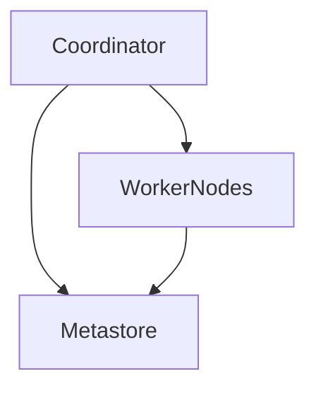

ino-product-tests/src/test/resources/tempto-configuration.yaml"
  ]
}

# Overview

Trino (formerly PrestoSQL) is an open-source SQL query engine designed for distributed data processing. It allows users to run interactive queries on large datasets across multiple data sources. Trino supports various connectors to access different types of databases and data storage systems.

# Architecture

The Trino architecture consists of several key components:

- **Coordinator**: The central component that handles client requests, manages query execution, and coordinates the work across worker nodes.
- **Worker Nodes**: These nodes execute the actual query tasks and process the data.
- **Metastore**: Stores metadata about tables, schemas, and other database objects.
- **Connector Plugins**: Allow Trino to interact with different data sources by providing custom implementations for accessing specific data formats and storage systems.



# Data Flow / Execution Flow

Data flows through Trino in the following manner:

1. A user submits a query to the Trino coordinator.
2. The coordinator parses the query and determines the optimal execution plan.
3. The coordinator assigns the query tasks to available worker nodes.
4. Each worker node executes its assigned tasks and processes the data.
5. Results are collected and sent back to the coordinator.
6. The coordinator aggregates the results and returns them to the user.

# Configuration & Dependencies

Trino requires several configurations and dependencies to function properly:

- **Configuration Files**: Various JSON files define settings such as security policies, resource limits, and connector configurations.
- **Dependencies**: Trino relies on libraries for parsing SQL, handling network communication, and interacting with external systems.

# How to Run / Key Scripts

To run Trino, follow these steps:

1. Build the project using Maven.
2. Configure the necessary properties in `etc/catalog` and `etc/node.properties`.
3. Start the Trino server using the provided scripts.

Key scripts include:

- `bin/trino`: Starts the Trino server.
- `bin/trino-admin`: Manages the Trino cluster.

# Notable Design Choices / Extension Points

Trino includes several notable design choices and extension points:

- **Dynamic Resource Group Management**: Allows dynamic adjustment of resource allocation based on workload.
- **Session Property Managers**: Enables customization of session properties at runtime.
- **Connector Plugins**: Facilitates integration with diverse data sources by allowing developers to create custom connectors.
```
This Markdown document provides a comprehensive overview of the Trino repository, including its architecture, data flow, configuration, how to run it, and notable design choices/extensions. The Mermaid diagram visually represents the key components and their interactions within the system.