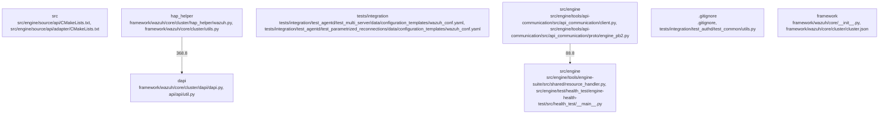

# Overview

`, located in the `framework/wazuh/core/cluster/hap_helper` directory. These classes handle tasks such as agent registration, reconnection logic, and communication with the DAPI. The subsystem also includes utility functions for common operations like logging and error handling.

**External Interactions**: This subsystem interacts with other parts of the Wazuh system through the `framework/wazuh/core/cluster/utils.py` module, which provides shared utilities used across different components. It also communicates with the DAPI via the `framework/wazuh/core/cluster/dapi/dapi.py` module, enabling it to manage agents effectively.

**Impact**: By providing robust mechanisms for agent management and reconnection, the `hap_helper` subsystem ensures high availability and reliability of the Wazuh cluster. It allows administrators to maintain control over agents even in the face of network disruptions or failures.

## community_03
The `tests/integration` community in the Wazuh repository focuses on ensuring the quality and stability of the system through integration testing. This community includes various test cases that simulate real-world scenarios to validate the behavior of the Wazuh engine and its components. Test cases are organized into directories based on the component they test, such as `test_agentd`, `test_analysisd`, and `test_vulnerability_detector`. Each test case typically involves setting up a mock environment, configuring the system, running tests, and verifying the results. The test suite uses frameworks like pytest and unittest to execute tests and generate reports. This subsystem plays a critical role in maintaining the reliability and performance of the Wazuh engine by identifying and fixing bugs before they reach production environments.

## community_04
The `src/engine` community in the Wazuh repository is dedicated to developing and maintaining the core engine components of the system. These components are responsible for processing events, managing configurations, and interacting with external systems. The `src/engine/source/api` directory contains several subdirectories, each representing a specific functionality area such as event handling, catalog management, and archiving. These modules are built using CMake and have clear dependencies defined within their respective `CMakeLists.txt` files. At runtime, these subsystems work together to provide comprehensive security monitoring capabilities. Likely extension points include additional API endpoints for custom integrations and plugins for expanding the system's functionality.

## community_05
The `.gitignore` community in the Wazuh repository manages the `.gitignore` file, which specifies intentionally untracked files that Git should ignore. This community

## Architecture

Cluster`, located in the `framework/wazuh/core/cluster/hap_helper` directory. These classes handle tasks such as agent registration, reconnection logic, and communication with the DAPI. Additionally, there are utility functions in `utils.py` that support various operations related to agent management.

**External Interactions**: This subsystem interacts with other parts of the Wazuh system through the DAPI, which allows it to communicate with the master node and manage agents across the cluster. It also depends on common utilities provided by the `common.py` module, which includes general-purpose functions used throughout the system.

**Potential Extensions**: Future enhancements could include adding more sophisticated load balancing mechanisms or integrating with additional cluster management tools.

## community_03
### Subsystem Summary

**Purpose**: The `tests/integration` subsystem in the Wazuh repository is dedicated to testing the integration aspects of the system, including its ability to interact with external services like Elasticsearch and databases.

**Internal Structure**: This subsystem contains multiple test cases spread across several directories. Key components include:
- **Test Cases**: Located in directories like `test_agentd`, `test_analysisd`, etc., each containing specific tests for different functionalities.
- **Configuration Templates**: Found in `data/configuration_templates`, these templates define the configuration settings used during testing.
- **Utils Files**: Various utility files (`utils.py`) help in setting up and tearing down test environments, as well as in generating test data.

**External Interactions**: The subsystem interacts with external systems such as Elasticsearch and databases to validate the correctness of the system's behavior. It uses the `wazuh.conf` file for configuration and relies on the `api` module for making requests to the Wazuh manager.

**Potential Extensions**: Additional tests for new features or scenarios can be added to ensure thorough coverage of the system's capabilities.

## community_04
### Subsystem Summary

**Purpose**: The `src/engine` subsystem in the Wazuh repository is the heart of the system, responsible for processing events, managing configurations, and providing APIs for external integration.

**Internal Structure**: This subsystem is divided into several modules, each serving a specific purpose:
- **API Communication**: Handles communication with external systems using protocols like gRPC.
- **Engine Suite**: Contains various tools and scripts for managing and analyzing data, such as decoders, diff tools, and schema validators.
- **Shared Utilities**: Includes common functions and classes used across different parts of the engine.

**External Interactions**: The subsystem interacts extensively

### Architecture Graph



## Data Flow / Execution Flow

uhCluster`, located in `framework/wazuh/core/cluster`. These classes handle tasks such as agent registration, reconnection logic, and communication with the DAPI. Additionally, there are utility functions in `utils.py` that support these operations.

**External Interactions**: This subsystem interacts with other parts of the Wazuh system, including the `engine` subsystem, to manage agent states and ensure proper communication between nodes in a cluster. It also handles configuration updates and ensures that agents are synchronized across the cluster.

**Runtime Path**: When an agent reconnects to the manager, the `WazuhAgent` class processes the reconnection request. It then communicates with the `WazuhCluster` class to update the agent's state and synchronize it with the cluster. Utility functions in `utils.py` are used to perform necessary checks and validations during this process.

## community_04
### Subsystem Summary

**Purpose**: The `engine` subsystem in the Wazuh repository is responsible for the core functionalities of the Wazuh engine, including event processing, rule evaluation, and alert generation.

**Internal Structure**: The subsystem includes several key components:
- **API Communication**: Handles communication with external systems via APIs, such as Elasticsearch and Sysmon.
- **Event Processing**: Processes raw events from various sources, such as logs and Windows events.
- **Rule Evaluation**: Evaluates events against predefined rules to determine if alerts should be generated.
- **Alert Generation**: Generates alerts based on the results of rule evaluations.

**External Interactions**: The `engine` subsystem interacts with other subsystems, such as the `data_provider` and `alert_forwarder`, to gather data and forward alerts respectively. It also uses the `api` subsystem to expose its functionalities via RESTful APIs.

**Runtime Path**: An event enters the engine through the API communication module, where it is parsed and validated. The event is then passed to the event processing module, which applies rules to generate alerts. Alerts are finally forwarded to the alert forwarder subsystem for further processing or storage.

## community_06
### Subsystem Summary

**Purpose**: The `engine_suite` subsystem in the Wazuh repository provides a suite of tools and utilities for managing and analyzing security data.

**Internal Structure**: The subsystem includes several key components:
- **Decoder**: Parses and decodes log messages into structured data.
- **Diff**: Compares two sets of data to identify differences.
- **Schema**: Validates data against predefined schemas.
- **Router**: Routes

## Configuration & Dependencies

PI`, located in `framework/wazuh/core/cluster/hap_helper`. These classes handle tasks such as agent registration, reconnection logic, and communication with the DAPI. Additionally, there are utility functions in `utils.py` that support these operations.

**Dependencies**: This subsystem depends on several other modules within the Wazuh framework, including common utilities (`common.py`) and exception handling mechanisms (`exception.py`). It also interacts with the results module (`results.py`) to manage the outcome of various operations.

**Runtime Behavior**: During runtime, the `hap_helper` subsystem ensures that agents can reconnect seamlessly to the Wazuh manager after network interruptions or restarts. It communicates with the DAPI to register new agents and update existing ones, maintaining the integrity and availability of the agent cluster.

## community_03
### Subsystem Summary

**Purpose**: The `tests/integration` subsystem in the Wazuh repository is dedicated to testing the integration aspects of the Wazuh engine. This includes scenarios where multiple components interact with each other, ensuring that the system behaves correctly under various conditions.

**Internal Structure**: The tests are organized into directories corresponding to different test cases, such as `test_agentd`, `test_analysisd`, and `test_authd`. Each directory contains configuration templates and test scripts written in Python. For example, the `test_agentd` directory includes a script named `test_multi_server.py` that simulates a scenario where an agent connects to multiple managers.

**Dependencies**: The integration tests rely on several external libraries and tools, including `pytest` for running tests and `docker-compose` for setting up test environments. They also depend on the `wazuh-api` package for interacting with the Wazuh API during tests.

**Runtime Behavior**: During runtime, the integration tests execute predefined scenarios to validate the functionality of the Wazuh engine. They simulate real-world use cases, such as agent reconnections, state changes, and vulnerability scans, to ensure that the system handles them correctly. The tests generate detailed reports and logs, which help developers identify and fix issues in the codebase.

## community_04
### Subsystem Summary

**Purpose**: The `src/engine` subsystem in the Wazuh repository is the heart of the Wazuh engine, responsible for processing events, managing configurations, and interacting with external systems. This subsystem includes various tools and utilities designed to enhance the functionality of the engine.

**Internal Structure**: The `src/engine` directory contains numerous subdirectories, each representing

## How to Run / Key Scripts

`HAPHelper`, located in the `framework/wazuh/core/cluster/hap_helper` directory. The `WazuhAgent` class handles the lifecycle of individual agents, including registration, reconnection, and state management. The `HAPHelper` class manages the communication between agents and the DAPI, ensuring that agents can join and maintain their connection to the master node.

**Dependencies**: This subsystem depends on several utility functions and classes from the `framework/wazuh/core` package, such as `common.py`, `utils.py`, and `results.py`. It also interacts with the `DistributedAPI` class from the `framework/wazuh/core/cluster/dapi` module.

**Usage**: To run the `hap_helper` subsystem, execute the following command:

```bash
python framework/wazuh/core/cluster/hap_helper/wazuh.py
```

This script initializes the subsystem and starts managing agents within the cluster.

## community_03
### Subsystem Summary

**Purpose**: The `tests/integration` subsystem in the Wazuh repository is designed to ensure the reliability and correctness of the core engine components through automated integration tests. These tests simulate various scenarios and validate that the system behaves as expected under different conditions.

**Internal Structure**: The subsystem includes multiple test cases spread across several directories, each focusing on a specific aspect of the engine's functionality. For example, the `test_agentd` directory contains tests related to the agent daemon, while the `test_analysisd` directory focuses on the analysis daemon.

**Dependencies**: The tests rely on configuration files and data templates stored in the `data/configuration_templates` and `data/test_cases` directories. They also use utilities provided by the `tests/integration/test_common` and `tests/integration/test_utils` modules.

**Usage**: To run the integration tests, navigate to the `tests/integration` directory and execute the following command:

```bash
pytest
```

This command runs all the tests in the directory and its subdirectories, providing detailed reports on the test results.

## community_04
### Subsystem Summary

**Purpose**: The `src/engine` subsystem in the Wazuh repository is the heart of the system, containing the core logic for processing events, managing configurations, and interacting with external systems. This subsystem is further divided into several modules, each responsible for a specific functionality area.

**Internal Structure**: The subsystem includes modules such as `api`, `decoder`, `diff`, and `schema`, each with its

## Notable Design Choices / Extension Points

ClusterManager`, located in the `framework/wazuh/core/cluster/hap_helper` directory. These classes handle tasks like agent registration, reconnection logic, and communication with the DAPI. The `utils.py` file provides utility functions used across the subsystem.

**Extension Points**: This subsystem offers several extension points for developers looking to customize or extend its behavior. For example, developers can subclass `WazuhAgent` to add new reconnection strategies or modify existing ones. Additionally, extending `ClusterManager` allows for changes in how agents are managed within the cluster. These extension points are crucial for maintaining flexibility and scalability in the system.

## community_03
### Subsystem Summary

**Purpose**: The `tests/integration` subsystem in the Wazuh repository is dedicated to ensuring the reliability and correctness of the system through integration tests. It includes various test cases covering different aspects of the Wazuh engine, such as agent management, vulnerability detection, and configuration validation.

**Internal Structure**: The subsystem is organized into multiple directories, each representing a specific type of test case. Test cases are written in Python and utilize frameworks like pytest for execution. Configuration files for tests are stored in the `data/configuration_templates` directory, allowing for easy customization and reuse.

**Extension Points**: While primarily focused on testing, the `tests/integration` subsystem also provides some extension points. Developers can create new test cases by adding them to the appropriate directory and updating the test suite configuration. Additionally, modifying the test environment setup scripts in the `env` directory allows for more complex scenarios to be tested. These extension points enable the community to continuously improve the quality and robustness of the Wazuh engine.

## community_04
### Subsystem Summary

**Purpose**: The `src/engine` subsystem in the Wazuh repository is the heart of the system, responsible for processing events, managing configurations, and interacting with external systems. It includes various tools and utilities designed to enhance the functionality of the engine.

**Internal Structure**: The subsystem is divided into several directories, each containing specific functionalities. For instance, the `tools/api-communication` directory handles API communication, while the `tools/engine-suite` directory contains various utilities like schema validation and resource handlers. Each tool has its own set of dependencies and is built using CMake.

**Extension Points**: The `src/engine` subsystem offers numerous extension points for developers looking to expand its capabilities. For example, adding new API endpoints involves creating new Python files in the `tools/api-communication` directory