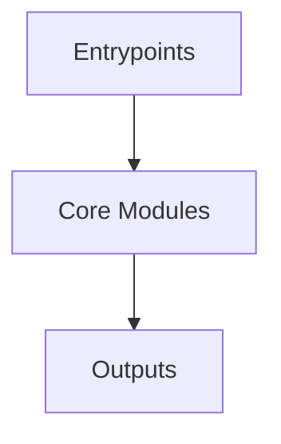

# Overview
Repository `wazuh` appears to implement a modular system with 6584 source files at commit `44b7cd33e05abb7730228bb092b23b419ee4f15e`.

## Architecture
Major components inferred from file/module analysis:
- `src`: -related functionalities and sets up the build environment to link against other libraries such as `base`, `defs`, `json`, `logpar`, and `xml`
- `root`: The `root` module in the Wazuh repository is primarily responsible for managing the overall architecture and documentation of the Wazuh platform

## Data Flow / Execution Flow
Typical execution path: `Entrypoint -> Core Modules -> Runtime Services -> Output/Side Effects`.
Entrypoints initialize core modules, which orchestrate processing and emit outputs or side effects.

## Configuration & Dependencies
- Build/dependency files: api/setup.py, framework/setup.py, framework/requirements.txt, src/CMakeLists.txt, src/data_provider/CMakeLists.txt, src/data_provider/qa/requirements.txt, src/data_provider/src/extended_sources/CMakeLists.txt, src/data_provider/src/extended_sources/groups/CMakeLists.txt, src/data_provider/src/extended_sources/groups/tests/CMakeLists.txt, src/data_provider/src/extended_sources/users/CMakeLists.txt, src/data_provider/src/extended_sources/users/tests/CMakeLists.txt, src/data_provider/tests/CMakeLists.txt, src/data_provider/tests/sysInfo/CMakeLists.txt, src/data_provider/tests/sysInfoHardwareMac/CMakeLists.txt, src/data_provider/tests/sysInfoNetworkBSD/CMakeLists.txt, src/data_provider/tests/sysInfoNetworkLinux/CMakeLists.txt, src/data_provider/tests/sysInfoNetworkWindows/CMakeLists.txt, src/data_provider/tests/sysInfoPackageLinuxParserRpm/CMakeLists.txt, src/data_provider/tests/sysInfoPackages/CMakeLists.txt, src/data_provider/tests/sysInfoPackagesBerkeleyDB/CMakeLists.txt, src/data_provider/tests/sysInfoPackagesLinuxHelper/CMakeLists.txt, src/data_provider/tests/sysInfoPackagesMAC/CMakeLists.txt, src/data_provider/tests/sysInfoPorts/CMakeLists.txt, src/data_provider/tests/sysInfoRpmPackageManager/CMakeLists.txt, src/data_provider/tests/sysInfoWin/CMakeLists.txt, src/data_provider/tests/sysInfoNetworkSolaris/CMakeLists.txt, src/data_provider/tests/sysInfoPackagesSolaris/CMakeLists.txt, src/data_provider/testtool/CMakeLists.txt, src/engine/CMakeLists.txt, src/engine/source/api/CMakeLists.txt, src/engine/source/api/adapter/CMakeLists.txt, src/engine/source/api/archiver/CMakeLists.txt, src/engine/source/api/event/CMakeLists.txt, src/engine/source/api/geo/CMakeLists.txt, src/engine/source/api/router/CMakeLists.txt, src/engine/source/api/tester/CMakeLists.txt, src/engine/source/api/catalog/CMakeLists.txt, src/engine/source/api/kvdb/CMakeLists.txt, src/engine/source/api/policy/CMakeLists.txt, src/engine/source/archiver/CMakeLists.txt, src/engine/source/base/CMakeLists.txt, src/engine/source/bk/CMakeLists.txt, src/engine/source/builder/CMakeLists.txt, src/engine/source/conf/CMakeLists.txt, src/engine/source/defs/CMakeLists.txt, src/engine/source/geo/CMakeLists.txt, src/engine/source/hlp/CMakeLists.txt, src/engine/source/httpsrv/CMakeLists.txt, src/engine/source/logicexpr/CMakeLists.txt, src/engine/source/logpar/CMakeLists.txt, src/engine/source/metrics/CMakeLists.txt, src/engine/source/parsec/CMakeLists.txt, src/engine/source/proto/CMakeLists.txt, src/engine/source/queue/CMakeLists.txt, src/engine/source/router/CMakeLists.txt, src/engine/source/schemf/CMakeLists.txt, src/engine/source/store/CMakeLists.txt, src/engine/source/yml/CMakeLists.txt, src/engine/source/indexerconnector/CMakeLists.txt, src/engine/source/indexerconnector/qa/requirements.txt, src/engine/source/indexerconnector/test/CMakeLists.txt, src/engine/source/indexerconnector/test/component/CMakeLists.txt, src/engine/source/indexerconnector/test/unit/CMakeLists.txt, src/engine/source/indexerconnector/tool/CMakeLists.txt, src/engine/source/kvdb/CMakeLists.txt, src/engine/source/udgramsrv/CMakeLists.txt, src/engine/test/acceptance_test/requirements.txt, src/engine/test/engine-test-utils/pyproject.toml, src/engine/test/helper_tests/engine-helper-test/pyproject.toml, src/engine/test/integration_tests/engine-it/pyproject.toml, src/engine/test/health_test/engine-health-test/pyproject.toml, src/engine/tools/api-communication/pyproject.toml, src/engine/tools/engine-bench/pyproject.toml, src/engine/tools/engine-suite/pyproject.toml, src/engine/tools/engine-suite/setup.py, src/engine/tools/evtx2xml/requirements.txt, src/engine/tools/evtx2xml/setup.py, src/shared_modules/content_manager/CMakeLists.txt, src/shared_modules/content_manager/tests/CMakeLists.txt, src/shared_modules/content_manager/tests/component/CMakeLists.txt, src/shared_modules/content_manager/tests/unit/CMakeLists.txt, src/shared_modules/content_manager/testtool/CMakeLists.txt, src/shared_modules/dbsync/CMakeLists.txt, src/shared_modules/dbsync/example/CMakeLists.txt, src/shared_modules/dbsync/integrationTests/CMakeLists.txt, src/shared_modules/dbsync/integrationTests/fim/CMakeLists.txt, src/shared_modules/dbsync/tests/CMakeLists.txt, src/shared_modules/dbsync/tests/dbengine/CMakeLists.txt, src/shared_modules/dbsync/tests/interface/CMakeLists.txt, src/shared_modules/dbsync/tests/pipelineFactory/CMakeLists.txt, src/shared_modules/dbsync/tests/sqlite/CMakeLists.txt, src/shared_modules/dbsync/testtool/CMakeLists.txt, src/shared_modules/indexer_connector/CMakeLists.txt, src/shared_modules/indexer_connector/qa/requirements.txt, src/shared_modules/indexer_connector/tests/CMakeLists.txt, src/shared_modules/indexer_connector/tests/component/CMakeLists.txt, src/shared_modules/indexer_connector/tests/unit/CMakeLists.txt, src/shared_modules/indexer_connector/testtool/CMakeLists.txt, src/shared_modules/keystore/CMakeLists.txt, src/shared_modules/keystore/qa/requirements.txt, src/shared_modules/keystore/tests/CMakeLists.txt, src/shared_modules/keystore/tests/component/CMakeLists.txt, src/shared_modules/keystore/testtool/CMakeLists.txt, src/shared_modules/router/CMakeLists.txt, src/shared_modules/router/tests/CMakeLists.txt, src/shared_modules/router/tests/benchmark/CMakeLists.txt, src/shared_modules/router/tests/component/CMakeLists.txt, src/shared_modules/router/tests/unit/CMakeLists.txt, src/shared_modules/router/testtool/CMakeLists.txt, src/shared_modules/utils/CMakeLists.txt, src/shared_modules/utils/benchmark/CMakeLists.txt, src/shared_modules/utils/flatbuffers/CMakeLists.txt, src/shared_modules/utils/flatbuffers/schemas/CMakeLists.txt, src/shared_modules/utils/tests/CMakeLists.txt, src/shared_modules/rsync/CMakeLists.txt, src/shared_modules/rsync/integrationTests/CMakeLists.txt, src/shared_modules/rsync/tests/CMakeLists.txt, src/shared_modules/rsync/tests/implementation/CMakeLists.txt, src/shared_modules/rsync/tests/interface/CMakeLists.txt, src/shared_modules/rsync/testtool/CMakeLists.txt, src/syscheckd/CMakeLists.txt, src/syscheckd/src/db/CMakeLists.txt, src/syscheckd/src/db/tests/CMakeLists.txt, src/syscheckd/src/db/tests/db/ComponentTest/dbInterface/CMakeLists.txt, src/syscheckd/src/db/tests/db/ComponentTest/fileInterface/CMakeLists.txt, src/syscheckd/src/db/tests/db/ComponentTest/registryInterface/CMakeLists.txt, src/syscheckd/src/db/tests/db/FIMDB/fimDBTests/CMakeLists.txt, src/syscheckd/src/db/tests/db/dbItem/FileItem/CMakeLists.txt, src/syscheckd/src/db/tests/db/dbItem/RegistryKey/CMakeLists.txt, src/syscheckd/src/db/tests/db/dbItem/RegistryValue/CMakeLists.txt, src/syscheckd/src/db/testtool/CMakeLists.txt, src/syscheckd/src/ebpf/CMakeLists.txt, src/syscheckd/src/ebpf/tests/CMakeLists.txt, src/syscheckd/src/ebpf/tests/fimEbpfWhodataTest/CMakeLists.txt, src/syscheckd/src/ebpf/tests/unit/CMakeLists.txt, src/unit_tests/CMakeLists.txt, src/unit_tests/active-response/CMakeLists.txt, src/unit_tests/addagent/CMakeLists.txt, src/unit_tests/client-agent/CMakeLists.txt, src/unit_tests/config/CMakeLists.txt, src/unit_tests/logcollector/CMakeLists.txt, src/unit_tests/monitord/CMakeLists.txt, src/unit_tests/os_auth/CMakeLists.txt, src/unit_tests/os_crypto/CMakeLists.txt, src/unit_tests/os_crypto/aes/CMakeLists.txt, src/unit_tests/os_crypto/blowfish/CMakeLists.txt, src/unit_tests/os_crypto/hmac/CMakeLists.txt, src/unit_tests/os_crypto/md5/CMakeLists.txt, src/unit_tests/os_crypto/md5_sha1_sha256/CMakeLists.txt, src/unit_tests/os_crypto/sha1/CMakeLists.txt, src/unit_tests/os_crypto/sha256/CMakeLists.txt, src/unit_tests/os_crypto/sha512/CMakeLists.txt, src/unit_tests/os_crypto/shared/CMakeLists.txt, src/unit_tests/os_crypto/md5_sha1/CMakeLists.txt, src/unit_tests/os_execd/CMakeLists.txt, src/unit_tests/os_net/CMakeLists.txt, src/unit_tests/os_regex/CMakeLists.txt, src/unit_tests/os_xml/CMakeLists.txt, src/unit_tests/os_zlib/CMakeLists.txt, src/unit_tests/remoted/CMakeLists.txt, src/unit_tests/shared/CMakeLists.txt, src/unit_tests/syscheckd/CMakeLists.txt, src/unit_tests/syscheckd/registry/CMakeLists.txt, src/unit_tests/syscheckd/whodata/CMakeLists.txt, src/unit_tests/wazuh_db/CMakeLists.txt, src/unit_tests/wazuh_modules/CMakeLists.txt, src/unit_tests/wazuh_modules/agent_upgrade/CMakeLists.txt, src/unit_tests/wazuh_modules/aws/CMakeLists.txt, src/unit_tests/wazuh_modules/azure/CMakeLists.txt, src/unit_tests/wazuh_modules/command/CMakeLists.txt, src/unit_tests/wazuh_modules/control/CMakeLists.txt, src/unit_tests/wazuh_modules/database/CMakeLists.txt, src/unit_tests/wazuh_modules/docker/CMakeLists.txt, src/unit_tests/wazuh_modules/exec/CMakeLists.txt, src/unit_tests/wazuh_modules/gcp/CMakeLists.txt, src/unit_tests/wazuh_modules/github/CMakeLists.txt, src/unit_tests/wazuh_modules/ms_graph/CMakeLists.txt, src/unit_tests/wazuh_modules/office365/CMakeLists.txt, src/unit_tests/wazuh_modules/scheduling/CMakeLists.txt, src/unit_tests/wazuh_modules/task_manager/CMakeLists.txt, src/unit_tests/wazuh_modules/vulnerability_detection/CMakeLists.txt, src/unit_tests/wazuh_modules/wmodules/CMakeLists.txt, src/unit_tests/wazuh_modules/ciscat/CMakeLists.txt, src/unit_tests/wazuh_modules/oscap/CMakeLists.txt, src/unit_tests/wazuh_modules/osquery/CMakeLists.txt, src/unit_tests/wazuh_modules/sca/CMakeLists.txt, src/unit_tests/win32/CMakeLists.txt, src/wazuh_modules/syscollector/CMakeLists.txt, src/wazuh_modules/syscollector/tests/CMakeLists.txt, src/wazuh_modules/syscollector/tests/sysCollectorImp/CMakeLists.txt, src/wazuh_modules/syscollector/tests/sysNormalizer/CMakeLists.txt, src/wazuh_modules/syscollector/tests/sysCollectorFlatbuffers/CMakeLists.txt, src/wazuh_modules/syscollector/testtool/CMakeLists.txt, src/wazuh_modules/vulnerability_scanner/CMakeLists.txt, src/wazuh_modules/vulnerability_scanner/qa/requirements.txt, src/wazuh_modules/vulnerability_scanner/src/databaseFeedManager/CMakeLists.txt, src/wazuh_modules/vulnerability_scanner/src/scanOrchestrator/CMakeLists.txt, src/wazuh_modules/vulnerability_scanner/tests/CMakeLists.txt, src/wazuh_modules/vulnerability_scanner/tests/benchmark/CMakeLists.txt, src/wazuh_modules/vulnerability_scanner/tests/component/CMakeLists.txt, src/wazuh_modules/vulnerability_scanner/tests/unit/CMakeLists.txt, src/wazuh_modules/vulnerability_scanner/testtool/CMakeLists.txt, src/wazuh_modules/vulnerability_scanner/testtool/databaseFeedManager/CMakeLists.txt, src/wazuh_modules/vulnerability_scanner/testtool/rocksDBQuery/CMakeLists.txt, src/wazuh_modules/vulnerability_scanner/testtool/scanner/CMakeLists.txt, src/wazuh_modules/vulnerability_scanner/testtool/wazuhDBQuery/CMakeLists.txt, src/wazuh_modules/inventory_harvester/CMakeLists.txt, src/wazuh_modules/inventory_harvester/qa/requirements.txt, src/wazuh_modules/inventory_harvester/tests/CMakeLists.txt, src/wazuh_modules/inventory_harvester/testtool/CMakeLists.txt, src/win32/qa/requirements.txt, extensions/elasticsearch/7.x/qa/requirements.txt
- Config files: api/api/configuration/api.yaml, api/test/integration/env/configurations/base/manager/config/api/configuration/api.yaml, api/test/integration/env/configurations/base/manager/config/api/configuration/security/security.yaml, api/test/integration/env/configurations/base/manager/configuration_files/master_only/agent_groups.yaml, api/test/integration/env/configurations/base/manager/configuration_files/master_only/agent_info.yaml, api/test/integration/env/configurations/rbac/active/black_config.yaml, api/test/integration/env/configurations/rbac/active/white_config.yaml, api/test/integration/env/configurations/rbac/agent/black_config.yaml, api/test/integration/env/configurations/rbac/agent/white_config.yaml, api/test/integration/env/configurations/rbac/cluster/black_config.yaml, api/test/integration/env/configurations/rbac/cluster/white_config.yaml, api/test/integration/env/configurations/rbac/event/black_config.yaml, api/test/integration/env/configurations/rbac/event/white_config.yaml, api/test/integration/env/configurations/rbac/mitre/black_config.yaml, api/test/integration/env/configurations/rbac/overview/black_config.yaml, api/test/integration/env/configurations/rbac/overview/white_config.yaml, api/test/integration/env/configurations/rbac/rootcheck/black_config.yaml, api/test/integration/env/configurations/rbac/rootcheck/white_config.yaml, api/test/integration/env/configurations/rbac/security/black_config.yaml, api/test/integration/env/configurations/rbac/security/white_config.yaml, api/test/integration/env/configurations/rbac/syscheck/black_config.yaml, api/test/integration/env/configurations/rbac/syscheck/white_config.yaml, api/test/integration/env/configurations/rbac/task/black_config.yaml, api/test/integration/env/configurations/rbac/task/white_config.yaml, api/test/integration/env/configurations/rbac/cdb/black_config.yaml, api/test/integration/env/configurations/rbac/cdb/white_config.yaml, api/test/integration/env/configurations/rbac/ciscat/black_config.yaml, api/test/integration/env/configurations/rbac/ciscat/white_config.yaml, api/test/integration/env/configurations/rbac/decoder/black_config.yaml, api/test/integration/env/configurations/rbac/decoder/white_config.yaml, api/test/integration/env/configurations/rbac/experimental/black_config.yaml, api/test/integration/env/configurations/rbac/experimental/white_config.yaml, api/test/integration/env/configurations/rbac/logtest/black_config.yaml, api/test/integration/env/configurations/rbac/manager/black_config.yaml, api/test/integration/env/configurations/rbac/manager/white_config.yaml, api/test/integration/env/configurations/rbac/rule/black_config.yaml, api/test/integration/env/configurations/rbac/rule/white_config.yaml, api/test/integration/env/configurations/rbac/sca/black_config.yaml, api/test/integration/env/configurations/rbac/sca/white_config.yaml, api/test/integration/env/configurations/rbac/syscollector/black_config.yaml, api/test/integration/env/configurations/rbac/syscollector/white_config.yaml, src/ci/input/test_tool_config.json, src/engine/source/indexerconnector/qa/test_data/test_add_bulk_indexer_connector/config.json, src/engine/source/indexerconnector/qa/test_data/test_initialize_indexer_connector/config.json, src/engine/source/indexerconnector/tool/input/config.json, src/engine/tools/devContainer/.vscode/settings.json, src/engine/tools/devContainer/e2e/wazuh-dashboard/config.yml, src/shared_modules/dbsync/smokeTests/config.json, src/shared_modules/dbsync/testtool/input/config.json, src/shared_modules/dbsync/testtool/input/config_template.json, src/shared_modules/indexer_connector/qa/test_data/test_add_bulk_indexer_connector/config.json, src/shared_modules/indexer_connector/qa/test_data/test_bulk_indexer_413_connector/config.json, src/shared_modules/indexer_connector/qa/test_data/test_initialize_indexer_connector/config.json, src/shared_modules/indexer_connector/qa/test_data/test_update_mappings_connector/config.json, src/shared_modules/indexer_connector/testtool/input/config.json, src/shared_modules/rsync/testtool/input/config.json, src/syscheckd/src/db/smokeTests/config.json, src/syscheckd/src/db/smokeTests/configWindows.json, src/wazuh_modules/syscollector/norm_config.json, src/wazuh_modules/vulnerability_scanner/qa/test_data_policy/001/config.json, src/wazuh_modules/vulnerability_scanner/qa/test_data_policy/001/configDisabled.json, src/wazuh_modules/vulnerability_scanner/qa/test_data_policy/001/configDisabledAndManagerDisabled.json, src/wazuh_modules/vulnerability_scanner/qa/test_data_policy/001/configManagerDisabled.json, src/wazuh_modules/vulnerability_scanner/qa/test_data_policy/002/config.json, src/wazuh_modules/vulnerability_scanner/qa/test_data_policy/002/configManagerDisabled.json, src/wazuh_modules/vulnerability_scanner/qa/test_data_policy/003/config.json, src/wazuh_modules/vulnerability_scanner/qa/test_data_policy/003/configDisabled.json, src/wazuh_modules/vulnerability_scanner/qa/test_data_policy/003/configDisabledAndManagerDisabled.json, src/wazuh_modules/vulnerability_scanner/qa/test_data_policy/003/configManagerDisabled.json, src/wazuh_modules/vulnerability_scanner/qa/test_data_policy/004/config.json, src/wazuh_modules/vulnerability_scanner/qa/test_data_policy/004/configManagerDisabled.json, src/wazuh_modules/vulnerability_scanner/qa/test_data_policy/005/config.json, src/wazuh_modules/vulnerability_scanner/qa/test_data_policy/005/configEnableCluster.json, src/wazuh_modules/vulnerability_scanner/qa/test_data_policy/006/defaultConfigDisabled.json, src/wazuh_modules/vulnerability_scanner/qa/test_data_policy/006/defaultConfigEnabled.json, src/wazuh_modules/vulnerability_scanner/qa/test_data_policy/007/config.json, src/wazuh_modules/vulnerability_scanner/qa/test_data_policy/007/configClusterEnable.json, src/wazuh_modules/vulnerability_scanner/qa/test_data_policy/007/configClusterName.json, src/wazuh_modules/vulnerability_scanner/qa/test_data_policy/007/configClusterNodeName.json, src/wazuh_modules/vulnerability_scanner/qa/test_data_policy/007/configClusterNodeNameManagerDisabled.json, src/wazuh_modules/vulnerability_scanner/qa/test_data_policy/007/configManagerDisabled.json, src/wazuh_modules/vulnerability_scanner/qa/test_data_policy/008/config.json, src/wazuh_modules/vulnerability_scanner/qa/test_data_policy/008/configManagerDisabled.json, src/wazuh_modules/vulnerability_scanner/testtool/databaseFeedManager/config.json, src/wazuh_modules/vulnerability_scanner/testtool/scanner/config.content_generation.json, src/wazuh_modules/vulnerability_scanner/testtool/scanner/config.json, src/wazuh_modules/vulnerability_scanner/testtool/scanner/config.offline_content_generation.json, src/wazuh_modules/vulnerability_scanner/testtool/scanner/TC-007/config.json, src/wazuh_modules/vulnerability_scanner/testtool/scanner/TC-008/config.json, src/wazuh_modules/vulnerability_scanner/testtool/wazuhDBQuery/config.json, src/wazuh_modules/inventory_harvester/qa/test_data/fim/file/000_insert_delta/config.json, src/wazuh_modules/inventory_harvester/qa/test_data/fim/file/001_insert_delete_delta/config.json, src/wazuh_modules/inventory_harvester/qa/test_data/fim/file/002_modify_delta/config.json, src/wazuh_modules/inventory_harvester/qa/test_data/fim/file/003_insert_rsync/config.json, src/wazuh_modules/inventory_harvester/qa/test_data/fim/file/004_insert_delete_rsync/config.json, src/wazuh_modules/inventory_harvester/qa/test_data/fim/file/005_integrity_clear/config.json, src/wazuh_modules/inventory_harvester/qa/test_data/fim/file/006_integrity_check_global/config.json, src/wazuh_modules/inventory_harvester/qa/test_data/fim/registry/000_insert_delta/config.json, src/wazuh_modules/inventory_harvester/qa/test_data/fim/registry/001_insert_delete_delta/config.json, src/wazuh_modules/inventory_harvester/qa/test_data/fim/registry/002_modify_delta/config.json, src/wazuh_modules/inventory_harvester/qa/test_data/fim/registry/003_insert_rsync/config.json, src/wazuh_modules/inventory_harvester/qa/test_data/fim/registry/004_insert_delete_rsync/config.json, src/wazuh_modules/inventory_harvester/qa/test_data/fim/registry/005_integrity_clear/config.json, src/wazuh_modules/inventory_harvester/qa/test_data/fim/registry/006_integrity_check_global/config.json, src/wazuh_modules/inventory_harvester/qa/test_data/inventory/groups/000_insert_rsync/config.json, src/wazuh_modules/inventory_harvester/qa/test_data/inventory/groups/001_insert_delete_rsync/config.json, src/wazuh_modules/inventory_harvester/qa/test_data/inventory/groups/002_insert_delta/config.json, src/wazuh_modules/inventory_harvester/qa/test_data/inventory/groups/003_insert_delete_delta/config.json, src/wazuh_modules/inventory_harvester/qa/test_data/inventory/groups/004_integrity_clear/config.json, src/wazuh_modules/inventory_harvester/qa/test_data/inventory/groups/005_integrity_check_global/config.json, src/wazuh_modules/inventory_harvester/qa/test_data/inventory/hardware/000_insert_delta/config.json, src/wazuh_modules/inventory_harvester/qa/test_data/inventory/hardware/001_insert_delete_delta/config.json, src/wazuh_modules/inventory_harvester/qa/test_data/inventory/hardware/002_insert_rsync/config.json, src/wazuh_modules/inventory_harvester/qa/test_data/inventory/hardware/003_insert_delete_rsync/config.json, src/wazuh_modules/inventory_harvester/qa/test_data/inventory/hardware/004_integrity_clear/config.json, src/wazuh_modules/inventory_harvester/qa/test_data/inventory/hardware/005_integrity_check_global/config.json, src/wazuh_modules/inventory_harvester/qa/test_data/inventory/hotfixes/000_insert_delta/config.json, src/wazuh_modules/inventory_harvester/qa/test_data/inventory/hotfixes/001_insert_delete_delta/config.json, src/wazuh_modules/inventory_harvester/qa/test_data/inventory/hotfixes/002_insert_rsync/config.json, src/wazuh_modules/inventory_harvester/qa/test_data/inventory/hotfixes/003_insert_delete_rsync/config.json, src/wazuh_modules/inventory_harvester/qa/test_data/inventory/hotfixes/004_integrity_clear/config.json, src/wazuh_modules/inventory_harvester/qa/test_data/inventory/hotfixes/005_integrity_check_global/config.json, src/wazuh_modules/inventory_harvester/qa/test_data/inventory/netifaces/000_insert_delta/config.json, src/wazuh_modules/inventory_harvester/qa/test_data/inventory/netifaces/001_insert_modify_delta/config.json, src/wazuh_modules/inventory_harvester/qa/test_data/inventory/netifaces/002_insert_delete_delta/config.json, src/wazuh_modules/inventory_harvester/qa/test_data/inventory/netifaces/003_insert_rsync/config.json, src/wazuh_modules/inventory_harvester/qa/test_data/inventory/netifaces/004_insert_delete_rsync/config.json, src/wazuh_modules/inventory_harvester/qa/test_data/inventory/netifaces/005_integrity_clear/config.json, src/wazuh_modules/inventory_harvester/qa/test_data/inventory/netifaces/006_integrity_check_global/config.json, src/wazuh_modules/inventory_harvester/qa/test_data/inventory/network_address/000_insert_delta/config.json, src/wazuh_modules/inventory_harvester/qa/test_data/inventory/network_address/001_insert_delete_delta/config.json, src/wazuh_modules/inventory_harvester/qa/test_data/inventory/network_address/002_insert_rsync/config.json, src/wazuh_modules/inventory_harvester/qa/test_data/inventory/network_address/003_insert_delete_rsync/config.json, src/wazuh_modules/inventory_harvester/qa/test_data/inventory/network_address/004_integrity_clear/config.json, src/wazuh_modules/inventory_harvester/qa/test_data/inventory/network_address/005_integrity_check_global/config.json, src/wazuh_modules/inventory_harvester/qa/test_data/inventory/os/000_insert_delta/config.json, src/wazuh_modules/inventory_harvester/qa/test_data/inventory/os/001_insert_modify_delta/config.json, src/wazuh_modules/inventory_harvester/qa/test_data/inventory/os/002_insert_delete_delta/config.json, src/wazuh_modules/inventory_harvester/qa/test_data/inventory/os/003_insert_rsync/config.json, src/wazuh_modules/inventory_harvester/qa/test_data/inventory/os/004_insert_delete_rsync/config.json, src/wazuh_modules/inventory_harvester/qa/test_data/inventory/os/005_insert_delete_rsync_delta/config.json, src/wazuh_modules/inventory_harvester/qa/test_data/inventory/os/006_integrity_clear/config.json, src/wazuh_modules/inventory_harvester/qa/test_data/inventory/os/007_integrity_check_global/config.json, src/wazuh_modules/inventory_harvester/qa/test_data/inventory/packages/000_insert_delta/config.json, src/wazuh_modules/inventory_harvester/qa/test_data/inventory/packages/001_insert_delete_delta/config.json, src/wazuh_modules/inventory_harvester/qa/test_data/inventory/packages/002_insert_rsync/config.json, src/wazuh_modules/inventory_harvester/qa/test_data/inventory/packages/003_insert_delete_rsync/config.json, src/wazuh_modules/inventory_harvester/qa/test_data/inventory/packages/004_integrity_clear/config.json, src/wazuh_modules/inventory_harvester/qa/test_data/inventory/packages/005_integrity_check_global/config.json, src/wazuh_modules/inventory_harvester/qa/test_data/inventory/ports/000_insert_delta/config.json, src/wazuh_modules/inventory_harvester/qa/test_data/inventory/ports/001_insert_delete_delta/config.json, src/wazuh_modules/inventory_harvester/qa/test_data/inventory/ports/002_insert_rsync/config.json, src/wazuh_modules/inventory_harvester/qa/test_data/inventory/ports/003_insert_rsync/config.json, src/wazuh_modules/inventory_harvester/qa/test_data/inventory/ports/004_insert_rsync/config.json, src/wazuh_modules/inventory_harvester/qa/test_data/inventory/ports/005_insert_delete_rsync/config.json, src/wazuh_modules/inventory_harvester/qa/test_data/inventory/ports/006_integrity_clear/config.json, src/wazuh_modules/inventory_harvester/qa/test_data/inventory/ports/007_integrity_check_global/config.json, src/wazuh_modules/inventory_harvester/qa/test_data/inventory/processes/000_insert_rsync/config.json, src/wazuh_modules/inventory_harvester/qa/test_data/inventory/processes/001_insert_delete_rsync/config.json, src/wazuh_modules/inventory_harvester/qa/test_data/inventory/processes/002_insert_delta/config.json, src/wazuh_modules/inventory_harvester/qa/test_data/inventory/processes/003_insert_delete_delta/config.json, src/wazuh_modules/inventory_harvester/qa/test_data/inventory/processes/004_integrity_clear/config.json, src/wazuh_modules/inventory_harvester/qa/test_data/inventory/processes/005_integrity_check_global/config.json, src/wazuh_modules/inventory_harvester/qa/test_data/inventory/protocols/000_insert_rsync/config.json, src/wazuh_modules/inventory_harvester/qa/test_data/inventory/protocols/001_insert_delete_rsync/config.json, src/wazuh_modules/inventory_harvester/qa/test_data/inventory/protocols/002_insert_delta/config.json, src/wazuh_modules/inventory_harvester/qa/test_data/inventory/protocols/003_insert_delete_delta/config.json, src/wazuh_modules/inventory_harvester/qa/test_data/inventory/protocols/004_integrity_clear/config.json, src/wazuh_modules/inventory_harvester/qa/test_data/inventory/protocols/005_integrity_check_global/config.json, src/wazuh_modules/inventory_harvester/qa/test_data/inventory/users/000_insert_rsync/config.json, src/wazuh_modules/inventory_harvester/qa/test_data/inventory/users/001_insert_delete_rsync/config.json, src/wazuh_modules/inventory_harvester/qa/test_data/inventory/users/002_insert_delta/config.json, src/wazuh_modules/inventory_harvester/qa/test_data/inventory/users/003_insert_delete_delta/config.json, src/wazuh_modules/inventory_harvester/qa/test_data/inventory/users/004_integrity_clear/config.json, src/wazuh_modules/inventory_harvester/qa/test_data/inventory/users/005_integrity_check_global/config.json, src/wazuh_modules/inventory_harvester/qa/test_data/wazuh_db/000_delete_agent/config.json, src/wazuh_modules/inventory_harvester/testtool/config.json, tests/integration/test_agentd/test_multi_server/data/configuration_templates/wazuh_conf.yaml, tests/integration/test_agentd/test_parametrized_reconnections/data/configuration_templates/wazuh_conf.yaml, tests/integration/test_agentd/test_reconnection/data/configuration_templates/wazuh_conf.yaml, tests/integration/test_agentd/test_state/data/configuration_templates/wazuh_conf.yaml, tests/integration/test_agentd/test_state/data/test_cases/wazuh_state_config_tests.yaml, tests/integration/test_agentd/test_state_config/data/configuration_templates/wazuh_conf.yaml, tests/integration/test_agentd/test_state_config/data/test_cases/wazuh_state_config_tests.yaml, tests/integration/test_analysisd/test_all_syscheckd_configurations/data/test_cases/cases_syscheck_rare_events.yaml, tests/integration/test_analysisd/test_limit_eps/data/configuration_templates/basic_test_module/configuration_enabled.yaml, tests/integration/test_analysisd/test_limit_eps/data/configuration_templates/basic_test_module/configuration_disabled.yaml, tests/integration/test_analysisd/test_limit_eps/data/configuration_templates/configuration_test_module/configuration_accepted_values.yaml, tests/integration/test_analysisd/test_limit_eps/data/configuration_templates/configuration_test_module/configuration_invalid_values.yaml, tests/integration/test_analysisd/test_limit_eps/data/configuration_templates/configuration_test_module/configuration_missing_configuration.yaml, tests/integration/test_analysisd/test_limit_eps/data/configuration_templates/event_processing_test_module/configuration_drop_events_queue_full.yaml, tests/integration/test_analysisd/test_limit_eps/data/configuration_templates/event_processing_test_module/configuration_limitation.yaml, tests/integration/test_analysisd/test_limit_eps/data/configuration_templates/event_processing_test_module/configuration_process_events_multi.yaml, tests/integration/test_analysisd/test_limit_eps/data/configuration_templates/event_processing_test_module/configuration_process_events_single.yaml, tests/integration/test_analysisd/test_limit_eps/data/configuration_templates/event_processing_test_module/configuration_queue_events_after_limit.yaml, tests/integration/test_analysisd/test_limit_eps/data/configuration_templates/logging_test_module/configuration_dropping_events.yaml, tests/integration/test_analysisd/test_limit_eps/data/test_cases/configuration_test_module/cases_accepted_values.yaml, tests/integration/test_analysisd/test_limit_eps/data/test_cases/configuration_test_module/cases_invalid_values.yaml, tests/integration/test_analysisd/test_limit_eps/data/test_cases/configuration_test_module/cases_missing_configuration.yaml, tests/integration/test_analysisd/test_signature_id/data/configuration_templates/configuration_signature_id_values.yaml, tests/integration/test_analysisd/test_trigger_active_response/data/configuration_templates/configuration_trigger_active_response.yaml, tests/integration/test_analysisd/test_rootcheck/data/configuration_templates/config_template.yaml, tests/integration/test_analysisd/test_rootcheck/data/test_cases/cases_configuration.yaml, tests/integration/test_api/test_config/test_DOS_blocking_system/data/configuration_templates/configuration_DOS_blocking_system.yaml, tests/integration/test_api/test_config/test_DOS_blocking_system/data/test_cases/cases_DOS_blocking_system.yaml, tests/integration/test_api/test_config/test_bruteforce_blocking_system/data/configuration_templates/configuration_bruteforce_blocking_system.yaml, tests/integration/test_api/test_config/test_bruteforce_blocking_system/data/test_cases/cases_bruteforce_blocking_system.yaml, tests/integration/test_api/test_config/test_cors/data/configuration_templates/configuration_cors.yaml, tests/integration/test_api/test_config/test_cors/data/test_cases/cases_cors.yaml, tests/integration/test_api/test_config/test_drop_privileges/data/configuration_templates/configuration_drop_privileges.yaml, tests/integration/test_api/test_config/test_drop_privileges/data/test_cases/cases_drop_privileges.yaml, tests/integration/test_api/test_config/test_host_port/data/configuration_templates/configuration_host_port.yaml, tests/integration/test_api/test_config/test_host_port/data/test_cases/cases_host_port.yaml, tests/integration/test_api/test_config/test_https/data/configuration_templates/configuration_https.yaml, tests/integration/test_api/test_config/test_https/data/test_cases/cases_https.yaml, tests/integration/test_api/test_config/test_indexer/data/configuration_templates/configuration_indexer.yaml, tests/integration/test_api/test_config/test_indexer/data/test_cases/cases_indexer.yaml, tests/integration/test_api/test_config/test_jwt_token_exp_timeout/data/configuration_templates/configuration_jwt_token_exp_timeout.yaml, tests/integration/test_api/test_config/test_jwt_token_exp_timeout/data/test_cases/cases_jwt_token_exp_timeout.yaml, tests/integration/test_api/test_config/test_limit_eps/data/configuration_templates/configuration_limit_eps_api_config.yaml, tests/integration/test_api/test_config/test_limit_eps/data/test_cases/cases_limit_eps_config.yaml, tests/integration/test_api/test_config/test_logs/data/configuration_templates/configuration_logs_format.yaml, tests/integration/test_api/test_config/test_logs/data/test_cases/cases_logs_format.yaml, tests/integration/test_api/test_config/test_max_upload_size/data/configuration_templates/configuration_max_upload_size.yaml, tests/integration/test_api/test_config/test_max_upload_size/data/test_cases/cases_max_upload_size.yaml, tests/integration/test_api/test_config/test_rbac/data/configuration_templates/configuration_rbac_mode.yaml, tests/integration/test_api/test_config/test_rbac/data/test_cases/cases_rbac_mode.yaml, tests/integration/test_api/test_config/test_request_timeout/data/configuration_templates/configuration_request_timeout.yaml, tests/integration/test_api/test_config/test_request_timeout/data/test_cases/cases_request_timeout.yaml, tests/integration/test_api/test_config/test_upload_configuration/data/configuration_templates/configuration_upload_configuration.yaml, tests/integration/test_api/test_config/test_upload_configuration/data/test_cases/cases_upload_configuration.yaml, tests/integration/test_api/test_config/test_experimental_features/data/configuration_templates/configuration_experimental_features.yaml, tests/integration/test_api/test_config/test_experimental_features/data/test_cases/cases_experimental_features.yaml, tests/integration/test_api/test_middlewares/data/configuration_templates/configuration_set_secure_headers.yaml, tests/integration/test_api/test_statistics/data/configuration_templates/configuration_manager_statistics_format.yaml, tests/integration/test_authd/test_cluster/data/configuration_templates/config_authd_local.yaml, tests/integration/test_authd/test_cluster/data/configuration_templates/config_authd_worker.yaml, tests/integration/test_authd/test_common/data/configuration_templates/config_authd_common.yaml, tests/integration/test_authd/test_force_options/data/configuration_templates/config_authd_force_options.yaml, tests/integration/test_authd/test_force_options/data/configuration_templates/config_force_insert.yaml, tests/integration/test_authd/test_force_options/data/configuration_templates/config_force_insert_only.yaml, tests/integration/test_authd/test_force_options/data/test_cases/cases_authd_force_options_invalid_config.yaml, tests/integration/test_authd/test_key_request/data/configuration_templates/config_authd_key_request_exec_path.yaml, tests/integration/test_authd/test_key_request/data/configuration_templates/config_authd_key_request_func.yaml, tests/integration/test_authd/test_key_request/data/configuration_templates/config_authd_key_request_limits.yaml, tests/integration/test_authd/test_key_request/data/configuration_templates/config_authd_key_request_worker.yaml, tests/integration/test_authd/test_remote_enrollment/data/configuration_templates/config_remote_enrollment.yaml, tests/integration/test_authd/test_ssl/data/configuration_templates/config_authd_ssl_certs.yaml, tests/integration/test_authd/test_ssl/data/configuration_templates/config_authd_ssl_options.yaml, tests/integration/test_authd/test_use_password/data/configuration_templates/config_authd_use_password.yaml, tests/integration/test_authd/test_use_password/data/configuration_templates/config_authd_use_password_invalid.yaml, tests/integration/test_authd/test_use_source_ip/data/configuration_templates/config_authd_use_source_ip.yaml, tests/integration/test_aws/data/configuration_template/basic_test_module/bucket_configuration_defaults.yaml, tests/integration/test_aws/data/configuration_template/basic_test_module/cloudwatch_configuration_defaults.yaml, tests/integration/test_aws/data/configuration_template/basic_test_module/inspector_configuration_defaults.yaml, tests/integration/test_aws/data/configuration_template/custom_bucket_test_module/custom_bucket_configuration.yaml, tests/integration/test_aws/data/configuration_template/discard_regex_test_module/configuration_bucket_discard_regex.yaml, tests/integration/test_aws/data/configuration_template/discard_regex_test_module/configuration_cloudwatch_discard_regex_json.yaml, tests/integration/test_aws/data/configuration_template/discard_regex_test_module/configuration_cloudwatch_discard_regex_simple_text.yaml, tests/integration/test_aws/data/configuration_template/discard_regex_test_module/configuration_inspector_discard_regex.yaml, tests/integration/test_aws/data/configuration_template/log_groups_test_module/configuration_log_groups.yaml, tests/integration/test_aws/data/configuration_template/only_logs_after_test_module/bucket_configuration_with_only_logs_after.yaml, tests/integration/test_aws/data/configuration_template/only_logs_after_test_module/bucket_configuration_without_only_logs_after.yaml, tests/integration/test_aws/data/configuration_template/only_logs_after_test_module/cloudwatch_configuration_with_only_logs_after.yaml, tests/integration/test_aws/data/configuration_template/only_logs_after_test_module/service_configuration_without_only_logs_after.yaml, tests/integration/test_aws/data/configuration_template/only_logs_after_test_module/inspector_configuration_with_only_logs_after.yaml, tests/integration/test_aws/data/configuration_template/parser_test_module/configuration_bucket_and_service_missing.yaml, tests/integration/test_aws/data/configuration_template/parser_test_module/configuration_multiple_bucket_and_service_tags.yaml, tests/integration/test_aws/data/configuration_template/parser_test_module/configuration_type_missing_in_bucket.yaml, tests/integration/test_aws/data/configuration_template/parser_test_module/configuration_type_missing_in_service.yaml, tests/integration/test_aws/data/configuration_template/parser_test_module/configuration_values_in_bucket.yaml, tests/integration/test_aws/data/configuration_template/parser_test_module/configuration_values_in_service.yaml, tests/integration/test_aws/data/configuration_template/path_suffix_test_module/configuration_path_suffix.yaml, tests/integration/test_aws/data/configuration_template/path_test_module/configuration_path.yaml, tests/integration/test_aws/data/configuration_template/regions_test_module/bucket_configuration_regions.yaml, tests/integration/test_aws/data/configuration_template/regions_test_module/cloudwatch_configuration_regions.yaml, tests/integration/test_aws/data/configuration_template/regions_test_module/inspector_configuration_regions.yaml, tests/integration/test_aws/data/configuration_template/remove_from_bucket_test_module/configuration_remove_from_bucket.yaml, tests/integration/test_aws/data/configuration_template/remove_from_bucket_test_module/configuration_remove_log_stream.yaml, tests/integration/test_enrollment/test_agent/data/configuration_templates/config_wazuh_agent_auth.yaml, tests/integration/test_enrollment/test_agent/data/configuration_templates/config_wazuh_enrollment.yaml, tests/integration/test_enrollment/test_options/data/configuration_templates/config_server_address.yaml, tests/integration/test_execd/test_run_active_response/data/configuration_templates/config_run_active_response.yaml, tests/integration/test_fim/test_files/test_ambiguous_confs/data/configuration_templates/configuration_ignore_works_over_restrict.yaml, tests/integration/test_fim/test_files/test_ambiguous_confs/data/configuration_templates/configuration_whodata_ambiguous_thread.yaml, tests/integration/test_fim/test_files/test_ambiguous_confs/data/configuration_templates/configuration_whodata_works_over_realtime.yaml, tests/integration/test_fim/test_files/test_audit/data/configuration_templates/configuration_remove_audit.yaml, tests/integration/test_fim/test_files/test_basic_usage/data/configuration_templates/configuration_basic.yaml, tests/integration/test_fim/test_files/test_basic_usage/data/configuration_templates/configuration_empty_directories_tag.yaml, tests/integration/test_fim/test_files/test_basic_usage/data/configuration_templates/configuration_fim_disabled.yaml, tests/integration/test_fim/test_files/test_checkers/data/configuration_templates/configuration_basic.yaml, tests/integration/test_fim/test_files/test_file_limit/data/configuration_templates/configuration_basic.yaml, tests/integration/test_fim/test_files/test_follow_symbolic_link/data/configuration_templates/configuration_basic.yaml, tests/integration/test_fim/test_files/test_follow_symbolic_link/data/configuration_templates/configuration_disabled.yaml, tests/integration/test_fim/test_files/test_ignore/data/configuration_templates/configuration_ignore_linux.yaml, tests/integration/test_fim/test_files/test_inotify/data/configuration_templates/configuration_num_watches.yaml, tests/integration/test_fim/test_files/test_invalid_characters/data/configuration_templates/configuration_registries.yaml, tests/integration/test_fim/test_files/test_invalid_characters/data/configuration_templates/configuration_basic.yaml, tests/integration/test_fim/test_files/test_max_eps/data/configuration_templates/configuration_max_eps.yaml, tests/integration/test_fim/test_files/test_moving_files/data/configuration_templates/configuration_moving_files.yaml, tests/integration/test_fim/test_files/test_process_priority/data/configuration_templates/configuration_process_priority.yaml, tests/integration/test_fim/test_files/test_report_changes/data/configuration_templates/configuration_report_changes_and_diff.yaml, tests/integration/test_fim/test_files/test_report_changes/data/configuration_templates/configuration_report_deleted_diff.yaml, tests/integration/test_fim/test_files/test_report_changes/data/configuration_templates/configuration_diff_size.yaml, tests/integration/test_fim/test_files/test_report_changes/data/configuration_templates/configuration_disk_quota_default.yaml, tests/integration/test_fim/test_files/test_report_changes/data/configuration_templates/configuration_large_changes.yaml, tests/integration/test_fim/test_files/test_report_changes/data/test_cases/cases_disk_quota_configured.yaml, tests/integration/test_fim/test_files/test_report_changes/data/test_cases/cases_file_size_configured.yaml, tests/integration/test_fim/test_files/test_restrict/data/configuration_templates/config_restrict.yaml, tests/integration/test_fim/test_files/test_windows_system_folder_redirection/data/configuration_templates/conf_win_system_folder_redir.yaml, tests/integration/test_fim/test_registry/test_registry_restrict/data/configuration_templates/configuration_registry_restrict_key.yaml, tests/integration/test_fim/test_registry/test_registry_restrict/data/configuration_templates/configuration_registry_restrict_value.yaml, tests/integration/test_github/test_configuration/data/configuration_templates/config_invalid_configuration.yaml, tests/integration/test_github/test_configuration/data/test_cases/cases_invalid_configuration.yaml, tests/integration/test_logcollector/test_configuration/data/configuration_templates/wazuh_basic_configuration.yaml, tests/integration/test_logcollector/test_configuration/data/configuration_templates/wazuh_basic_configuration_command.yaml, tests/integration/test_logcollector/test_configuration/data/configuration_templates/wazuh_basic_configuration_label.yaml, tests/integration/test_logcollector/test_configuration/data/configuration_templates/wazuh_basic_configuration_log_format.yaml, tests/integration/test_logcollector/test_configuration/data/configuration_templates/wazuh_basic_configuration_log_format_location.yaml, tests/integration/test_logcollector/test_configuration/data/configuration_templates/wazuh_basic_configuration_out_format.yaml, tests/integration/test_logcollector/test_configuration/data/configuration_templates/wazuh_basic_configuration_reconnect_time.yaml, tests/integration/test_logcollector/test_configuration/data/configuration_templates/wazuh_basic_configuration_target.yaml, tests/integration/test_logcollector/test_configuration/data/configuration_templates/wazuh_duplicated_macos_configuration.yaml, tests/integration/test_logcollector/test_configuration/data/configuration_templates/wazuh_no_defined_location_macos_configuration.yaml, tests/integration/test_logcollector/test_configuration/data/test_cases/cases_basic_configuration_alias.yaml, tests/integration/test_logcollector/test_configuration/data/test_cases/cases_basic_configuration_command.yaml, tests/integration/test_logcollector/test_configuration/data/test_cases/cases_basic_configuration_label.yaml, tests/integration/test_logcollector/test_configuration/data/test_cases/cases_basic_configuration_location.yaml, tests/integration/test_logcollector/test_configuration/data/test_cases/cases_basic_configuration_location_macos.yaml, tests/integration/test_logcollector/test_configuration/data/test_cases/cases_basic_configuration_location_win.yaml, tests/integration/test_logcollector/test_configuration/data/test_cases/cases_basic_configuration_log_format.yaml, tests/integration/test_logcollector/test_configuration/data/test_cases/cases_basic_configuration_log_format_macos_duplicated.yaml, tests/integration/test_logcollector/test_configuration/data/test_cases/cases_basic_configuration_log_format_macos_no_defined.yaml, tests/integration/test_logcollector/test_configuration/data/test_cases/cases_basic_configuration_log_format_win.yaml, tests/integration/test_logcollector/test_configuration/data/test_cases/cases_basic_configuration_out_format.yaml, tests/integration/test_logcollector/test_configuration/data/test_cases/cases_basic_configuration_reconnect_time.yaml, tests/integration/test_logcollector/test_configuration/data/test_cases/cases_basic_configuration_target.yaml, tests/integration/test_logcollector/test_configuration/data/test_cases/cases_basic_configuration_journald.yaml, tests/integration/test_msgraph/test_API/data/configuration_templates/config_API.yaml, tests/integration/test_msgraph/test_configuration/data/configuration_templates/config_basic.yaml, tests/integration/test_msgraph/test_configuration/data/configuration_templates/config_invalid_configuration.yaml, tests/integration/test_msgraph/test_configuration/data/test_cases/cases_disabled.yaml, tests/integration/test_msgraph/test_configuration/data/test_cases/cases_enabled.yaml, tests/integration/test_msgraph/test_configuration/data/test_cases/cases_invalid_configuration.yaml, tests/integration/test_office365/test_configuration/data/configuration_templates/config_invalid_configuration.yaml, tests/integration/test_office365/test_configuration/data/test_cases/cases_invalid_configuration.yaml, tests/integration/test_remoted/test_active_response/data/configuration_templates/config_ar.yaml, tests/integration/test_remoted/test_agent_communication/data/configuration_templates/config_agent_pending_status.yaml, tests/integration/test_remoted/test_agent_communication/data/configuration_templates/config_agents_switching_protocols.yaml, tests/integration/test_remoted/test_agent_communication/data/configuration_templates/config_invalid_protocols_communication.yaml, tests/integration/test_remoted/test_agent_communication/data/configuration_templates/config_multi_agent_protocols_communication.yaml, tests/integration/test_remoted/test_agent_communication/data/configuration_templates/config_multi_agent_status.yaml, tests/integration/test_remoted/test_agent_communication/data/configuration_templates/config_protocols_communication.yaml, tests/integration/test_remoted/test_agent_communication/data/configuration_templates/config_request_agent_info.yaml, tests/integration/test_remoted/test_agent_communication/data/configuration_templates/config_shared_configuration.yaml, tests/integration/test_remoted/test_agent_communication/data/test_cases/cases_shared_configuration.yaml, tests/integration/test_remoted/test_configurations/data/configuration_templates/config_invalid_connection.yaml, tests/integration/test_remoted/test_configurations/data/configuration_templates/config_invalid_local_ip.yaml, tests/integration/test_remoted/test_configurations/data/configuration_templates/config_queue_size.yaml, tests/integration/test_remoted/test_configurations/data/configuration_templates/config_rids_closing_time.yaml, tests/integration/test_remoted/test_configurations/data/configuration_templates/config_syslog_allowed_denied_ips.yaml, tests/integration/test_remoted/test_configurations/data/configuration_templates/config_syslog_allowed_denied_ips_multiple.yaml, tests/integration/test_remoted/test_configurations/data/configuration_templates/config_syslog_invalid_allowed_ips.yaml, tests/integration/test_remoted/test_configurations/data/configuration_templates/config_syslog_invalid_denied_ips.yaml, tests/integration/test_remoted/test_configurations/data/configuration_templates/config_syslog_no_allowed_ips.yaml, tests/integration/test_remoted/test_configurations/data/configuration_templates/config_valid_local_ip.yaml, tests/integration/test_remoted/test_configurations/data/test_cases/cases_invalid_connection.yaml, tests/integration/test_remoted/test_configurations/data/test_cases/cases_invalid_connection_port.yaml, tests/integration/test_remoted/test_configurations/data/test_cases/cases_invalid_connection_protocol.yaml, tests/integration/test_remoted/test_configurations/data/test_cases/cases_invalid_local_ip.yaml, tests/integration/test_remoted/test_configurations/data/test_cases/cases_queue_size_syslog.yaml, tests/integration/test_remoted/test_configurations/data/test_cases/cases_queue_size_too_big.yaml, tests/integration/test_remoted/test_configurations/data/test_cases/cases_rids_invalid_closing_time.yaml, tests/integration/test_remoted/test_configurations/data/test_cases/cases_rids_valid_closing_time.yaml, tests/integration/test_remoted/test_configurations/data/test_cases/cases_syslog_allowed_denied_ips.yaml, tests/integration/test_remoted/test_configurations/data/test_cases/cases_syslog_allowed_denied_ips_multiple.yaml, tests/integration/test_remoted/test_configurations/data/test_cases/cases_syslog_denied_ips.yaml, tests/integration/test_remoted/test_configurations/data/test_cases/cases_syslog_invalid_allowed_ips.yaml, tests/integration/test_remoted/test_configurations/data/test_cases/cases_syslog_invalid_denied_ips.yaml, tests/integration/test_remoted/test_configurations/data/test_cases/cases_syslog_no_allowed_ips.yaml, tests/integration/test_remoted/test_configurations/data/test_cases/cases_valid_connection.yaml, tests/integration/test_remoted/test_configurations/data/test_cases/cases_valid_local_ip.yaml, tests/integration/test_remoted/test_configurations/data/test_cases/cases_valid_queue_size.yaml, tests/integration/test_remoted/test_manager/data/configuration_templates/config_manager_ack.yaml, tests/integration/test_remoted/test_multi_groups/data/configuration_templates/config_multi_groups.yaml, tests/integration/test_remoted/test_rids/data/configuration_templates/config_rids.yaml, tests/integration/test_remoted/test_rids/data/test_cases/cases_config.yaml, tests/integration/test_remoted/test_socket_communication/data/configuration_templates/config_socket_communication.yaml, tests/integration/test_remoted/test_socket_communication/data/configuration_templates/config_syslog.yaml, tests/integration/test_remoted/test_socket_communication/data/configuration_templates/config_syslog_msg_parser.yaml, tests/integration/test_sca/test_basic/data/configuration_templates/configuration_sca.yaml, tests/integration/test_syscollector/test_configuration/data/configuration_templates/configuration_syscollector_no_tags.yaml, tests/integration/test_syscollector/test_configuration/data/configuration_templates/configuration_syscollector.yaml, tests/integration/test_syscollector/test_configuration/data/configuration_templates/configuration_syscollector_scans_disabled.yaml, tests/integration/test_syscollector/test_configuration/data/test_cases/case_test_default_values.yaml, tests/integration/test_syscollector/test_configuration/data/test_cases/case_test_all_scans_disabled.yaml, tests/integration/test_syscollector/test_configuration/data/test_cases/case_test_invalid_configurations.yaml, tests/integration/test_syscollector/test_configuration/data/test_cases/case_test_scanning.yaml, tests/integration/test_syscollector/test_configuration/data/test_cases/case_test_syscollector_deactivation.yaml, tests/integration/test_wazuh_db/test_backup/data/configuration_templates/configuration_wazuh_db_backups_conf.yaml, tests/integration/test_wazuh_db/test_configuration/data/test_cases/cases_wazuhdb_getconfig.yaml, tests/integration/test_vulnerability_detector/test_cpe_helper/data/configuration_templates/configuration_cpe_indexing.yaml, tests/integration/test_vulnerability_detector/test_feeds/data/configuration_templates/configuration_cpe_indexing.yaml, tests/integration/test_vulnerability_detector/test_feeds/data/configuration_templates/configuration_duplicate_feeds.yaml, tests/integration/test_vulnerability_detector/test_feeds/data/configuration_templates/configuration_import_invalid_feed_type.yaml, tests/integration/test_vulnerability_detector/test_feeds/data/configuration_templates/configuration_msu_inventory.yaml, tests/integration/test_vulnerability_detector/test_general_settings/data/configuration_templates/configuration_enabled.yaml, tests/integration/test_vulnerability_detector/test_general_settings/data/configuration_templates/configuration_interval.yaml, tests/integration/test_vulnerability_detector/test_general_settings/data/configuration_templates/configuration_min_full_scan_interval.yaml, tests/integration/test_vulnerability_detector/test_general_settings/data/configuration_templates/configuration_retry_interval.yaml, tests/integration/test_vulnerability_detector/test_general_settings/data/configuration_templates/configuration_run_on_start.yaml, tests/integration/test_vulnerability_detector/test_general_settings/data/test_cases/cases_enabled.yaml, tests/integration/test_vulnerability_detector/test_general_settings/data/test_cases/cases_interval.yaml, tests/integration/test_vulnerability_detector/test_general_settings/data/test_cases/cases_min_full_scan_interval.yaml, tests/integration/test_vulnerability_detector/test_general_settings/data/test_cases/cases_retry_interval.yaml, tests/integration/test_vulnerability_detector/test_general_settings/data/test_cases/cases_run_on_start.yaml, tests/integration/test_vulnerability_detector/test_providers/data/configuration_templates/configuration_enabled.yaml, tests/integration/test_vulnerability_detector/test_providers/data/configuration_templates/configuration_missing_os.yaml, tests/integration/test_vulnerability_detector/test_providers/data/configuration_templates/configuration_multiple_provider_feeds.yaml, tests/integration/test_vulnerability_detector/test_providers/data/configuration_templates/configuration_update_interval.yaml, tests/integration/test_vulnerability_detector/test_scan_results/data/configuration_templates/configuration_scan_nvd_vulnerabilities.yaml, tests/integration/test_vulnerability_detector/test_scan_results/data/configuration_templates/configuration_scan_provider_and_nvd_vulnerabilities.yaml, tests/integration/test_vulnerability_detector/test_scan_results/data/configuration_templates/configuration_scan_provider_vulnerabilities.yaml, tests/integration/test_vulnerability_detector/test_scan_results/data/configuration_templates/configuration_scan_vulnerabilities_triaged_null.yaml, tests/integration/test_vulnerability_detector/test_scan_results/data/configuration_templates/configuration_scan_vulnerability_removal.yaml, tests/integration/test_vulnerability_detector/test_scan_types/data/configuration_templates/configuration_baseline_scan.yaml, tests/integration/test_vulnerability_detector/test_scan_types/data/configuration_templates/configuration_full_scan.yaml, tests/integration/test_vulnerability_detector/test_scan_types/data/configuration_templates/configuration_partial_scan.yaml, tests/integration/test_vulnerability_detector/test_vulnerability_inventory/data/configuration_templates/configuration_inventory_baseline_scan.yaml, tests/integration/test_vulnerability_detector/test_vulnerability_inventory/data/configuration_templates/configuration_inventory_full_scan.yaml, tests/integration/test_vulnerability_detector/test_vulnerability_inventory/data/configuration_templates/configuration_inventory_partial_scan.yaml, extensions/filebeat/7.x/wazuh-module/_meta/config.yml, extensions/filebeat/7.x/wazuh-module/alerts/config/alerts.yml, extensions/filebeat/7.x/wazuh-module/archives/config/archives.yml

## How to Run / Key Scripts
- Detected entrypoints: framework/wazuh/__main__.py, framework/wazuh/core/cluster/server.py, src/engine/test/helper_tests/engine-helper-test/src/generator_runner/__main__.py, src/engine/test/helper_tests/engine-helper-test/src/helper_test/__main__.py, src/engine/test/integration_tests/engine-it/src/integration_test/__main__.py, src/engine/test/health_test/engine-health-test/src/health_test/__main__.py, src/engine/tools/engine-bench/src/engine_bench/__main__.py, src/engine/tools/engine-suite/src/engine_archiver/__main__.py, src/engine/tools/engine-suite/src/engine_router/__main__.py, src/engine/tools/engine-suite/src/engine_test/__main__.py, src/engine/tools/engine-suite/src/engine_test/cmds/run.py, src/engine/tools/engine-suite/src/engine_catalog/__main__.py, src/engine/tools/engine-suite/src/engine_clear/__main__.py, src/engine/tools/engine-suite/src/engine_decoder/__main__.py, src/engine/tools/engine-suite/src/engine_diff/__main__.py, src/engine/tools/engine-suite/src/engine_geo/__main__.py, src/engine/tools/engine-suite/src/engine_integration/__main__.py, src/engine/tools/engine-suite/src/engine_kvdb/__main__.py, src/engine/tools/engine-suite/src/engine_policy/__main__.py, src/engine/tools/engine-suite/src/engine_schema/__main__.py, src/alert_forwarder/main.py
- Use repository build scripts/package manager tasks based on detected build files.

## Notable Design Choices / Extension Points
- The codebase is organized in modules that can be extended by adding new feature files under existing module boundaries.
- Extension is likely centered around entrypoint wiring, configuration files, and module-specific implementations.
