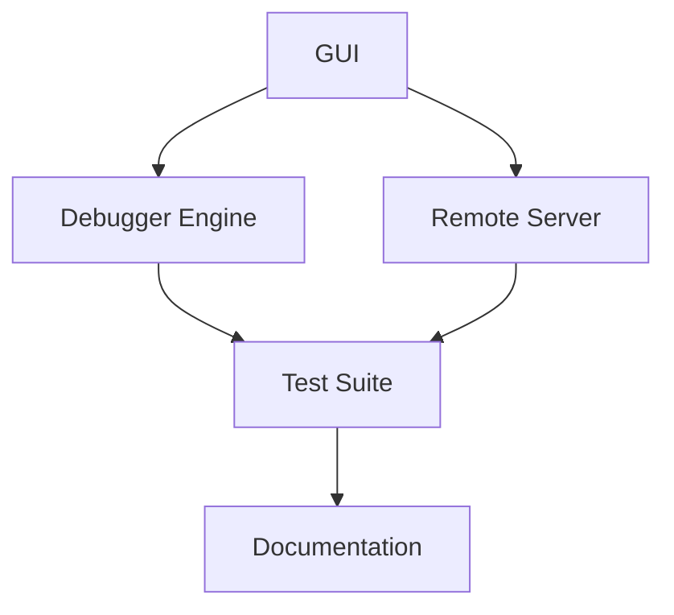

# Overview

x64dbg is an open-source Windows binary debugger designed for malware analysis and reverse engineering of executables without source code. It features a comprehensive plugin system and is developed by a community effort. The repository includes both the core debugger application and extensive documentation.

# Architecture

x64dbg follows a modular architecture, divided into several key components:

- **GUI**: Handles the user interface, including the main window, menus, and dialogs.
- **Debugger Engine**: Manages the actual debugging logic, including breakpoints, memory manipulation, and thread management.
- **Remote Server**: Provides a WebSocket interface for remote debugging and monitoring.
- **Test Suite**: Includes unit and integration tests to ensure the application works as expected.
- **Documentation**: Generates and maintains the project's documentation using Sphinx.

Here is a Mermaid diagram illustrating the high-level architecture:



# Data Flow / Execution Flow

The execution flow of x64dbg typically starts with the user launching the GUI. The GUI initializes the debugger engine and sets up the remote server. When a user attaches to a process or loads a binary, the debugger engine takes over, allowing the user to set breakpoints, inspect memory, and step through code. The remote server handles any remote debugging sessions, enabling users to monitor and control processes from a distance.

# Configuration & Dependencies

x64dbg relies on several external libraries and tools for its operation:

- **Qt**: For creating the graphical user interface.
- **Zydis**: For disassembling machine code.
- **TitanEngine**: For the core debugging engine.
- **Minidump**: For loading and analyzing minidump files.
- **Markdown**: For rendering help and documentation.

Configuration is managed via `CMakeSettings.json`, which specifies build options and dependencies. The `requirements.txt` file in the `docs` module lists Python packages needed for building the documentation.

# How to Run / Key Scripts

To run x64dbg, follow these steps:

1. Clone the repository:
   ```sh
   git clone https://github.com/x64dbg/x64dbg.git
   cd x64dbg
   ```

2. Build the project using CMake:
   ```sh
   mkdir build && cd build
   cmake ..
   make
   ```

3. Run the debugger:
   ```sh
   ./x64dbg
   ```

Key scripts include:

- `CMakeLists.txt`: Main build configuration file.
- `pyproject.toml`: Dependency management for Python modules.
- `makechm.bat`: Script for building CHM documentation.

# Notable Design Choices / Extension Points

x64dbg offers several extension points and design choices that allow for customization and expansion:

- **Plugins**: The debugger supports a plugin system, enabling users to extend its functionality.
- **Custom Commands**: Users can define their own commands through the debugger's scripting interface.
- **Remote Debugging**: The WebSocket server allows for remote debugging sessions, facilitating collaborative debugging.
- **Extensible GUI**: The GUI framework is designed to be extensible, allowing developers to add new features and controls.

These design choices make x64dbg a flexible tool suitable for both casual users and advanced developers.