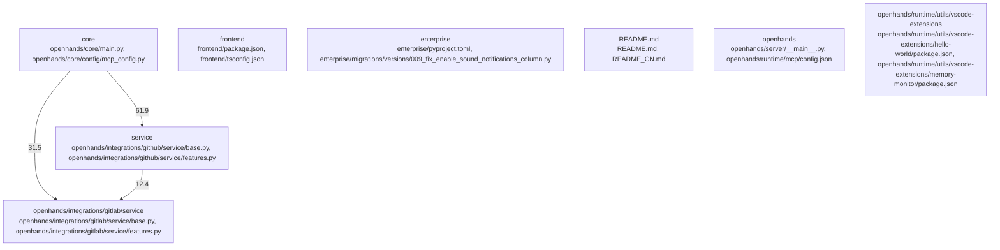

# Overview
Repository `OpenHands` at commit `30604c40fc6e9ac914089376f41e118582954f22` is documented using a graph-aware V2 pipeline. The architecture IR contains 2453 nodes, 9912 edges, and 206 detected subsystems.

## Architecture
The repository was decomposed into communities derived from dependency and package signals.
Top subsystems:
- `core`: for modifying search API settings
- `frontend`: frontend centers on frontend/package.json, frontend/tsconfig.json, frontend/src/api/git-service/git-service.api.ts
- `enterprise`: enterprise centers on enterprise/pyproject.toml, enterprise/migrations/versions/009_fix_enable_sound_notifications_column.py, enterprise/migrations/versions/010_create_offline_tokens_table.py
- `README.md`: README.md centers on README.md, README_CN.md, README_JA.md
- `service`: service centers on openhands/integrations/github/service/base.py, openhands/integrations/github/service/features.py, openhands/integrations/github/service/prs.py
- `openhands`: openhands centers on openhands/server/__main__.py, openhands/runtime/mcp/config.json, openhands/integrations/vscode/package.json
- `openhands/runtime/utils/vscode-extensions`: openhands/runtime/utils/vscode-extensions centers on openhands/runtime/utils/vscode-extensions/hello-world/package.json, openhands/runtime/utils/vscode-extensions/memory-monitor/package.json, openhands/runtime/utils/vscode-extensions/memory-monitor/README.md
- `openhands/integrations/gitlab/service`: openhands/integrations/gitlab/service centers on openhands/integrations/gitlab/service/base.py, openhands/integrations/gitlab/service/features.py, openhands/integrations/gitlab/service/prs.py

### Architecture Graph

Top cross-community interactions:
- `community_01` -> `community_05` (weight=61.9)
- `community_01` -> `community_149` (weight=41.5)
- `community_01` -> `community_08` (weight=31.5)
- `community_01` -> `community_185` (weight=15.0)
- `community_01` -> `community_201` (weight=13.2)
- `community_05` -> `community_08` (weight=12.4)

## Data Flow / Execution Flow
Evidence suggests execution moves across: openhands/core/main.py, openhands/core/main.py, openhands/core/main.py, openhands/core/main.py, openhands/core/main.py, openhands/cli/main.py, openhands/cli/main.py, openhands/cli/main.py.
Entrypoints hand off to subsystem-specific modules discovered in the architecture graph before producing outputs or side effects.

## Configuration & Dependencies
- Build/dependency files: enterprise/pyproject.toml, evaluation/benchmarks/lca_ci_build_repair/setup.py, evaluation/benchmarks/mint/requirements.txt, evaluation/benchmarks/versicode/requirements.txt, frontend/package.json, openhands-ui/package.json, openhands/core/setup.py, openhands/integrations/vscode/package.json, openhands/runtime/utils/vscode-extensions/hello-world/package.json, openhands/runtime/utils/vscode-extensions/memory-monitor/package.json, pyproject.toml
- Config surfaces: openhands/core/main.py, openhands/core/main.py, openhands/core/main.py, openhands/core/main.py, openhands/core/main.py, openhands/cli/main.py, openhands/cli/main.py, openhands/cli/main.py
- Docs anchors: CONTRIBUTING.md, README.md, README_CN.md, README_JA.md, containers/README.md, containers/dev/README.md, containers/runtime/README.md, enterprise/README.md

## How to Run / Key Scripts
- Entrypoints: frontend/src/components/features/home/git-branch-dropdown/index.ts, frontend/src/components/features/home/git-provider-dropdown/index.ts, frontend/src/components/features/home/repository-selection/index.ts, frontend/src/components/features/home/shared/index.ts, frontend/src/i18n/index.ts, frontend/src/types/core/index.ts, frontend/src/utils/suggestions/index.ts, openhands-ui/index.ts, openhands/cli/main.py, openhands/core/main.py, openhands/integrations/vscode/src/test/suite/index.ts, openhands/server/__main__.py
- Likely operational scripts/docs: openhands/core/main.py, openhands/core/main.py, openhands/core/main.py, openhands/core/main.py, openhands/core/main.py, openhands/cli/main.py, openhands/cli/main.py, openhands/cli/main.py

## Notable Design Choices / Extension Points
- V2 graph decomposition highlights subsystem boundaries using import, package, and configuration signals.
- Extension points are typically concentrated around high-centrality files, registries, interfaces, and build/config entry surfaces.
