# Overview
Repository `electron` at commit `828fd59a72e673acf03f878b4f488a40fca46dfe` is documented using a graph-aware V2 pipeline. The architecture IR contains 2593 nodes, 5054 edges, and 275 detected subsystems.

## Architecture
The repository was decomposed into communities derived from dependency and package signals.
Top subsystems:
- `shell`: shell centers on shell/browser/api/electron_api_extensions.cc, shell/browser/api/electron_api_extensions.h, shell/browser/api/electron_api_service_worker_context.cc
- `docs`: docs centers on docs/api/extensions-api.md, docs/api/extensions.md, docs/api/ipc-main-service-worker.md
- `README.md`: README.md centers on README.md, tsconfig.default_app.json, tsconfig.electron.json
- `lib`: lib centers on lib/browser/api/service-worker-main.ts, lib/browser/api/content-tracing.ts, lib/browser/api/crash-reporter.ts
- `docs`: The Electron framework is responsible for building cross-platform desktop applications using JavaScript, HTML, and CSS
- `lib`: The `electron` repository is a subsystem that provides a runtime environment for building cross-platform desktop applications
- `shell/browser/extensions`: The `electron` repository has a subsystem called `script` that is responsible for generating various files and configurations used by the Electron framework
- `shell/common/extensions/api`: shell/common/extensions/api centers on shell/common/extensions/api/BUILD.gn, shell/common/extensions/api/_api_features.json, shell/common/extensions/api/_manifest_features.json

### Architecture Graph

```mermaid
flowchart TD
  community_01[shell\nshell/browser/api/electron_api_extensions.cc, shell/browser/api/electron_api_extensions.h]
  community_02[docs\ndocs/api/extensions-api.md, docs/api/extensions.md]
  community_03[README.md\nREADME.md, tsconfig.default_app.json]
  community_04[lib\nlib/browser/api/service-worker-main.ts, lib/browser/api/content-tracing.ts]
  community_05[docs\ndocs/README.md, docs/breaking-changes.md]
  community_06[lib\nscript/lib/util.py, script/lib/config.py]
  community_07[shell/browser/extensions\nshell/browser/extensions/electron_browser_context_keyed_service_factories.cc, shell/browser/extensions/electron_browser_context_keyed_service_factories.h]
  community_08[shell/common/extensions/api\nshell/common/extensions/api/BUILD.gn, shell/common/extensions/api/_api_features.json]
```

Top cross-community interactions:
- `community_06` -> `community_107` (weight=6.0)
- `community_196` -> `community_47` (weight=6.0)
- `community_107` -> `community_47` (weight=3.7)
- `community_06` -> `community_106` (weight=3.5)
- `community_06` -> `community_230` (weight=3.3)
- `community_06` -> `community_20` (weight=3.0)

## Data Flow / Execution Flow
Evidence suggests execution moves across: spec/fixtures/extensions/devtools-extension/index.js, spec/fixtures/auto-update/initial/index.js, spec/fixtures/auto-update/check-with-headers/index.js, script/release/notes/index.ts, spec/fixtures/crash-cases/fs-promises-renderer-crash/index.js, npm/index.js, script/release/notes/index.ts, npm/index.js.
Entrypoints hand off to subsystem-specific modules discovered in the architecture graph before producing outputs or side effects.

## Configuration & Dependencies
- Build/dependency files: default_app/package.json, npm/package.json, package.json, spec/fixtures/api/app-path/package.json, spec/fixtures/api/command-line/package.json, spec/fixtures/api/context-bridge/context-bridge-mutability/package.json, spec/fixtures/api/cookie-app/package.json, spec/fixtures/api/default-menu/package.json, spec/fixtures/api/exit-closes-all-windows-app/package.json, spec/fixtures/api/first-party-sets/base/package.json, spec/fixtures/api/first-party-sets/command-line/package.json, spec/fixtures/api/ipc-main-listeners/package.json
- Config surfaces: package.json, spec/fixtures/api/command-line/package.json, spec/is-valid-window/package.json, spec/fixtures/api/locale-check/package.json, spec/fixtures/api/net-log/package.json, package.json, package.json, package.json
- Docs anchors: .devcontainer/README.md, CONTRIBUTING.md, README.md, docs/README.md, docs/breaking-changes.md, docs/experimental.md, docs/faq.md, docs/glossary.md

## How to Run / Key Scripts
- Entrypoints: npm/index.js, script/release/notes/index.ts, spec/fixtures/api/app-path/lib/index.js, spec/fixtures/api/electron-main-module/app/index.js, spec/fixtures/auto-update/check-with-headers/index.js, spec/fixtures/auto-update/check/index.js, spec/fixtures/auto-update/initial/index.js, spec/fixtures/auto-update/update-json/index.js, spec/fixtures/auto-update/update-stack/index.js, spec/fixtures/auto-update/update/index.js, spec/fixtures/crash-cases/api-browser-destroy/index.js, spec/fixtures/crash-cases/early-in-memory-session-create/index.js
- Likely operational scripts/docs: script/release/notes/index.ts, script/release/notes/index.ts, script/release/notes/index.ts, spec/fixtures/auto-update/update/index.js, spec/fixtures/auto-update/update-stack/index.js, spec/fixtures/auto-update/initial/index.js, npm/index.js, script/release/notes/index.ts

## Notable Design Choices / Extension Points
- V2 graph decomposition highlights subsystem boundaries using import, package, and configuration signals.
- Extension points are typically concentrated around high-centrality files, registries, interfaces, and build/config entry surfaces.
