# Overview
Repository `logstash` at commit `895cfa5b14633ae9b9e671105f7b7935c9f2b9f1` is documented using a graph-aware V2 pipeline. The architecture IR contains 2096 nodes, 5050 edges, and 259 detected subsystems.

## Architecture
The repository was decomposed into communities derived from dependency and package signals.
Top subsystems:
- `logstash-core`: logstash-core centers on logstash-core/lib/logstash-core.rb, logstash-core/lib/logstash/bootstrap_check/default_config.rb, logstash-core/lib/logstash/config/pipeline_config.rb
- `tools`: tools centers on tools/dependencies-report/src/main/resources/notices/aws-sdk-core-NOTICE.txt, tools/dependencies-report/src/main/resources/notices/com.fasterxml.jackson.core!jackson-annotations-NOTICE.txt, tools/dependencies-report/src/main/resources/notices/com.fasterxml.jackson.core!jackson-core-NOTICE.txt
- `docs`: docs centers on docs/extend/java-filter-plugin.md, docs/extend/java-input-plugin.md, docs/extend/java-output-plugin.md
- `README.md`: The subsystem of the Logstash project that this evidence is about is the build configuration
- `docs/extend`: docs/extend centers on docs/extend/codec-new-plugin.md, docs/extend/community-maintainer.md, docs/extend/contribute-to-core.md
- `lib/pluginmanager/templates/codec-plugin`: lib/pluginmanager/templates/codec-plugin centers on lib/pluginmanager/templates/codec-plugin/README.md, lib/pluginmanager/templates/codec-plugin/.ruby-version, lib/pluginmanager/templates/codec-plugin/CHANGELOG.md
- `lib/pluginmanager/templates/filter-plugin`: stash project
- `lib/pluginmanager/templates/input-plugin`: lib/pluginmanager/templates/input-plugin centers on lib/pluginmanager/templates/input-plugin/README.md, lib/pluginmanager/templates/input-plugin/.ruby-version, lib/pluginmanager/templates/input-plugin/CHANGELOG.md

### Architecture Graph

```mermaid
flowchart TD
  community_01[logstash-core\nlogstash-core/lib/logstash-core.rb, logstash-core/lib/logstash/bootstrap_check/default_config.rb]
  community_02[tools\ntools/dependencies-report/src/main/resources/notices/aws-sdk-core-NOTICE.txt, tools/dependencies-report/src/main/resources/notices/com.fasterxml.jackson.core!jackson-annotations-NOTICE.txt]
  community_03[docs\ndocs/extend/java-filter-plugin.md, docs/extend/java-input-plugin.md]
  community_04[README.md\nREADME.md, build.gradle]
  community_05[docs/extend\ndocs/extend/codec-new-plugin.md, docs/extend/community-maintainer.md]
  community_06[lib/pluginmanager/templates/codec-plugin\nlib/pluginmanager/templates/codec-plugin/README.md, lib/pluginmanager/templates/codec-plugin/.ruby-version]
  community_07[lib/pluginmanager/templates/filter-plugin\nlib/pluginmanager/templates/filter-plugin/README.md, lib/pluginmanager/templates/filter-plugin/.ruby-version]
  community_08[lib/pluginmanager/templates/input-plugin\nlib/pluginmanager/templates/input-plugin/README.md, lib/pluginmanager/templates/input-plugin/.ruby-version]
```

Top cross-community interactions:
- `community_226` -> `community_77` (weight=3.5)

## Data Flow / Execution Flow
Evidence suggests execution moves across: .buildkite/scripts/health-report-tests/main.py, .buildkite/scripts/health-report-tests/main.py, .buildkite/scripts/health-report-tests/main.py, logstash-core/build.gradle, .buildkite/scripts/health-report-tests/requirements.txt, qa/integration/build.gradle, logstash-core/benchmarks/build.gradle, logstash-core/build.gradle.
Entrypoints hand off to subsystem-specific modules discovered in the architecture graph before producing outputs or side effects.

## Configuration & Dependencies
- Build/dependency files: .buildkite/scripts/health-report-tests/requirements.txt, build.gradle, buildSrc/build.gradle, logstash-core/benchmarks/build.gradle, logstash-core/build.gradle, qa/integration/build.gradle, tools/benchmark-cli/build.gradle, tools/dependencies-report/build.gradle, tools/jvm-options-parser/build.gradle, x-pack/build.gradle
- Config surfaces: x-pack/build.gradle, logstash-core/build.gradle, logstash-core/build.gradle, logstash-core/build.gradle, logstash-core/build.gradle, logstash-core/benchmarks/build.gradle, tools/dependencies-report/build.gradle, qa/integration/build.gradle
- Docs anchors: .buildkite/scripts/benchmark/README.md, .buildkite/scripts/benchmark/save-objects/README.md, .buildkite/scripts/health-report-tests/README.md, CONTRIBUTING.md, README.md, ci/serverless/README.md, docker/README.md, docker/ironbank/README.md

## How to Run / Key Scripts
- Entrypoints: .buildkite/scripts/health-report-tests/main.py
- Likely operational scripts/docs: .buildkite/scripts/health-report-tests/main.py, .buildkite/scripts/health-report-tests/main.py, .buildkite/scripts/health-report-tests/main.py, x-pack/build.gradle, qa/integration/build.gradle, tools/benchmark-cli/build.gradle, qa/integration/build.gradle, qa/integration/build.gradle

## Notable Design Choices / Extension Points
- V2 graph decomposition highlights subsystem boundaries using import, package, and configuration signals.
- Extension points are typically concentrated around high-centrality files, registries, interfaces, and build/config entry surfaces.
